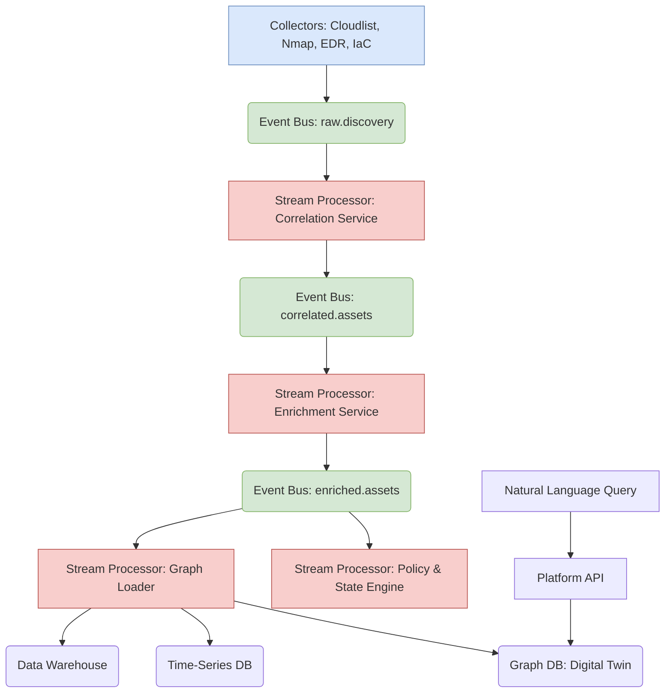

# The 10x Universal Asset Inventory: An Asset Intelligence Platform

This document challenges the previously defined "Scalable Architecture." While that model is an effective data platform for passive asset discovery, a true 10x solution requires a paradigm shift: from a reactive inventory to a proactive, predictive **Asset Intelligence Platform**.

## 1. Limitations of the "Scalable" Data Platform

The previous architecture, while powerful, has inherent limitations that prevent it from being a truly transformative solution:

-   **It is Reactive, Not Proactive:** It primarily catalogs what exists after the fact. It doesn't manage desired state or prevent misconfigurations before they happen.
-   **Correlation is a Secondary Task:** Asset correlation is treated as an ETL step. In reality, establishing a persistent, universal identity for an asset across disparate data sources is the most critical and complex problem, and it must be a core service.
-   **ETL is a Bottleneck:** A centralized ETL process becomes brittle and slow at extreme scale. A real-time, decentralized model is superior.
-   **It is Asset-Centric, Not Impact-Centric:** It tells you about a server, but it can't easily tell you the business services that depend on it, the data that flows through it, or the potential "blast radius" of a compromise.

## 2. From Inventory to Intelligence: A New Paradigm

A 10x system is not just a database; it is a dynamic model of your entire digital ecosystem. It is an active platform that **understands, governs, and predicts**.

## 3. The 10 Principles of an Asset Intelligence Platform

This is a new architectural vision built on ten core principles:

| # | Principle | Description | 10x Leap |
|---|---|---|---|
| 1 | **Event-Driven Core** | The platform is built around a real-time event bus (e.g., Kafka). Every discovery, change, and action is an event. This replaces batch ETL with scalable, real-time stream processing. | From batch ETL to real-time streams. |
| 2 | **First-Class Identity & Correlation Engine** | A dedicated microservice that consumes discovery events and uses ML and heuristics to assign a single, persistent **Universal Asset ID** to each entity, resolving conflicts and duplicates in real-time. | From a secondary ETL step to a primary, always-on service. |
| 3 | **The Digital Twin Graph** | The graph database models a "Digital Twin" of your environment. It stores not just the **Observed State** (from collectors) but also the **Desired State** (from IaC tools like Terraform) and **Business Context**. | From a simple model to a multi-layered, state-aware graph. |
| 4 | **Active Governance & Policy Enforcement** | The platform constantly compares Observed vs. Desired state. It doesn't just report on policy violations; it can trigger automated remediation (e.g., reverting a security group change) or block non-compliant deployments in CI/CD. | From passive reporting to active governance and enforcement. |
| 5 | **Predictive Blast Radius Analysis** | By modeling dependencies between assets, services, and data, the graph can run predictive simulations. It answers: "What is the business impact if this server is compromised?" | From asking "what is?" to predicting "what if?" |
| 6 | **Natural Language Interface** | The primary interface is a powerful NLP engine that allows security, finance, and engineering teams to ask complex questions in plain English, abstracting away the underlying query language. | From a developer API to an intuitive, human interface. |
| 7 | **Data-Centric Modeling** | The platform moves beyond assets to model data itself. It tracks data classifications (PII, PCI) and maps how that data **flows through** the asset graph, directly connecting infrastructure to risk. | From tracking assets to understanding data flow and impact. |
| 8 | **Automated Collector & Source Discovery** | The platform is self-expanding. It can automatically discover new data sources (e.g., a new code repository, a new cloud account) and suggest how to integrate them into the collection fleet. | From manual configuration to self-driving discovery. |
| 9 | **Full Lifecycle Modeling** | The Digital Twin captures the entire asset lifecycle: from the `terraform plan` (birth), to deployment, operation, and automated decommissioning, linking every stage to a single Universal Asset ID. | From snapshots in time to a full chronological history. |
| 10 | **Pluggable Reasoning Engines** | The platform supports specialized "reasoning engines" that analyze the graph for specific purposes: a **Security Engine** finds attack paths, a **Cost Engine** finds waste, and a **Compliance Engine** validates against regulatory frameworks. | From a single query engine to a pluggable analysis framework. |

## 4. The Event-Driven Architecture

This architecture is fundamentally more dynamic and scalable. Data flows in real-time streams, processed by independent microservices that are specialists at their tasks (correlation, enrichment, loading), removing the single point of failure of a monolithic ETL process. This is the foundation of a true 10x system.
