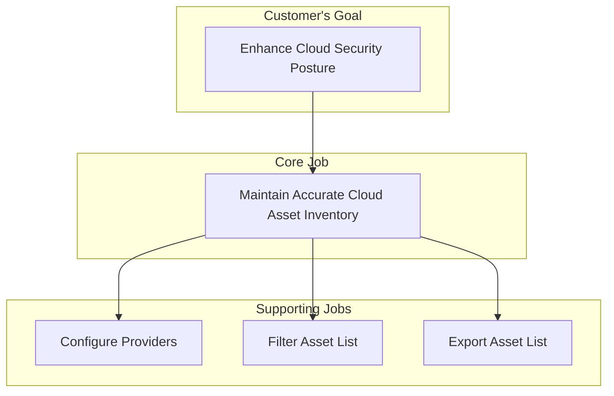
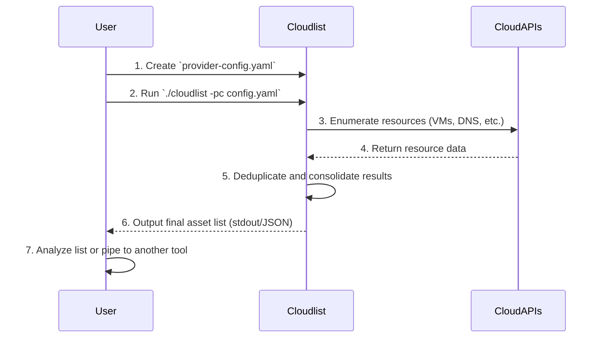

# Jobs to be Done (JTBD) Documentation for Cloudlist

This document outlines the "Jobs to be Done" that customers hire Cloudlist to perform. It analyzes the core job, related jobs, and desired outcomes from the customer's perspective.

## 1. Core Job Definition

The primary job that customers hire Cloudlist for is:

> **When** I am responsible for securing my organization's multi-cloud infrastructure, **I want to** automatically discover and list all our publicly exposed assets (like IPs and domains), **so I can** maintain a complete and accurate inventory for security analysis and risk mitigation.

## 2. Related Jobs

Customers are also trying to accomplish several related jobs, which can be categorized as follows:

#### Supporting Jobs
These are smaller jobs that help in the execution of the core job.

*   **Job:** Configure the scope of asset discovery across different cloud accounts.
*   **Job:** Filter the discovered asset list to focus on specific providers or services.
*   **Job:** Integrate the asset inventory data with other security tools (e.g., vulnerability scanners, SIEMs).
*   **Job:** Keep the discovery tool updated with support for new cloud services and providers.

#### Complementary Jobs
These jobs are often performed before, during, or after the core job.

*   **Job:** Continuously monitor for new, unknown assets (Shadow IT discovery).
*   **Job:** Validate the compliance of discovered assets against organizational security policies.
*   **Job:** Investigate and remediate security vulnerabilities found on discovered assets.

#### Competing Jobs
These are alternative solutions or workarounds that customers might use instead of hiring Cloudlist.

*   Manually logging into each cloud provider console to list assets.
*   Using the cloud providers' native asset inventory services.
*   Writing and maintaining custom scripts for each cloud provider's API.
*   Purchasing a full-featured Cloud Security Posture Management (CSPM) platform.

## 3. Desired Outcomes

These are the measurable results customers want to achieve by getting the job done. They are solution-agnostic.

*   **Reduce the time it takes to get a complete multi-cloud asset inventory** from days or weeks to minutes.
*   **Minimize the percentage of undiscovered or "shadow IT" assets** to less than 1%.
*   **Increase the frequency of asset inventory updates** from quarterly/monthly to daily/on-demand.
*   **Decrease the manual effort required for asset discovery** by over 90%.
*   **Ensure the asset list can be seamlessly consumed** by other tools without manual re-formatting.
*   **Minimize the time and complexity required to add a new cloud provider** to the discovery process.

## 4. Visualizing the Job

Mermaid.js diagrams help visualize the relationships between the different jobs and the customer's process.

### Job Map

This diagram shows how the core job relates to the supporting and higher-level jobs.

### User Progress Diagram

This diagram illustrates the steps a customer takes to get the job done using Cloudlist.

