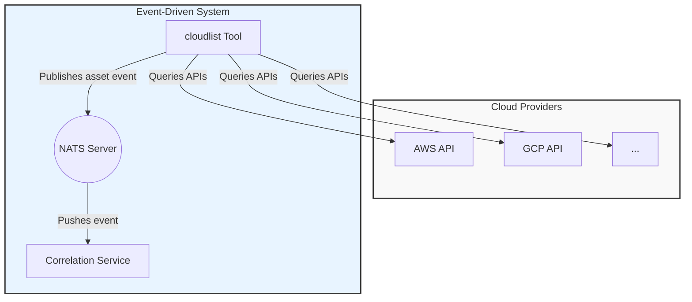
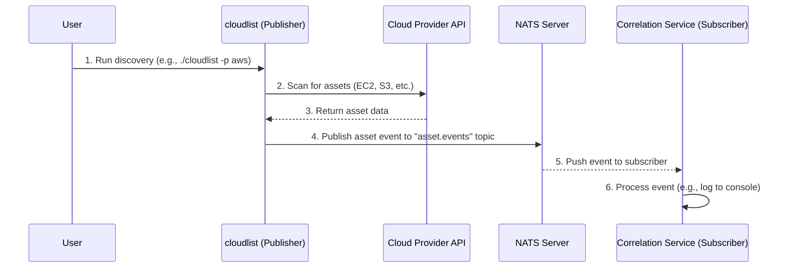

# Proof of Concept: Real-Time Asset Discovery with NATS

This document outlines a proof-of-concept (POC) demonstrating the integration of NATS messaging into the `cloudlist` tool for real-time asset discovery and event processing.

## Overview

The goal of this POC is to evolve `cloudlist` from a simple batch-oriented discovery tool into a real-time event publisher. When `cloudlist` discovers a cloud asset, it will publish an event to a NATS message bus. A separate microservice (the `correlation-service`) subscribes to this bus, receives the events in real-time, and can then perform further processing, such as storing the asset in a database, triggering alerts, or correlating it with other data sources.

This architecture decouples the discovery process from the processing logic, enabling a more scalable, extensible, and real-time security asset inventory system.

## Components

1.  **`cloudlist` (Publisher)**: The existing tool, modified to publish discovered asset information as events to a NATS topic.
2.  **NATS Server**: The messaging middleware that routes events from publishers to subscribers.
3.  **`correlation-service` (Subscriber)**: A new Go microservice that subscribes to the NATS topic, listens for asset events, and logs them to the console.

All source code for this POC is located within the `_docs` directory.

## System Architecture

The following diagrams illustrate the architecture and data flow of the POC.

### High-Level Architecture

This diagram shows the main components and their relationships. `cloudlist` scans cloud provider APIs, and upon finding an asset, publishes a message to the NATS server, which is then consumed by the `correlation-service`.



### Data Flow Sequence

This sequence diagram illustrates the end-to-end flow, from a user initiating a scan to the event being processed by the subscriber.



## Demo Steps

### Step 1: Prerequisites

- **Go**: Ensure Go (version 1.22+) is installed and configured.
- **Docker**: Ensure Docker is installed to run the NATS server.
- **Cloud Credentials**: Have credentials configured for at least one cloud provider that `cloudlist` supports (e.g., AWS, GCP, DigitalOcean).

### Step 2: Start the NATS Server

Run a NATS server in a Docker container. It will be accessible on your local machine.

```bash
docker run --rm -p 4222:4222 -p 8222:8222 nats:latest
```

This command starts a NATS server with the client port on `4222` and the HTTP monitoring port on `8222`. You can view the server status at `http://localhost:8222`.

### Step 3: Run the Correlation Service (Subscriber)

In a new terminal window, start the subscriber service. This service will connect to NATS and wait for asset events.

```bash
# Navigate to the service directory
cd _docs/services/correlation-service

# Tidy dependencies
go mod init correlation-service
go mod tidy

# Run the service
go run main.go
```

Upon successful execution, you will see the following output, and the cursor will hang as it waits for messages:

```
2024/05/22 14:30:00 Connected to NATS
2024/05/22 14:30:00 Subscribed to asset.events
```

### Step 4: Run Cloudlist (Publisher)

In a third terminal, run the `cloudlist` tool. The tool has been modified to publish events to NATS. You will need a valid `provider-config.yaml`.

```bash
# Ensure you are at the root of the cloudlist project directory

# Build the latest version of cloudlist
make build

# Run cloudlist against a configured provider
# Replace with your actual provider config and provider flags
./cloudlist -pc ~/.config/cloudlist/provider-config.yaml -p aws
```

## Verification Steps

As `cloudlist` runs and discovers assets, it will publish an event for each one. To verify the POC, observe the terminal where the `correlation-service` is running.

For each asset found by `cloudlist`, you will see a corresponding log message printed by the `correlation-service`:

```
# Example output from the correlation-service terminal

2024/05/22 14:35:00 Received event: {"provider":"aws","asset":{"public":true,"provider":"aws","service":"ec2","id":"i-0123456789abcdef0","public_ipv4":"54.12.34.56","dns_name":"ec2-54-12-34-56.compute-1.amazonaws.com"}}
2024/05/22 14:35:01 Received event: {"provider":"aws","asset":{"public":true,"provider":"aws","service":"s3","dns_name":"my-unique-bucket-name.s3.amazonaws.com"}}
2024/05/22 14:35:02 Received event: {"provider":"aws","asset":{"public":true,"provider":"aws","service":"route53","dns_name":"example.com"}}
```

This output confirms that:

1.  `cloudlist` successfully published the asset discovery events to the `asset.events` NATS topic.
2.  The `correlation-service` successfully received these events in real-time.

This completes the proof-of-concept, demonstrating a decoupled, event-driven architecture for cloud asset inventory management.
