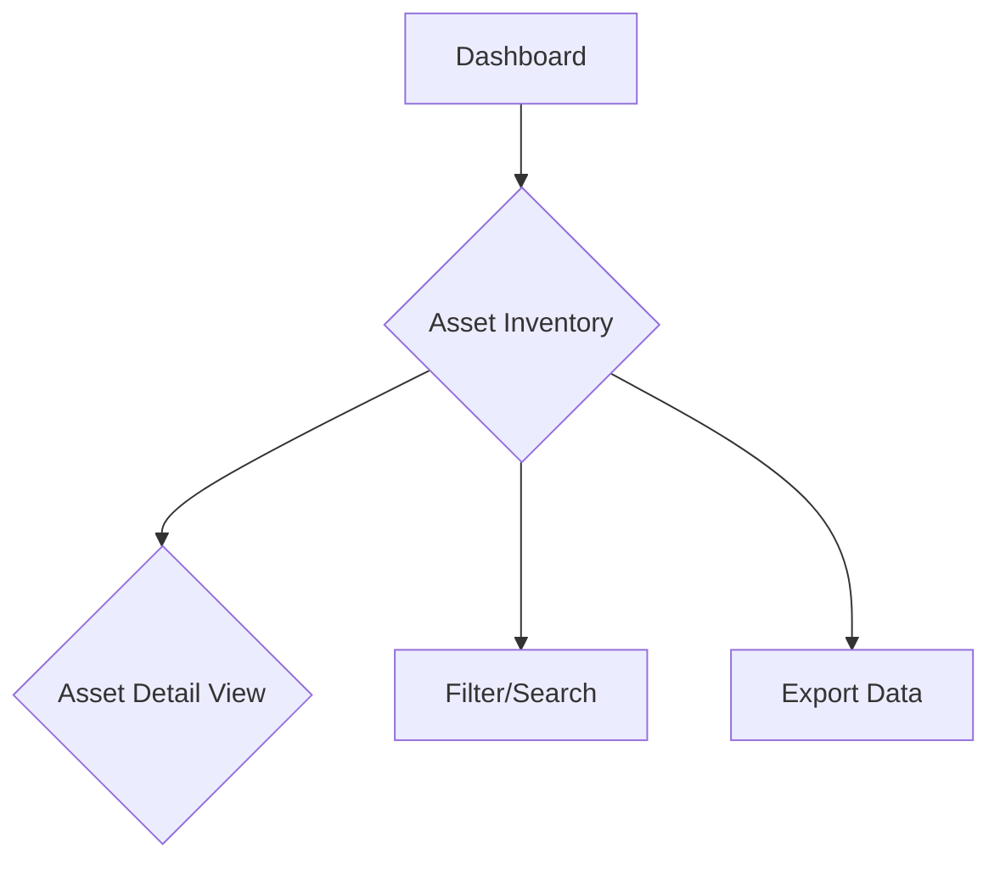

# Plan: Next.js Web-Based UI for Cloudlist Assets

This document outlines the plan for creating a web-based user interface using Next.js to visualize assets discovered by the Cloudlist tool.

## 1. Overview & Goals

The primary goal of this UI is to provide a user-friendly, visual interface for the asset data collected by Cloudlist. It will transition the project from a command-line tool to a more accessible platform, aligning with the vision of becoming an "Asset Intelligence Platform."

The UI will help users to:
- **Visualize** their complete multi-cloud asset inventory in one place.
- **Quickly search, filter, and sort** assets to find what they need.
- **Understand relationships** between assets and services.
- **Reduce the manual effort** required to analyze CLI output.

## 2. UI & Design Proposal

The design will be clean, modern, and data-centric, focusing on clarity and ease of use.

**Technology Choice:**
- **Framework:** Next.js (App Router)
- **Styling:** Tailwind CSS
- **Component Library:** **Shadcn/UI** - It's a modern, accessible, and composable component library that works well with Next.js and Tailwind CSS.

### Key Screens & Components:

#### a. Main Dashboard

- **Purpose:** Provide a high-level overview of the asset inventory.
- **Components:**
    - **Stat Cards:** Key metrics like "Total Assets," "Public IPs," "DNS Names," and "Providers."
    - **Assets by Provider:** A donut or bar chart showing the distribution of assets across different cloud providers (AWS, GCP, Azure, etc.).
    - **Asset Types:** A chart showing the breakdown of resources by service (e.g., Compute, DNS, Storage).
    - **Recent Activity:** A feed of recent discovery jobs (stretch goal).

#### b. Asset Inventory Page

- **Purpose:** The core of the UI. A detailed, filterable table of all discovered assets.
- **Components:**
    - **Powerful Data Table:**
        - Columns: Provider, Service, ID/Name, Public IP, Private IP, DNS Name.
        - Features: Sorting by any column, client-side or server-side pagination.
    - **Advanced Filtering:**
        - A filter sidebar or dropdowns to filter by:
            - Provider(s)
            - Service(s)
            - Public/Private status
            - IP range or CIDR
    - **Full-Text Search:** A search bar to quickly find any asset by its attributes.
    - **Export Functionality:** An "Export to CSV/JSON" button.

#### c. Asset Detail View

- **Purpose:** Show all available information for a single asset.
- **Triggered by:** Clicking on a row in the Asset Inventory table.
- **Components:**
    - **Side Panel or Modal:** Appears without losing the context of the main table.
    - **Information Display:** Shows all fields from the `schema.Resource`, including:
        - Basic Info (Provider, Service, ID)
        - IP Addresses (Public IPv4/v6, Private IPv4)
        - DNS Name
        - **Metadata:** A key-value table displaying the extended metadata.

### Page Flow (Mermaid Diagram)

## 3. Architecture

- **Frontend:** Next.js application hosted separately (e.g., on Vercel, Netlify, or self-hosted).
- **API:** The UI will communicate exclusively with the existing **GraphQL API** to fetch asset data.
- **Data Fetching:** Use a GraphQL client like **Apollo Client** for declarative data fetching, caching, and state management.

## 4. Phased Implementation Plan

### Phase 1: Foundation & Basic View (MVP)
- **Goal:** Get a basic, read-only view of the assets.
- **Steps:**
    1. Set up a new Next.js project with Tailwind CSS and Shadcn/UI.
    2. Configure Apollo Client to connect to the GraphQL endpoint.
    3. Create the Asset Inventory page with a simple, non-paginated table displaying all assets.
    4. Implement the Asset Detail modal/panel to show all data for a selected asset.

### Phase 2: Core Features & Usability
- **Goal:** Make the inventory usable for large datasets.
- **Steps:**
    1. Implement server-side pagination, sorting, and filtering in the data table.
    2. Add the full-text search functionality.
    3. Build the "Export to CSV/JSON" feature.
    4. Refine the UI/UX based on initial feedback.

### Phase 3: Dashboard & Visualization
- **Goal:** Provide at-a-glance insights.
- **Steps:**
    1. Create the main Dashboard page.
    2. Implement the statistical cards (Total Assets, etc.).
    3. Add charts for asset distribution by provider and service (using a library like `recharts`).

## 5. Next Steps

1. **Create Repository:** Set up a new repository for the Next.js project (or a new directory within this monorepo, e.g., `ui/`).
2. **Confirm GraphQL Endpoint:** Ensure the GraphQL API is accessible and documented.
3. **Begin Phase 1 Development:** Start implementing the MVP based on the plan above.
