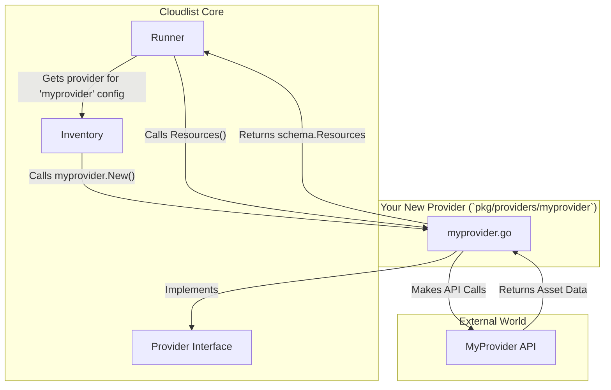

# How to Add a New Provider to Cloudlist

This document provides a technical guide for developers on how to extend Cloudlist by adding a new cloud provider.

## 1. Introduction

Cloudlist is designed with extensibility in mind. The core logic is decoupled from individual provider implementations through a `Provider` interface. By implementing this interface, you can easily add support for any cloud provider or asset source that exposes an API.

## 2. Architecture Overview

The process of adding a new provider involves creating an implementation that satisfies the `Provider` interface and then registering it with the central inventory.

### Core Components

-   **`pkg/providers/`**: This directory contains the specific implementation for each cloud provider. Your new provider code will live in a new subdirectory here.
-   **`pkg/schema/schema.go`**: This file defines the core `Provider` interface that all providers must implement, and the `Resource` struct that is used to represent a discovered asset (like an IP or DNS name).
-   **`pkg/inventory/inventory.go`**: This file acts as a factory. It maps the provider names from the configuration file (e.g., `aws`, `gcp`) to the actual provider implementation.

### Data Flow Diagram

This diagram shows how a new provider (`myprovider`) plugs into the Cloudlist enumeration engine.



## 3. The `Provider` Interface

Located in `pkg/schema/schema.go`, this is the interface you must implement.

```go
// located in pkg/schema/schema.go

type Provider interface {
	Name() string
	ID() string
	Resources(ctx context.Context) (*Resources, error)
	Services() []string
}
```

-   `Name() string`: Returns the static, official name of the provider (e.g., `"aws"`, `"digitalocean"`).
-   `ID() string`: Returns the user-defined `id` from the configuration block, used for identifying specific configurations.
-   `Services() []string`: Returns a slice of strings listing all discoverable services this provider supports (e.g., `[]string{"compute", "dns", "storage"}`). This is used for filtering with the `-s` flag.
-   `Resources(ctx context.Context) (*Resources, error)`: This is the main method where asset discovery happens. It should connect to the provider's API, fetch assets, and return them in a `*schema.Resources` object.

## 4. Step-by-Step Implementation Guide

Here is the process for creating a new provider called `myprovider`.

### Step 1: Create the Provider Directory

Create a new directory for your provider within the `pkg/providers` folder.

```bash
mkdir -p pkg/providers/myprovider
```

### Step 2: Implement the Provider Logic

Create a new file, `pkg/providers/myprovider/myprovider.go`, and implement the `Provider` interface. Use the following template as a starting point.

```go
package myprovider

import (
	"context"
	"github.com/projectdiscovery/cloudlist/pkg/schema"
)

// Provider is a struct for holding the provider configuration.
type Provider struct {
	id    string
	apiKey string // Example: store the API key
}

// New creates a new provider client for myprovider.
func New(options schema.OptionBlock) (schema.Provider, error) {
	id, _ := options.GetMetadata("id")

	// Read the API key from the config block.
	apiKey, ok := options.GetMetadata("myprovider_api_key")
	if !ok {
		// Return an error if a required key is missing.
		return nil, &schema.ErrNoSuchKey{Name: "myprovider_api_key"}
	}

	return &Provider{id: id, apiKey: apiKey}, nil
}

// Name returns the name of the provider.
func (p *Provider) Name() string {
	return "myprovider"
}

// ID returns the user-defined ID of the provider.
func (p *Provider) ID() string {
	return p.id
}

// Services returns the list of services supported by the provider.
func (p *Provider) Services() []string {
	return []string{"vps", "dns"}
}

// Resources returns the list of resources for a provider.
func (p *Provider) Resources(ctx context.Context) (*schema.Resources, error) {
	resources := schema.NewResources()

	// 1. Use the p.apiKey to connect to the MyProvider API.
	// 2. Respect the context `ctx` for cancellation in long-running calls.
	// 3. For each discovered asset, create a schema.Resource object.
	exampleAsset := schema.Resource{
		Provider:   p.Name(),
		Service:    "vps",
		PublicIPv4: "1.2.3.4",
		DNSName:    "server1.myprovider.com",
	}

	// 4. Append the resource. This handles automatic deduplication.
	resources.Append(&exampleAsset)

	return resources, nil
}
```

### Step 3: Register the Provider

Open `pkg/inventory/inventory.go` and add your provider to the `nameToProvider` function. This maps the configuration key to your provider's constructor.

1.  Add the import for your new provider package:
    ```go
    import (
        ...
        "github.com/projectdiscovery/cloudlist/pkg/providers/myprovider"
    )
    ```

2.  Add a `case` to the `switch` statement in `nameToProvider()`:
    ```go
    // in nameToProvider(...)
    switch name {
    // ... other cases
    case "myprovider":
        provider, err = myprovider.New(block)
    }
    ```

### Step 4: Update the Services Map

In the same file (`pkg/inventory/inventory.go`), add your provider and its supported services to the `Providers` map. This makes them discoverable by the tool.

```go
// in var Providers = map[string][]string{...}
var Providers = map[string][]string{
    // ... other providers
    "myprovider": {"vps", "dns"},
}
```

### Step 5: Document the Provider

Create a new Markdown file, `_docs/providers/myprovider.md`. In this file, document the configuration keys your provider requires and provide a sample YAML configuration block. This is critical for users.

## 5. Important Patterns & Best Practices

-   **Configuration Handling**: Always use `options.GetMetadata("key")` to read configuration. Check for the presence of required keys and return `&schema.ErrNoSuchKey{Name: "key"}` if one is missing.
-   **Context Cancellation**: Long-running API calls should respect the `ctx context.Context` passed to the `Resources()` method to allow for timeouts and graceful cancellation.
-   **Resource Deduplication**: Always use `resources.Append(&resource)` to add assets. The `Resources` object handles deduplication automatically, so you don't need to manage it yourself.
-   **Error Handling**: Return errors clearly. If an API call fails, wrap the error with additional context where possible.
-   **Metadata**: Use the `Metadata` field (`map[string]string`) on the `schema.Resource` struct to store extra information about an asset (e.g., region, instance size, tags).
