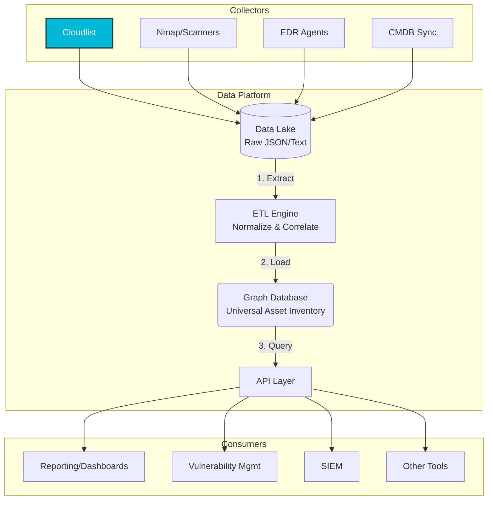
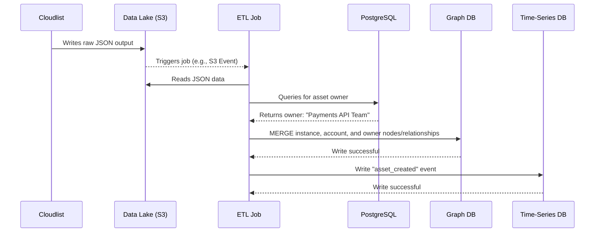
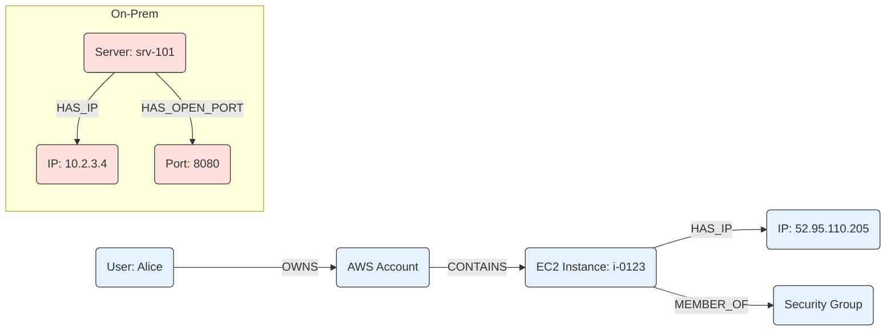

# A Scalable Architecture for a Universal Asset Inventory

This document presents a robust, scalable architecture for building a true Universal Asset Inventory. It revises the previous, simpler model by positioning Cloudlist as a critical data collector rather than the central database, which is a more practical and powerful approach.

## 1. Critique of the Simpler Model

The previous model, which used Cloudlist as a central aggregator, has limitations:

-   **Statelessness:** Cloudlist is a scanner, not a database. It discovers the current state but does not store historical data or complex asset relationships.
-   **Lack of Correlation:** It cannot easily correlate that an IP address from an Nmap scan and a VM from a cloud provider are the same logical entity with a shared identity.
-   **Limited Metadata:** It is not designed to store rich, queryable metadata such as asset owners, data sensitivity, or business context.

## 2. A Better Architecture: The 10 Core Principles

A scalable Universal Asset Inventory is a data warehousing and analytics platform. Here are the 10 core components and principles of a superior design:

| # | Principle | Description | Cloudlist's Role |
|---|---|---|---|
| 1 | **Centralized Data Lake** | A storage layer (like AWS S3 or GCP GCS) to hold all raw, immutable output from every collection tool. This provides a historical audit trail. | Cloudlist output (`-json` format) is a key data source that feeds into the data lake. |
| 2 | **Diverse Collector Fleet** | Use a variety of best-in-class tools for discovery. No single tool can see everything. This creates a mesh of overlapping visibility. | Cloudlist is the **primary collector for cloud assets**. Other collectors would include Nmap, OSQuery, EDR agents, and CMDB sync scripts. |
| 3 | **Scheduled & Event-Driven Collection** | Run collectors on a schedule (e.g., hourly) but also trigger them based on events (e.g., a new VPC is created, a new app is deployed). | Cloudlist can be executed on a schedule or triggered by CI/CD pipelines. |
| 4 | **Normalization & ETL Engine** | A service (e.g., using AWS Glue, Airflow) that extracts data from the lake, transforms it into a standard `Universal Asset Schema`, and loads it. | The ETL process would parse Cloudlist's JSON output and map it to the universal schema. |
| 5 | **Graph Database Core** | Use a graph database (like Neo4j, ArangoDB, or AWS Neptune) as the primary inventory. This is crucial for mapping complex relationships. | An asset from Cloudlist (e.g., an EC2 instance) becomes a node in the graph, linked to its IP, VPC, and security groups. |
| 6 | **Asset Correlation Engine** | A smart process that identifies and merges duplicate entities from different sources (e.g., correlating a Cloudlist IP with an Nmap host). | Cloudlist provides foundational identifiers (instance IDs, IPs) that the correlation engine uses. |
| 7 | **Rich Asset Metadata** | The universal schema must support not just technical data, but also business context: asset owner, environment (`prod`/`staging`), cost center, etc. | Data from Cloudlist provides the initial technical context, which is then enriched by other sources (like a CMDB). |
| 8 | **Exposed API Layer** | A dedicated GraphQL or REST API that allows all other security and operational tools to query the Universal Asset Inventory. | The API provides a consistent way for tools to get asset data, abstracting away the collectors like Cloudlist. |
| 9 | **Historical State Snapshotting** | The inventory should be versioned, allowing you to ask, "What did our public footprint look like last Tuesday?" | This is achieved by timestamping data in the data lake and graph, a feature Cloudlist itself doesn't provide. |
| 10| **Ownership & RBAC** | Define asset ownership within the inventory and control who can view or modify asset data via the API. | Asset data from Cloudlist can be automatically tagged with an initial owner based on cloud account information. |

## 3. Advanced Architecture Diagram



This architecture provides a far more scalable and functional solution for a true Universal Asset Inventory. It correctly positions **Cloudlist as an essential, best-in-class collector for cloud environments** while acknowledging the need for a broader data platform to achieve the full vision.

## 4. Deep Dive: An Improved Polyglot Persistence Model

Yes, modern data architectures almost always use **polyglot persistence**—the practice of using multiple, specialized databases to handle different types of data and workloads. A truly scalable Universal Asset Inventory is a data platform, not a single database.

Here is a breakdown of an improved polyglot persistence model, explaining the role of each component:

| Database Type | Role in Architecture | Why It's the Right Choice | Example Systems |
| :--- | :--- | :--- | :--- |
| **Object Storage** | **Raw Data Lake & Archive** | Stores the immutable, raw JSON/text output from all collectors (like Cloudlist). It provides a cheap, durable, and auditable historical record of every discovery scan. This is the ultimate source of truth. | AWS S3, Google Cloud Storage, Azure Blob Storage |
| **Graph Database** | **Live Asset Inventory & Relationship Engine** | This is the core operational database. It stores normalized asset data as nodes and, crucially, the relationships between them as edges. It is optimized for answering complex, relationship-based questions that are critical for security analysis. | Neo4j, ArangoDB, AWS Neptune, TigerGraph |
| **Search Engine** | **Log & Metadata Search** | Provides powerful full-text search capabilities across unstructured or semi-structured data. This is ideal for searching through asset logs, configuration files, or extensive metadata fields that are not easily indexed in a graph. | Elasticsearch, OpenSearch, Algolia |
| **Time-Series Database** | **Asset State & Performance Monitoring** | Stores data points that are indexed by time. This is perfect for tracking asset state changes (e.g., port opened/closed, software version changed) or performance metrics (CPU, memory), enabling trend analysis and anomaly detection. | InfluxDB, Prometheus, TimescaleDB |
| **Relational Database (SQL)**| **Business Context & Ownership** | A traditional SQL database is often still the best place to store structured, transactional business data, such as asset ownership details, cost centers, compliance status, and user roles (RBAC). This data can be joined with the graph data for enriched queries. | PostgreSQL, MySQL, AWS RDS |

## 5. How It Works: Detailed Data Flow Examples

This section provides a concrete, step-by-step illustration of how different asset types flow through the system.

### Example 1: New AWS EC2 Instance (Cloud Asset)

**Scenario**: A developer deploys a new EC2 instance in a production AWS account, which Cloudlist discovers.

1.  **Collection**: A scheduled Cloudlist run executes. It connects to the AWS API and discovers the new EC2 instance (`i-0123abcd`). It outputs a JSON object containing the instance ID, IP address (`52.95.110.205`), attached security groups, VPC ID, and tags.
2.  **Ingestion to Data Lake**: The raw Cloudlist JSON output is written as a timestamped object to an AWS S3 bucket (our Data Lake).
3.  **ETL & Enrichment**: 
    a. The S3 `ObjectCreated` event triggers an ETL job (e.g., AWS Lambda).
    b. The ETL job reads the JSON and queries our **PostgreSQL (Relational) DB** to enrich the data. It finds that AWS Account `123456789012` is owned by the `Payments API Team`.
4.  **Loading into Graph DB**: The ETL job makes several writes to the **Neo4j (Graph) DB**:
    *   `MERGE (a:AWSAccount {id: '123456789012'})`
    *   `MERGE (i:EC2Instance {id: 'i-0123abcd'}) SET i.ip = '52.95.110.205'`
    *   `MERGE (t:Team {name: 'Payments API Team'})`
    *   `MERGE (a)-[:OWNED_BY]->(t)`
    *   `MERGE (i)-[:RUNS_IN]->(a)`
5.  **State Tracking**: The ETL job checks if this instance ID was seen before. It's new. An event is written to the **InfluxDB (Time-Series) DB**: `asset_state,asset_id=i-0123abcd,type=ec2 state="created",owner="Payments API Team" <timestamp>`.
6.  **Auxiliary Indexing**: If the instance is configured to ship logs (e.g., CloudTrail, application logs), those logs are ingested by a separate process into **Elasticsearch**. Queries against the Graph DB can now include a link to the relevant logs in Elasticsearch.

### Example 2: On-Premise Server with New Open Port

**Scenario**: A system administrator accidentally exposes a web server on an internal, on-premise server.

1.  **Collection**: A nightly Nmap scan runs against the corporate IP range and discovers that server `10.2.3.4` now has port `8080` open.
2.  **Ingestion to Data Lake**: The raw Nmap XML output is written to the S3 bucket.
3.  **ETL & Enrichment**:
    a. The ETL job parses the Nmap XML.
    b. It finds a node in the **Graph DB** that already exists: `(:Server {ip: '10.2.3.4'})`. This node was created from a daily sync with the on-premise CMDB (ServiceNow).
4.  **Loading into Graph DB**: The ETL job updates the graph:
    *   `MATCH (s:Server {ip: '10.2.3.4'}) MERGE (p:Port {number: 8080}) MERGE (s)-[:HAS_OPEN_PORT]->(p)`
5.  **State Tracking**: The ETL job compares the server's current open ports to the last known state. Port `8080` is new. It writes an event to **InfluxDB**: `asset_state,asset_id=10.2.3.4,type=server state="port_opened",port=8080 <timestamp>`.

## 6. System & Flow Diagrams

### System Component Diagram

This diagram shows the high-level components of the Universal Asset Inventory platform.

```mermaid
componentDiagram
    subgraph Consumers
        A[API]
        B(Dashboards)
        C(Vulnerability Scanners)
    end

    subgraph Data Platform
        API --> GDB(Graph DB)
        API --> TDB(Time-Series DB)
        API --> SE(Search Engine)
        
        ETL[ETL Engine] --> GDB
        ETL --> TDB
        ETL --> SE
        ETL --> RDB(Relational DB)
        
        DL[(Data Lake)] --> ETL
    end

    subgraph Collectors
        Cloudlist --> DL
        Nmap --> DL
        EDR --> DL
    end
```

### Data Flow Sequence Diagram (EC2 Example)

This diagram shows the sequence of interactions for the EC2 instance discovery example.



### Conceptual Graph Data Model

This diagram illustrates how the final, enriched data looks inside the Graph Database, connecting assets from different sources.


