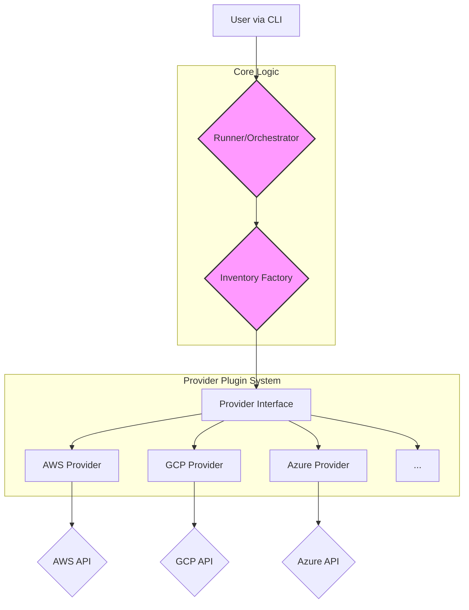

# Cloudlist Technical Architecture

This document provides a detailed overview of the Cloudlist system architecture, its components, and the design decisions behind it.

## 1. Architecture Overview

Cloudlist is a command-line interface (CLI) tool written in Go, designed for discovering and inventorying assets across multiple cloud providers. Its architecture is fundamentally a **plugin-based** or **provider-based** system. This design promotes extensibility, allowing new cloud providers to be integrated with minimal changes to the core application logic.

The core of the architecture is the `Provider` interface, which defines a standard contract that all cloud provider implementations must adhere to. The central application orchestrates the enumeration process by loading, configuring, and invoking these providers based on user input.

The system can be visualized as a layered architecture:

1.  **CLI / User Interface Layer:** Parses command-line arguments and configuration files.
2.  **Orchestration Layer:** Manages the lifecycle of the enumeration process, including provider initialization and result aggregation.
3.  **Provider Interface Layer:** The abstract interface that decouples the orchestrator from concrete provider implementations.
4.  **Provider Implementation Layer:** Contains the specific logic for interacting with each cloud provider's API.



## 2. Use Cases

### Primary Use Case: Discover All Cloud Assets

The most common use case is for a security or operations professional to get a complete list of all IPs and DNS names their organization owns across all their cloud accounts.

1.  **User Interaction:** The user prepares a `provider-config.yaml` file with credentials and other necessary details for each cloud account.
2.  **System Process:**
    *   The user runs `./cloudlist -pc provider-config.yaml`.
    *   The `main` function in `cmd/cloudlist/main.go` parses the flags.
    *   The `runner` is initialized, which in turn uses the `inventory` to load all providers specified in the config file.
    *   The runner iterates through each provider and concurrently calls the `Resources()` method.
    *   Each provider implementation makes one or more API calls to its respective cloud service to fetch assets.
    *   Results are streamed back to the runner, which uses a `ResourceDeduplicator` to ensure the final list is unique.
    *   The final list is printed to `stdout`.
3.  **Expected Outcome:** A list of all unique public and private IP addresses and DNS names, along with metadata about which provider and service they belong to.

### Sequence Diagram for Asset Discovery

```mermaid
sequenceDiagram
    participant User
    participant "CLI (main.go)"
    participant "Runner (runner.go)"
    participant "Inventory (inventory.go)"
    participant "Provider (e.g., aws.go)"
    participant CloudAPI

    User->>"CLI (main.go)": Executes `./cloudlist -pc config.yaml`
    "CLI (main.go)"->>"Runner (runner.go)": Initializes with options
    "Runner (runner.go)"->>"Inventory (inventory.go)": Reads config and requests providers
    "Inventory (inventory.go)"-->>"Runner (runner.go)": Returns initialized Provider instances
    "Runner (runner.go)"->>"Provider (e.g., aws.go)": Calls `Resources(ctx)` concurrently for each provider
    "Provider (e.g., aws.go)"->>CloudAPI: Makes API calls to fetch assets
    CloudAPI-->>"Provider (e.g., aws.go)": Returns raw resource data
    "Provider (e.g., aws.go)"-->>"Runner (runner.go)": Streams `schema.Resource` objects
    "Runner (runner.go)"->>"Runner (runner.go)": Deduplicates and aggregates resources
    "Runner (runner.go)"-->>"CLI (main.go)": Returns final list
```

## 3. Technology Stack

- **Programming Language:** Go (1.24+)
- **Key Dependencies:**
    - **CLI Flags:** `github.com/projectdiscovery/goflags`
    - **Logging:** `github.com/projectdiscovery/gologger`
    - **Concurrency:** `github.com/alitto/pond/v2` for worker pools.
    - **Cloud Provider SDKs:**
        - `github.com/aws/aws-sdk-go`
        - `github.com/Azure/azure-sdk-for-go`
        - `google.golang.org/api`
        - And many others for specific providers.

## 4. Key Design Decisions

1.  **Provider-Based Architecture:** The choice of a `Provider` interface as the core abstraction is the most critical design decision. It makes the system highly modular and easy to extend to new cloud services without modifying the core orchestration logic.

2.  **YAML for Configuration:** Using a YAML file (`provider-config.yaml`) for configuration provides a human-readable and flexible way to manage credentials and provider-specific settings. It also supports environment variable substitution (`$VAR_NAME`), enhancing security by avoiding hardcoded secrets.

3.  **Stateless CLI Tool:** Cloudlist is a stateless CLI tool that takes an input configuration and produces an output. This simple, predictable model makes it easy to integrate into automated scripts, CI/CD pipelines, and other security workflows.

4.  **Automatic Resource Deduplication:** By handling deduplication centrally in the `schema` package, the provider implementations are simplified. They can focus solely on fetching resources without worrying about whether another provider has already discovered the same asset.

5.  **Concurrency Model:** The tool uses a worker pool (`pond`) to enumerate resources from multiple providers concurrently. This significantly speeds up the discovery process in environments with many cloud accounts.
