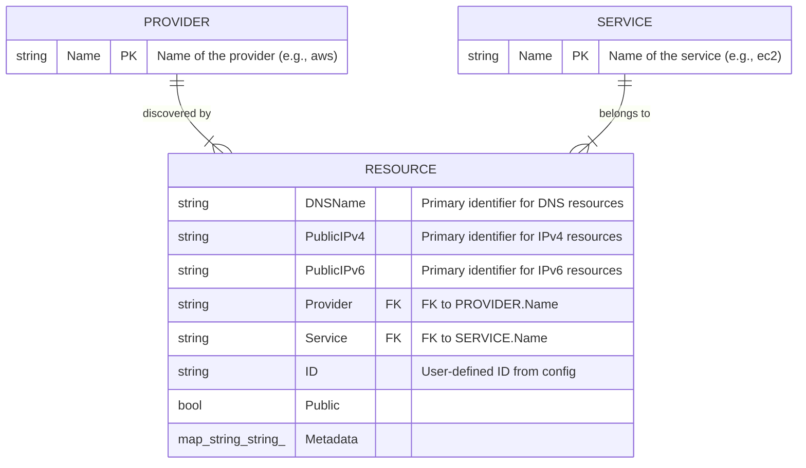

# Cloudlist Data Schema Documentation

## 1. Database Schema Overview

Cloudlist operates as a stateless CLI tool and does not utilize a traditional database (like SQL or NoSQL) for persistent storage. Instead, it constructs an in-memory data model during runtime to represent the cloud assets it discovers. This documentation outlines the conceptual schema of that in-memory data structure.

The primary purpose of this data model is to create a standardized representation of a "resource" (like an IP address or a DNS name) that can be consistently used across all supported cloud providers. The core entity of this model is the `Resource`.

### Key Entities

| Entity/Table | Primary Key(s) (Conceptual) | Role Description |
| :--- | :--- | :--- |
| **Resource** | `DNSName` or `PublicIPv4` or `PublicIPv6` or `PrivateIpv4` or `PrivateIpv6` | Represents a single, unique cloud asset, which is either a DNS name or an IP address. This is the central entity in the data model. |
| **Provider** | `Name` | Represents a cloud provider (e.g., `aws`, `gcp`). A Provider is responsible for discovering Resources. |
| **Service** | `Name` | Represents a specific service within a cloud provider (e.g., `ec2`, `s3`, `dns`). A Resource is associated with a Service. |

## 2. Detailed Table Descriptions

### `Resource` Table (Conceptual)

**Description:** This entity represents a single discoverable asset. The structure is denormalized to keep all relevant information about a single IP or DNS name in one place. The deduplication logic ensures that each unique asset appears only once in the final output.

| Column | Data Type | Constraints | Description |
| :--- | :--- | :--- | :--- |
| `DNSName` | `string` | | The fully qualified domain name of the asset. One of this or an IP must be present. |
| `PublicIPv4` | `string` | | The public IPv4 address of the asset. |
| `PublicIPv6` | `string` | | The public IPv6 address of the asset. |
| `PrivateIpv4` | `string` | | The private IPv4 address of the asset. |
| `PrivateIpv6` | `string` | | The private IPv6 address of the asset. |
| `Public` | `bool` | `NOT NULL` | A flag indicating whether the asset is considered public-facing. |
| `Provider` | `string` | `NOT NULL` | **(Foreign Key)** The name of the cloud `Provider` that discovered this resource. |
| `Service` | `string` | | **(Foreign Key)** The name of the `Service` within the provider where the resource was found. |
| `ID` | `string` | | The user-defined identifier for the provider configuration block. |
| `Metadata` | `map<string, string>` | | A key-value map for storing any additional, provider-specific details about the asset. |

**Relationships:**

*   **Many-to-One** with `Provider`: Many resources can be discovered by a single provider.
*   **Many-to-One** with `Service`: Many resources can belong to a single service.

## 3. Mermaid Diagrams

### Entity-Relationship Diagram (ERD)

This diagram visualizes the conceptual relationships between the `Provider`, `Service`, and `Resource` entities.



### System Interaction Diagram

This diagram shows how the in-memory data model is constructed and used within the overall system architecture.

```mermaid
graph TD
    subgraph Input
        A[YAML Config File]
    end

    subgraph Cloudlist Application
        B{Orchestrator} --> C[Provider Implementations];
        C --> D{Cloud APIs};
        D --> E[Raw Asset Data];
        E --> F[Data Model (`Resource` structs)];
        F --> G[Resource Deduplicator];
        G --> H[Final In-Memory Asset List];
    end

    subgraph Output
        I[STDOUT (JSON, Host, IP)]
    end

    A --> B;
    H --> I;
```

## 4. Additional Technical Details

*   **Indexes:** Since this is an in-memory model, the primary "index" is a `sync.Map` used by the `ResourceDeduplicator`. This hash map stores each unique asset value (IP or DNS name) to provide O(1) average time complexity for checking if a resource has already been discovered.

*   **Normalization:** The data model is intentionally **denormalized**. A `Resource` object contains all information, including provider and service names. This is a deliberate design choice for a stateless tool where the entire dataset is processed at once. Normalization would add unnecessary complexity and require joins for a process that simply needs to output a flat list.

## 5. Example Query (Conceptual)

Since there is no SQL database, a "query" is a combination of command-line flags. For instance, to get all public DNS names from the `aws` provider and the `route53` service, the conceptual process is as follows:

1.  **Filter Providers:** The user runs Cloudlist with the `-p aws` flag.
2.  **Filter Services:** The user adds the `-s route53` flag.
3.  **Filter Output:** The user adds the `-host` flag to get only hostnames.

The Go equivalent of this filtering happens during the orchestration and output generation phases, iterating through the final list of `Resource` structs:

```go
// Pseudocode for demonstrating a query
finalResults := []*Resource{}
for _, resource := range allDiscoveredResources {
    // Corresponds to: WHERE provider = 'aws' AND service = 'route53'
    isAWS := resource.Provider == "aws"
    isRoute53 := resource.Service == "route53"

    // Corresponds to: SELECT DNSName WHERE DNSName IS NOT NULL AND Public = true
    isPublicHost := resource.DNSName != "" && resource.Public

    if isAWS && isRoute53 && isPublicHost {
        finalResults.Append(resource)
        fmt.Println(resource.DNSName)
    }
}
```
