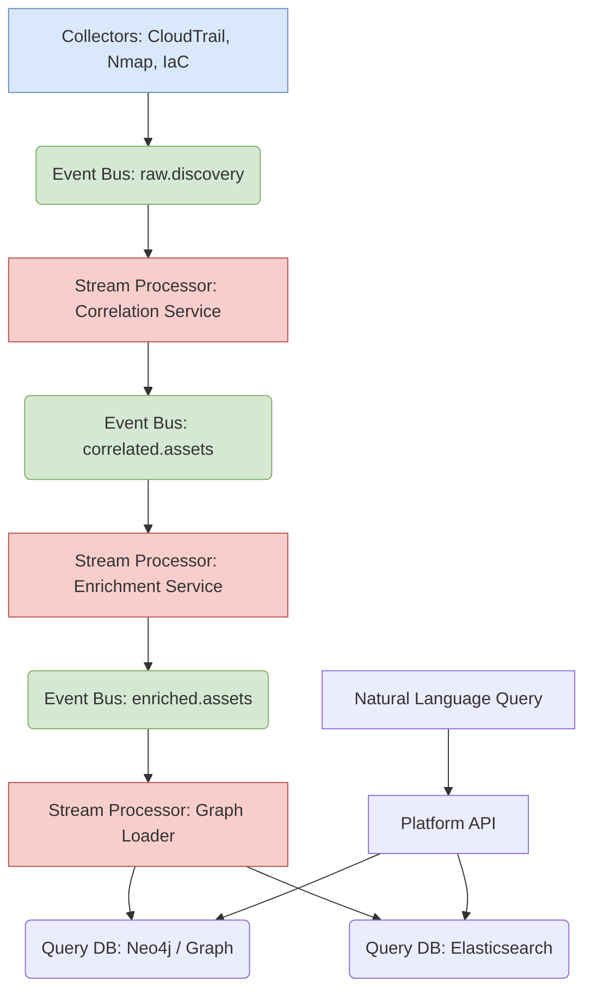

# Next-Generation Architecture: The 10x Asset Intelligence Platform

This document proposes a new technological architecture designed to evolve the Cloudlist asset discovery tool from a periodic, batch-oriented utility into a real-time, high-throughput Asset Intelligence Platform. The goal is a 10x improvement in performance, scalability, and time-to-insight.

## 1. The 10x Challenge

### Current State
*   **System:** The current solution is a monolithic Go application (`cloudlist`) executed on-demand as a single process. While it uses concurrency internally, it is fundamentally limited to the resources of a single machine and runs in a batch model.
*   **Key Metric (Batch-Oriented):**
    *   **Throughput:** A typical run might process **~10,000 assets in 15 minutes** (~11 assets/sec).
    *   **Latency:** The time-to-insight is the full duration of the batch run, meaning data is **at least 15 minutes old**, and often hours or days depending on execution frequency.

### The 10x Performance Goal
*   **System:** A horizontally scalable, real-time platform with minimal operational overhead.
*   **Target Metrics (Event-Oriented):**
    *   **Throughput:** Ingest and process a continuous stream of **10,000 asset change events per second**.
    *   **Latency:**
        *   **Event-to-Query Latency:** Asset changes are reflected and queryable in the platform in **under 5 seconds (p99)**.
        *   **API Query Latency:** The query API maintains a **p99 latency of <50ms** for typical lookups.

---

## 2. Architectural Leap: From Batch to Real-Time

The 10x performance goal cannot be met by optimizing the current monolithic architecture. It requires a paradigm shift from a synchronous, on-demand process to an asynchronous, event-driven system of microservices.

Instead of periodically pulling the state of the entire world, the new architecture will react to a continuous stream of events representing discrete changes in the environment (e.g., an EC2 instance started, a firewall rule changed).

## 3. Core Architectural Patterns for 10x Performance

### 3.1. Event-Driven Core
This is the most critical pattern. We replace synchronous API calls with an event bus (e.g., Kafka).

*   **How it Works:** Collector services (the evolution of Cloudlist's provider logic) and other sources (e.g., cloud event streams like AWS CloudTrail) publish raw change events to a central topic. Downstream services consume these events to process, correlate, and store the data.
*   **10x Leap:** Decouples data collection from processing, eliminates backpressure on data sources, and allows for massive, independent scaling of processing logic. It moves from slow batch cycles to real-time stream processing.

### 3.2. Microservices & Stream Processing
The single `cloudlist` binary is broken apart into a fleet of specialized, independently scalable services that operate on the event stream.

*   **How it Works:**
    1.  **Correlation Service:** Consumes raw discovery events and assigns a Universal Asset ID.
    2.  **Enrichment Service:** Appends business context, ownership, and data from other tools.
    3.  **Policy Engine:** Compares the asset state to security policies in real-time.
    4.  **Graph Loader:** Persists the final, enriched asset into the query databases.
*   **10x Leap:** Allows each part of the processing pipeline to be scaled independently based on its specific workload. A bottleneck in one service (e.g., enrichment) does not halt the entire system.

### 3.3. CQRS (Command Query Responsibility Segregation)
We separate the data ingestion path (Commands) from the data query path (Queries) and use different database technologies optimized for each.

*   **How it Works:** The "write" side is optimized for high-throughput event stream ingestion. The "read" side is optimized for complex, low-latency queries from users and APIs, using specialized databases like a graph DB. Data flows from the write side to the read side after processing.
*   **10x Leap:** Prevents high-volume data ingestion from degrading query performance. We can choose the absolute best database for each job (e.g., graph for relationships, search index for text) instead of a single, compromised solution.

---

## 4. Proposed Technology Stack

| Component | Proposed Technology | Justification |
| :--- | :--- | :--- |
| **Language (Microservices)** | **Go** or **Rust** | **Go** offers excellent concurrency, a strong ecosystem for cloud-native development, and leverages the team's existing expertise. **Rust** provides maximum performance and memory safety for the most critical data path components. |
| **Event Bus** | **Apache Kafka** or **Redpanda** | The industry standard for high-throughput, persistent, and scalable event streaming. Redpanda offers a Kafka-compatible, lower-ops alternative. |
| **Stream Processing** | **Kafka Streams** or **Apache Flink** | Provides the framework for building stateful stream-processing applications (the microservices described above) that are scalable and fault-tolerant. |
| **Query Database (Graph)** | **Neo4j** or **TigerGraph** | A graph is the ideal model for asset relationships, dependencies, and "blast radius" analysis. These offer the performance and query language (Cypher, GSQL) needed for complex queries. |
| **Query Database (Search)** | **Elasticsearch** / **OpenSearch** | Provides powerful, fast, full-text search capabilities across all asset metadata, which is impossible to do efficiently in a graph or relational DB. |
| **Deployment / Orchestration**| **Kubernetes** | The de facto standard for deploying, scaling, and managing containerized microservices, which is essential for achieving horizontal scalability with minimal operational overhead. |

---

## 5. Architectural Diagram

This diagram visualizes the event-driven flow, from collection to queryable intelligence.

