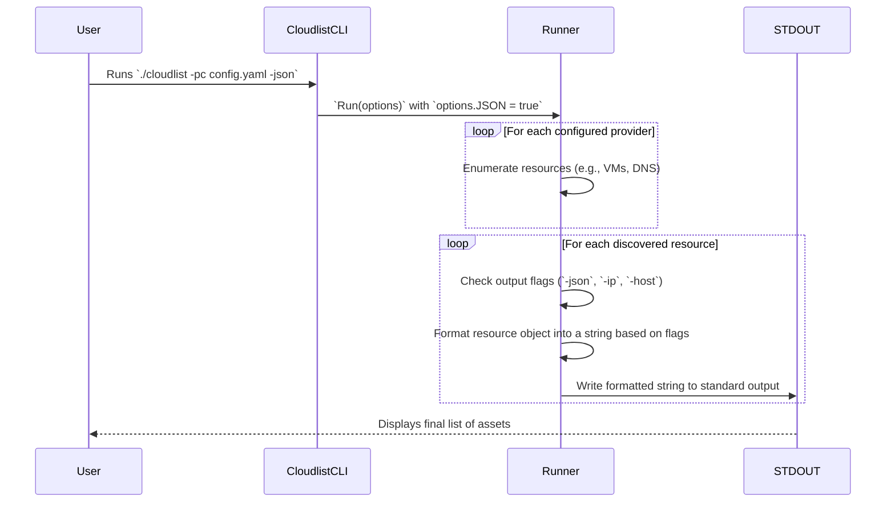

# Cloudlist Output Formats and Examples

This document provides a detailed overview of the different output formats available in Cloudlist, complete with examples and use cases.

## 1. Overview

Cloudlist can produce output in several formats, designed for both human-readable inspection and machine-parsable scripting. The desired format is controlled via command-line flags. If no flag is specified, it uses a simple, default format.

The primary output flags are:
- **Default (No Flag):** Human-readable list of assets.
- `-json`      : Detailed information for each asset in JSON format.
- `-host`      : A list of only DNS names (hostnames).
- `-ip`        : A list of only IP addresses.

## 2. Default Output

The default format is intended for quick manual review. It prints each asset on a new line, prefixed with the name of the provider it was discovered from.

*   **Command:**
    ```bash
    ./cloudlist -pc provider-config.yaml
    ```

*   **Example Output:**
    ```
    [aws] 54.12.34.56
    [aws] app.example.com
    [gcp] 203.0.113.22
    [do] 198.51.100.10
    ```

*   **Use Case:** Best for getting a quick, at-a-glance overview of cloud assets across all configured providers.

## 3. JSON Output (`-json`)

This format provides the most detail for each discovered asset. When the `-json` flag is used, Cloudlist prints a stream of JSON objects, one per line. This is ideal for scripting and integration with other tools.

*   **Command:**
    ```bash
    ./cloudlist -pc provider-config.yaml -json
    ```

*   **Example Output:**
    ```json
    {"provider":"aws","service":"ec2","id":"i-1234567890abcdef0","public_ipv4":"54.12.34.56","dns_name":"ec2-54-12-34-56.compute-1.amazonaws.com","metadata":{"instance_type":"t2.micro","region":"us-east-1"}}
    {"provider":"gcp","service":"dns","dns_name":"prod.example.com.","public_ipv4":"203.0.113.22"}
    {"provider":"digitalocean","service":"droplet","id":"12345678","public_ipv4":"198.51.100.10","private_ipv4":"10.0.0.5","dns_name":"my-droplet.example.com"}
    ```

*   **Use Case:** Piping output to tools like `jq` for filtering and transformation, or ingesting asset data into other systems and databases.

## 4. Host-Only Output (`-host`)

This flag filters the output to show only DNS names (hostnames).

*   **Command:**
    ```bash
    ./cloudlist -pc provider-config.yaml -host
    ```

*   **Example Output:**
    ```
    app.example.com
    prod.example.com.
    my-droplet.example.com
    ec2-54-12-34-56.compute-1.amazonaws.com
    ```

*   **Use Case:** Generating a list of domains to feed into other security tools for reconnaissance, such as subdomain enumerators or vulnerability scanners.

## 5. IP-Only Output (`-ip`)

This flag filters the output to show only IP addresses (both public and private).

*   **Command:**
    ```bash
    ./cloudlist -pc provider-config.yaml -ip
    ```

*   **Example Output:**
    ```
    54.12.34.56
    203.0.113.22
    198.51.100.10
    10.0.0.5
    ```

*   **Use Case:** Creating a target list of IP addresses for network scanning tools like `nmap` or `masscan`, or for building firewall rules.

## 6. User and System Interaction Flow

This diagram illustrates how Cloudlist processes command-line flags to generate the final output.


