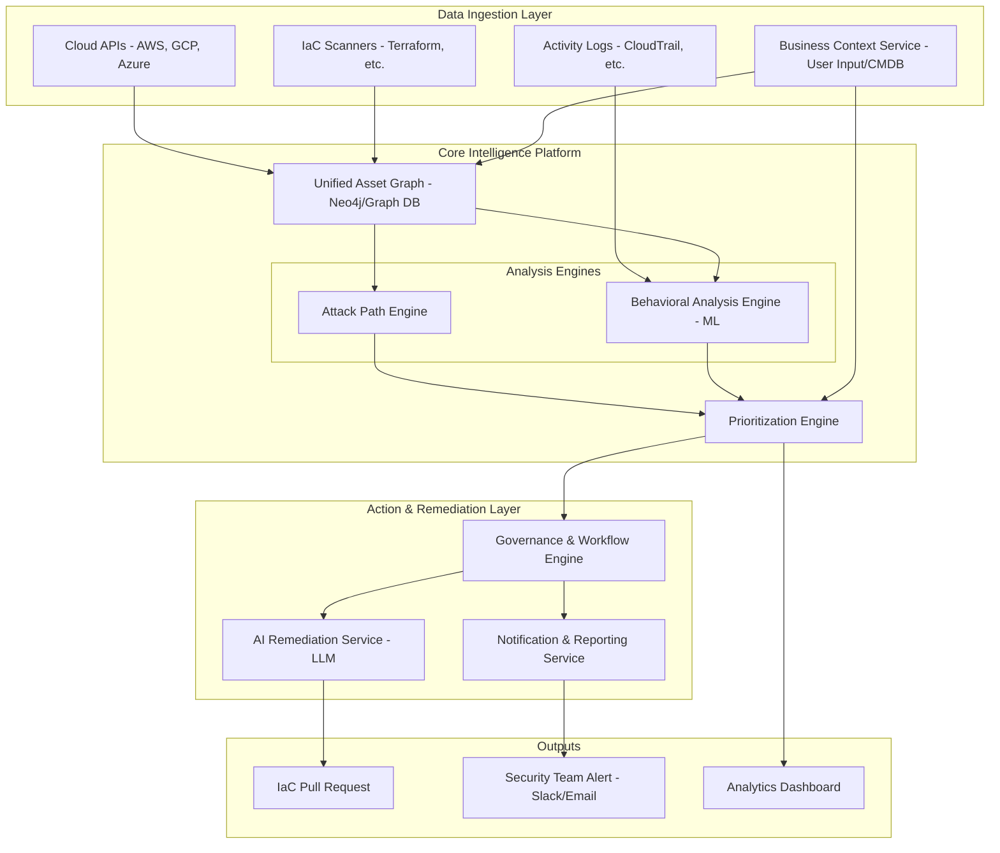

# Architecture: The 10x Security Auditing Solution

This document outlines the architecture for a "10x" Security Auditing solution that moves beyond static checks to create an intelligent, proactive platform that understands and mitigates risk in context.

## Guiding Principles: The "FROM/TO" Shifts

Our architecture is designed to facilitate the following fundamental shifts in security auditing:

1.  **FROM a Static Checklist... TO a Dynamic Risk Graph**
    *   **How Might We represent the entire cloud environment as a single, queryable graph?** We will create a unified data model that represents every entity—resources, identities, code, network paths, and business context—as a node in a graph database. Edges will represent relationships like "can access," "is connected to," or "is owned by." This model will be populated by a continuous ingestion service that pulls data from cloud APIs, IaC files, and real-time event streams.
    *   **How Might We use this graph to discover "attack paths"?** We will build an "Attack Path Engine" that uses graph traversal algorithms (e.g., shortest path, all paths) to find toxic combinations of misconfigurations. It can answer questions like, "Find all paths from a public-facing resource to a node tagged `data: pii`."

2.  **FROM Reactive Findings... TO Proactive, Autonomous Remediation**
    *   **How Might We use AI/LLMs to automatically generate validated IaC pull requests?** We will create an "AI Remediation Service." When a misconfiguration is found, it will be passed to an LLM with a carefully engineered prompt that includes the resource's current (bad) state and the desired (good) state from the policy. The LLM will generate the corrective IaC code. This code will then be validated in a sandboxed environment before a pull request is automatically created.
    *   **How Might We design a safety model for autonomous remediation?** We will implement a "Governance & Workflow Engine" that uses a confidence score. High-confidence, low-impact fixes (e.g., removing a public ACL from a non-production S3 bucket) can be remediated autonomously. High-impact changes (e.g., modifying a production IAM policy) will require human approval via the generated pull request.

3.  **FROM Configuration Checks... TO Behavioral Anomaly Detection**
    *   **How Might We ingest and analyze streams of activity logs in real-time?** The architecture includes a "Real-Time Ingestion Layer" using a streaming platform like Kafka or Kinesis. This will feed cloud activity logs (CloudTrail, GCP Audit Logs) into our "Behavioral Analysis Engine."
    *   **How Might We define "normal" behavior and automatically flag deviations?** The Behavioral Analysis Engine will use machine learning to build a baseline model of normal activity for each entity (role, user, resource). It will model patterns like typical API calls, time-of-day access, and source IPs. Any significant deviation from this learned baseline will be flagged as a high-fidelity anomaly and correlated with other findings in the graph.

4.  **FROM Technical Findings... TO Business-Context-Aware Prioritization**
    *   **How Might We allow users to define their business context?** We will provide a "Business Context Service" where users can enrich the asset graph by tagging resources with their application name, data sensitivity (`pii`, `financial`), compliance scope (`soc2`, `gdpr`), and owner. This service will be accessible via UI and API.
    *   **How Might We use this context to automatically elevate a finding's priority?** A "Prioritization Engine" will consume the raw output from the Attack Path and Behavioral Engines. It will apply a weighting algorithm that uses the business context. A finding's final risk score will be a function of its technical severity and its business criticality.

## High-Level Architecture Diagram

## Narrative Description: Processing a Finding

Let's trace how an "overly permissive IAM role on an EC2 instance" is handled.

1.  **Ingestion & Modeling:** The `cloudlist` tool (part of the **Data Ingestion Layer**) discovers the EC2 instance and its attached IAM role. This data is fed into the **Unified Asset Graph**, creating nodes for the instance and the role, with an edge representing the "is attached to" relationship. The **Business Context Service** enriches the instance node with the tag `app: 'customer-billing-api'`.

2.  **Analysis:** The **Attack Path Engine** queries the graph and discovers a "toxic path": the EC2 instance is in a public subnet, and its overly permissive role has write access to a DynamoDB table tagged `data: 'pii'`. Simultaneously, the **Behavioral Analysis Engine**, which has been monitoring CloudTrail logs, flags that this role, which normally only performs `DynamoDB:Read` operations, recently made an unusual `IAM:ListUsers` call, indicating potential credential misuse.

3.  **Prioritization:** Both findings are sent to the **Prioritization Engine**. The attack path finding, which would normally be "High," is elevated to "Critical" because the affected resource is tagged as part of a critical billing application and involves PII. The behavioral anomaly is correlated with this finding, further increasing the score.

4.  **Action & Remediation:** The "Critical" finding is sent to the **Governance & Workflow Engine**. Based on its policy, it triggers two actions:
    *   It immediately sends a high-priority alert to the security team's Slack channel via the **Notification Service**.
    *   It invokes the **AI Remediation Service**. The service is prompted with the IAM role's details and the principle of least privilege. The LLM generates a revised, tightened Terraform configuration for the IAM role. This code is validated, and a pull request is automatically opened in the relevant repository, with a comment linking back to the detected risk and the business context, ready for a one-click human approval.
