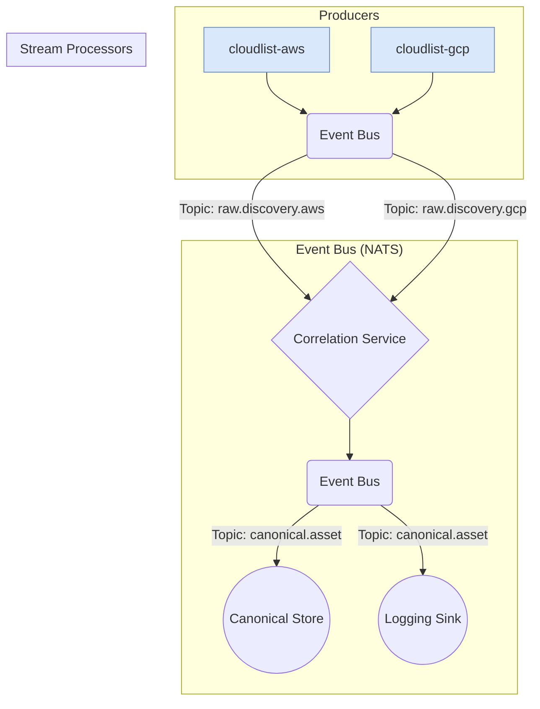

# Technical Requirements Document: PoC 2 - The Asset Intelligence Platform Core

## 1. Vision & Objective

This document provides the technical requirements for **PoC 2: The Asset Intelligence Platform Core**. The primary objective is to **validate the foundational paradigm shift from a batch-oriented tool to an event-driven, stream-processing platform.**

This architectural shift is a direct response to the core user need identified in the PRD: enabling a **Senior Cloud Security Engineer** to move from being a reactive auditor of stale data to a proactive defender of live services. This PoC lays the essential groundwork for that future.

The goals are to:

*   **Prove an Event-Driven Architecture**: Demonstrate a decoupled, microservice-based architecture using an event bus as the central nervous system.
*   **Validate the Core Correlation Concept**: Build a functioning "Correlation Service" to unify raw discovery events into a canonical asset identity.
*   **Establish a Scalable Pattern**: Create a foundational code structure for future real-time services (e.g., enrichment, policy, graph loading).

---

## 2. High-Level Architecture

The PoC will implement a stream-processing pipeline. The existing `cloudlist` binary will be treated as a "producer" of raw facts, which are then processed and unified by a series of new, independent services.

### Architectural Diagram



### Core Components

1.  **`cloudlist` Adapters (`cloudlist-*`)**: These are simple wrapper applications. They execute the `cloudlist` binary for a specific provider, take the resulting JSON output, and publish each discovered resource as a separate `RawDiscoveryEvent` onto the event bus.
2.  **Event Bus (NATS)**: For the PoC, NATS is the recommended technology due to its simplicity, high performance, and low operational overhead. It will act as the central nervous system for the entire platform.
3.  **Correlation Service**: This is the heart of the PoC. It is a standalone microservice that subscribes to all `raw.discovery.*` topics. Its sole responsibility is to receive raw events and use a set of rules to intelligently merge them into a single, unified `CanonicalAsset` record.
4.  **Logging Sink**: A simple consumer service that subscribes to the `canonical.asset` topic and logs the unified asset records to the console. This serves to visually validate that the end-to-end pipeline is working correctly.
5.  **Canonical Store**: For the PoC, this will be a simple in-memory key-value store within the Correlation Service. It holds the state of known identifiers and their mapping to a canonical asset ID. *Note: In a production system, this would be an external database like Redis or PostgreSQL.*

---

## 3. Event & Data Schemas

### 3.1. `RawDiscoveryEvent`

This event represents a single resource as discovered by `cloudlist`.

*   **Topic**: `raw.discovery.<provider>` (e.g., `raw.discovery.aws`)
*   **Payload Schema**:
    ```json
    {
      "event_id": "uuid-v4",
      "source_tool": "cloudlist",
      "source_provider": "aws",
      "discovery_timestamp": "2023-10-27T10:00:00Z",
      "raw_data": {
        // The original, unmodified JSON object for one resource 
        // from the cloudlist output array
        "provider": "aws",
        "public_ipv4": "1.2.3.4",
        "private_ipv4": ["10.0.0.5"],
        "dns_name": "ec2-1-2-3-4.compute-1.amazonaws.com"
      }
    }
    ```

### 3.2. `CanonicalAsset`

This data model represents the "golden record" of a single asset, unified from one or more raw events.

*   **Data Model Schema**:
    ```json
    {
        "asset_id": "casset-uuid-v4", // Unique ID generated by the Correlation Service
        "asset_type": "COMPUTE_INSTANCE", // Inferred type
        "first_seen": "2023-10-27T10:00:00Z",
        "last_seen": "2023-10-27T10:15:00Z",
        "identifiers": {
            "public_ipv4": ["1.2.3.4"],
            "private_ipv4": ["10.0.0.5"],
            "dns_name": ["ec2-1-2-3-4.compute-1.amazonaws.com", "app.example.com"]
        },
        "source_data": [
            {
                "source_tool": "cloudlist",
                "source_provider": "aws",
                "last_seen": "2023-10-27T10:15:00Z",
                "raw_data": { ... }
            },
            {
                "source_tool": "cloudlist",
                "source_provider": "route53",
                "last_seen": "2023-10-27T10:05:00Z",
                "raw_data": { ... }
            }
        ]
    }
    ```
*   **Topic**: `canonical.asset`

---

## 4. Component Deep-Dive: Correlation Service Logic

The Correlation Service is stateful. For the PoC, it will maintain an in-memory lookup table (a map) that associates a specific identifier (e.g., an IP address) with a canonical `asset_id`.

**Core Logic:**

1.  Consume a `RawDiscoveryEvent`.
2.  Extract a pre-defined list of key identifiers from the `raw_data` (e.g., public IPs, private IPs, DNS names).
3.  For each identifier, query the internal lookup table.
4.  **Scenario A: An identifier is found.**
    *   Retrieve the existing `asset_id` associated with that identifier.
    *   Load the full `CanonicalAsset` record.
    *   Merge the new information from the `RawDiscoveryEvent` into the `CanonicalAsset` (e.g., add new IPs, update `last_seen`, append to `source_data`).
5.  **Scenario B: No identifiers are found.**
    *   This is a new asset.
    *   Generate a new `asset_id`.
    *   Create a new `CanonicalAsset` record from the `RawDiscoveryEvent`.
    *   Update the lookup table to map all of the new asset's identifiers to the newly created `asset_id`.
6.  Publish the complete, updated `CanonicalAsset` to the `canonical.asset` topic.

---

## 5. PoC Scope & Success Criteria

### Scope

*   Two `cloudlist` adapters will be created: `aws` and `gcp`.
*   The Correlation Service will be built with in-memory state.
*   The correlation logic will focus on matching Public/Private IPv4 addresses and DNS names.
*   A `LoggingSink` service will be created to consume and print final canonical assets.

### Success Criteria

The PoC will be considered successful when the following can be demonstrated:

1.  **Successful Ingestion**: Running the `aws` and `gcp` adapters successfully publishes `RawDiscoveryEvent`s to the NATS bus.
2.  **Successful Creation**: The Correlation Service correctly creates two *separate* `CanonicalAsset` records when it processes an AWS EC2 instance and a GCP GCE instance that have no overlapping identifiers.
3.  **Successful Correlation/Merge**: The Correlation Service correctly merges data into a *single* `CanonicalAsset` record when it processes a `cloudlist` event for an AWS EC2 instance and a subsequent event for a Route53 CNAME record that points to the EC2 instance's DNS name.
4.  **End-to-End Validation**: The `LoggingSink` prints the final, merged `CanonicalAsset` from criterion #3 to the console, proving the entire pipeline works.
