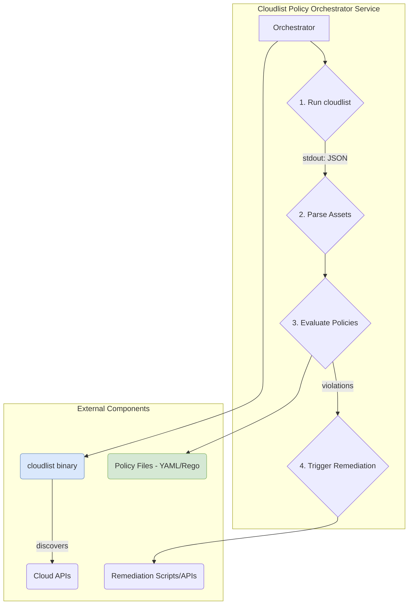

# Strategic Technical Design: Cloudlist Policy as Code Platform

## 1. Vision: A Unified Policy as Code Platform

This document outlines the strategic vision and technical architecture for building a comprehensive **Policy as Code platform** by leveraging the existing `cloudlist` discovery engine. The goal is to provide a unified framework for defining, evaluating, and remediating security and compliance policies across all cloud assets.

## 2. Architecture: The Cloudlist Policy Orchestrator Model

To achieve our vision without modifying the stable, core `cloudlist` binary, we will adopt a **Cloudlist Policy Orchestrator Model**. This approach treats the existing `cloudlist` executable as an immutable, black-box component. The entire policy and remediation lifecycle will be managed by a new, higher-level service that orchestrates `cloudlist` as one of its tools.

This decouples the new policy functionality from the core discovery functionality, providing stability, flexibility, and a clear separation of concerns.

### Architectural Diagram



### Component Overview

*   **Cloudlist Policy Orchestrator Service**: A new, standalone application (e.g., written in Go or Python). Its primary role is to orchestrate the entire process.
    1.  It must invoke the `cloudlist` binary as a subprocess.
    2.  It must capture the JSON output from `cloudlist`'s `stdout`.
    3.  It must load and parse this asset data.
    4.  It must run the **Policy Engine** against the asset data.
    5.  It must trigger the **Remediation Engine** based on policy violations.
*   **`cloudlist` Binary (Unmodified)**: The existing, battle-tested discovery tool. Its sole responsibility is to scan cloud environments and output a structured list of assets to `stdout`.
*   **Policy Engine (Internal Component)**: A module within the Cloudlist Policy Orchestrator that loads policy files (e.g., YAML, Rego) and evaluates them against the asset data provided by `cloudlist`.
*   **Remediation Engine (Internal Component)**: A module within the Cloudlist Policy Orchestrator that executes pre-defined actions (e.g., running CLI commands, making API calls) in response to policy violations.

### Advantages of the Cloudlist Policy Orchestrator Model

*   **Zero-Impact on Core Binary**: The `cloudlist` binary is never modified, preserving its stability, reliability, and simplifying upgrades.
*   **Enhanced Stability & Decoupling**: A crash or bug in the Policy Engine will not affect the core discovery functionality. The components are isolated processes.
*   **Language & Tool Flexibility**: The orchestrator can be written in any language best suited for orchestration (e.g., Python, Go). It can also easily orchestrate *other* tools alongside `cloudlist` in the future (e.g., vulnerability scanners, cost estimators).
*   **Simplified Development**: Developers working on the policy platform do not need to understand the internal complexities of `cloudlist`; they only need to understand its JSON output format, treating it as a stable API.

## 3. Cross-Cutting Platform Requirements

To ensure the platform is secure, configurable, and production-ready, the following requirements must be addressed.

### 3.1. Security & Credential Management

*   **Principle of Least Privilege**: The Orchestrator must operate with two distinct sets of credentials:
    1.  **Read-Only Credentials** for the `cloudlist` discovery process.
    2.  **Remediation Credentials** (write-access) that are scoped only to the specific remediation actions defined in a policy. These must only be used by the Remediation Engine.
*   **Secure Credential Storage**: The Orchestrator must not store any credentials in its own configuration or code. It must leverage secure, external mechanisms appropriate for the deployment environment (e.g., AWS IAM Roles for EC2/ECS, Kubernetes Service Account tokens, or environment variables from a secret management system like HashiCorp Vault).

### 3.2. Configuration Management

*   **Centralized Configuration File**: The Orchestrator must be configurable via a single YAML file.
*   **Environment Variable Overrides**: All configuration file settings must be overridable via environment variables for secrets and for compatibility with containerized environments.
*   **Key Configuration Parameters**:
    *   `cloudlistPath`: The file path to the `cloudlist` executable.
    *   `logLevel`: (e.g., `debug`, `info`, `warn`, `error`).
    *   `policySources`: A list of policy source locations (see Policy Distribution).
    *   `remediation`: A global toggle (`enabled: true/false`) and default mode (`dry-run` or `auto`).

### 3.3. Observability

*   **Structured Logging**: All log output must be in a machine-readable format (e.g., JSON). This is non-negotiable for a service that runs non-interactively.
*   **Key Log Events**: The Orchestrator must log critical events in its lifecycle, including:
    *   `orchestrator.run.start`, `orchestrator.run.end`
    *   `cloudlist.process.start`, `cloudlist.process.end`, `cloudlist.process.error`
    *   `policy.evaluation.start`, `policy.evaluation.end`
    *   `remediation.action.skipped`, `remediation.action.success`, `remediation.action.failure`
*   **Prometheus Metrics (for Service Mode)**: When running as a long-lived service, the Orchestrator should expose a `/metrics` endpoint with key operational metrics, such as:
    *   `cloudlist_runs_total` (counter)
    *   `policy_evaluations_total` (counter)
    *   `assets_scanned_total` (counter)
    *   `policy_violations_total` (counter, with labels for policy ID and severity)

### 3.4. Policy Distribution & Versioning

*   **Git-Based Policy Source**: The primary mechanism for policy distribution shall be a Git repository. The Orchestrator must be able to clone and pull from a specified Git URL.
*   **Policy Pinning**: To ensure reproducible and safe runs, the Orchestrator must support pinning policies to a specific Git commit hash, tag, or branch. This prevents untested or unapproved policy changes from being deployed automatically.
    ```yaml
    # Example policy source configuration
    policySources:
      - name: "company-baseline"
        type: "git"
        url: "https://github.com/my-org/security-policies.git"
        ref: "v1.2.3" # Pin to a specific tag
    ```

## 4. The Policy Lifecycle

This architecture supports a full, end-to-end lifecycle for managing policies:

1.  **Define**: Policies are defined in human-readable YAML or Rego, completely independent of `cloudlist`.
2.  **Test**: A CLI tool (`policy-test`) can be built to validate policy logic against mock `cloudlist` JSON output, enabling CI/CD integration.
3.  **Distribute**: Policies are stored and versioned in a Git repository, which the Cloudlist Policy Orchestrator clones or pulls.
4.  **Evaluate**: The Cloudlist Policy Orchestrator runs `cloudlist`, captures the assets, and its internal Policy Engine evaluates policies against those assets.
5.  **Remediate**: The Cloudlist Policy Orchestrator's Remediation Engine acts on violations based on the policy definition, supporting both "dry-run" and "auto" modes.
6.  **Report**: The Cloudlist Policy Orchestrator is responsible for generating the final `PolicyReport`, aggregating asset data and evaluation results.

## 5. Production-Ready Enhancements

To elevate the platform to an enterprise-grade service, the following requirements focusing on trust, safety, and auditability must be implemented.

### 5.1. Enriched Audit & Data Models

The `PolicyReport` must be enhanced to serve as a complete, self-contained audit record. Each report must contain a `runMetadata` block with the following information:

*   `orchestratorVersion`: The version of the Orchestrator that performed the run.
*   `cloudlistVersion`: The version of the `cloudlist` binary used for discovery.
*   `runId`: A unique identifier for this specific execution.
*   `startTimeUTC`, `endTimeUTC`: Timestamps for the run.
*   `policySources`: A list of the exact policy sources used, including the resolved Git commit hash for each.

### 5.2. Remediation Safety & Control Mechanisms

To build operator trust and prevent unintended consequences, the following safety mechanisms are required:

*   **Concurrency Control**: The Remediation Engine must support a configuration parameter (`remediation.concurrency`) to limit the number of simultaneous write actions. This prevents API rate limiting and controls the blast radius of automated changes.

*   **Approval Workflows**: The platform must support a remediation mode of `require-approval`. In this mode, when a violation is found, the Orchestrator will:
    1.  Log the violation and the intended remediation action.
    2.  Pause execution for that specific violation.
    3.  Expose an API endpoint or a mechanism (e.g., a message to a Slack channel with a button) that. Allows a human operator to approve or deny the action.
    4.  Only proceed with the remediation if the action is explicitly approved.

*   **Rollback Definition**: The policy schema must be extended to allow an optional `revert` step within each remediation block. This step should define the action required to undo the remediation (e.g., a command or API call). The platform is not required to perform automatic rollback, but it must provide a mechanism (`policy-orchestrator revert --run-id <runId>`) to facilitate a manual, operator-triggered rollback using this data.

### 5.3. Handling Stateful Policies

To support policies that require historical context (e.g., grace periods), the platform will use **Stateful Tagging** (In-Band State Management). This approach leverages the cloud provider's own tagging system as the state store, keeping the Orchestrator itself stateless and lightweight.

**Workflow Example: 14-Day Grace Period for Unused EBS Volumes**

This workflow is implemented using two distinct policies:

1.  **Policy 1: `ebs-mark-for-deletion`**
    *   **Trigger**: Finds an EBS volume where `status` is `available` AND the tag `state:marked-for-deletion` does NOT exist.
    *   **Action**: The remediation action is **not** to delete the volume. Instead, it is to **tag the resource** via a cloud provider API call with two tags:
        *   `state:marked-for-deletion` = `true`
        *   `state:marked-for-deletion-timestamp` = `<current_utc_timestamp>`

2.  **Policy 2: `ebs-enforce-deletion`**
    *   **Trigger**: Finds an EBS volume with the tag `state:marked-for-deletion` = `true`.
    *   **Condition**: The policy's logic then checks if the current date is more than 14 days past the `state:marked-for-deletion-timestamp` tag value.
    *   **Action**: If the condition is true, the policy triggers its remediation action (e.g., deleting the volume), which would be subject to the standard remediation modes (`dry-run`, `auto`, `require-approval`).

**Advantages of this pattern:**

*   **Stateless Orchestrator**: The core platform does not need its own database, significantly reducing operational complexity.
*   **High Visibility**: The state of any resource is self-documented and visible directly in the cloud provider's console.
*   **Robustness**: It relies on the cloud provider's highly available and durable tagging infrastructure.

While this pattern is the primary recommendation, the Orchestrator's design should be modular enough to allow for an external state store (e.g., a Redis or PostgreSQL database) as a potential future enhancement for more advanced use cases.

## 6. Phased Implementation Roadmap

This roadmap is adapted for the Cloudlist Policy Orchestrator model.

#### Phase 1: The Core Orchestrator and Native Engine (MVP)

*   **Goal**: Build the initial Cloudlist Policy Orchestrator and a simple policy engine.
*   **Features**:
    *   Create the main orchestrator application in Go.
    *   Implement the logic to execute the `cloudlist` binary and parse its JSON output.
    *   Build a `NativeEvaluator` component within the orchestrator.
    *   Implement basic configuration management (YAML file).
    *   Integrate a command to run the end-to-end process: `policy-orchestrator --config config.yaml`.
    *   Generate a consolidated `PolicyReport` to the console with basic run metadata.

#### Phase 2: Extensibility and Hardening

*   **Goal**: Add support for OPA/Rego and implement initial production-ready features.
*   **Features**:
    *   Develop a pluggable `OPAEvaluator` component.
    *   Integrate the OPA Go SDK.
    *   Implement Git-based policy distribution with commit pinning.
    *   Add concurrency controls to the Remediation Engine.
    *   Create a `policy-test` CLI command.

#### Phase 3: Enterprise-Grade Operations

*   **Goal**: Implement advanced safety, audit, and operational features.
*   **Features**:
    *   Implement the `require-approval` remediation workflow.
    *   Add the `revert` step to the policy schema and create the manual revert command.
    *   Introduce structured JSON logging and Prometheus metrics.
    *   Build the comprehensive E2E testing suite against a sandbox cloud account.

## 7. Deployment Models

The Cloudlist Policy Orchestrator model is highly adaptable.

### Model 1: CLI Tool

The Cloudlist Policy Orchestrator is compiled into a single binary. An operator runs it on-demand or in a CI/CD script. It calls the `cloudlist` binary, which must be in the system's `$PATH`.

### Model 2: Server / Service

The Cloudlist Policy Orchestrator is deployed as a long-running service (e.g., in a Docker container on Kubernetes). It can expose an API to trigger scans or run on a cron schedule, publishing reports to a central data store.

## 8. Use Cases & Testing Strategy

### 8.1. Key Use Cases

This platform is designed to support a range of security and operational use cases:

*   **Continuous Compliance Monitoring**: A security team runs the Orchestrator as a service. It continuously scans all cloud accounts and generates a real-time dashboard showing compliance against standards like CIS Benchmarks or internal security policies. Alerts are sent to Slack for any high-severity violations.

*   **CI/CD Security Gate**: A development team integrates the Orchestrator CLI into their CI/CD pipeline. Before deploying a new application, the pipeline uses the Orchestrator to scan the target environment with the new application's infrastructure-as-code configuration. If the changes would violate policy (e.g., create a public S3 bucket), the pipeline fails, preventing a security issue before it happens.

*   **Automated Security Hygiene**: An operations team uses the Orchestrator to enforce basic security hygiene. A policy is written to detect and automatically remediate common, low-risk issues, such as adding missing security tags to EC2 instances or disabling public access to non-web-facing security groups. This reduces manual toil and ensures a consistent baseline.

*   **On-Demand Audit & Evidence Collection**: An audit team uses the Orchestrator CLI to perform on-demand scans of specific cloud environments or services. The generated `PolicyReport` serves as immutable, time-stamped evidence of the compliance state at a specific point in time, which can be submitted for regulatory requirements.

### 8.1.1. Example Policy Implementations

Below are concrete examples of policies that can be implemented using this platform. These are based on common security frameworks and operational needs.

#### CIS AWS Foundations Benchmark Examples

*   **Policy 1.2 - Ensure Multi-Factor Authentication (MFA) is enabled for all IAM users that have a console password.**
    *   **Detection**: Identify IAM users with `password_enabled: true` but `mfa_active: false`.
    *   **Remediation (Dry-Run)**: Log a violation and send a high-priority notification to the security team.

*   **Policy 2.3.1 - Ensure S3 bucket access logging is enabled on the S3 bucket.**
    *   **Detection**: Find S3 buckets where `logging_enabled` is false.
    *   **Remediation (Auto)**: Enable server access logging on the S3 bucket, directing logs to a central logging bucket. This is a safe, non-disruptive action.

*   **Policy 4.1 - Ensure no security groups allow ingress from 0.0.0.0/0 to port 22.**
    *   **Detection**: Identify security groups with ingress rules where `CidrIp` is `0.0.0.0/0` and `FromPort` is `22`.
    *   **Remediation (Require Approval)**: Flag the rule for review. An operator must approve the removal of the rule. This prevents locking out legitimate administrative access.

#### Internal & Operational Policy Examples

*   **Policy: Enforce Mandatory Tagging for Cost Allocation**
    *   **Detection**: Identify any EC2 instances or S3 buckets that are missing the `cost-center` tag.
    *   **Remediation (Auto)**: Add a default `cost-center: unassigned` tag to the resource. This ensures the resource at least shows up in cost reports for later assignment.

*   **Policy: Prohibit Public IPs on Development VMs**
    *   **Detection**: Find EC2 instances with a `public_ip_address` where the instance also has a `environment: dev` tag.
    *   **Remediation (Require Approval)**: Alert the development team lead and require them to approve the removal of the public IP. This provides a safeguard while allowing for exceptions.

*   **Policy: Clean Up Unused (Detached) EBS Volumes**
    *   **Detection**: Identify EBS volumes with a `status: available`.
    *   **Remediation (Auto, after grace period)**: A multi-stage policy. First, tag the volume with `marked-for-deletion-date: <today>`. A second policy runs later and deletes any volumes that have been in the marked state for more than 14 days.

### 8.2. Multi-Layered Testing Strategy

A robust testing strategy is critical to ensure the platform is reliable and safe. We will adopt a multi-layered approach:

1.  **Unit Testing**:
    *   **Scope**: Individual functions and components within the Orchestrator (e.g., parsing logic, configuration loading, rule evaluation).
    *   **Method**: Standard Go `testing` package with mocked inputs and interfaces.
    *   **Goal**: Verify the correctness of individual logic units in isolation.

2.  **Policy Testing (`policy-test` CLI)**:
    *   **Scope**: The logic of individual policy files (YAML/Rego).
    *   **Method**: A dedicated CLI command (`policy-test`) will be created. It takes a policy file and a mock `cloudlist` JSON file as input and outputs the evaluation result.
    *   **Goal**: Enable policy authors to test their policies without needing access to a live cloud environment. This is the cornerstone of the "shift-left" approach.

3.  **Integration Testing**:
    *   **Scope**: The interaction between the Orchestrator and its immediate dependencies.
    *   **Method**: Tests that run the Orchestrator binary but replace external components with mocks:
        *   The `cloudlist` binary is replaced with a script that returns pre-canned JSON output.
        *   Cloud provider APIs for remediation are replaced with a mock HTTP server that validates API calls and returns expected responses.
    *   **Goal**: Verify that the Orchestrator correctly invokes its dependencies (like `cloudlist`) and that its internal components (like the Remediation Engine) are correctly wired together.

4.  **End-to-End (E2E) Testing**:
    *   **Scope**: The entire, unmodified system in a real-world scenario.
    *   **Method**: A fully automated test suite that runs in a dedicated, sandboxed cloud account. The tests will:
        1.  Create known-good and known-bad cloud resources using infrastructure-as-code (e.g., Terraform).
        2.  Run the full Orchestrator against this sandbox account.
        3.  Assert that the `PolicyReport` correctly identifies all violations.
        4.  Assert that `dry-run` remediation logs the correct intended actions.
        5.  (Optional) Run a limited set of safe `auto` remediation actions and verify the outcome.
    *   **Goal**: Provide the ultimate confidence that the system works as expected in a live environment. This is the final quality gate before a release.
