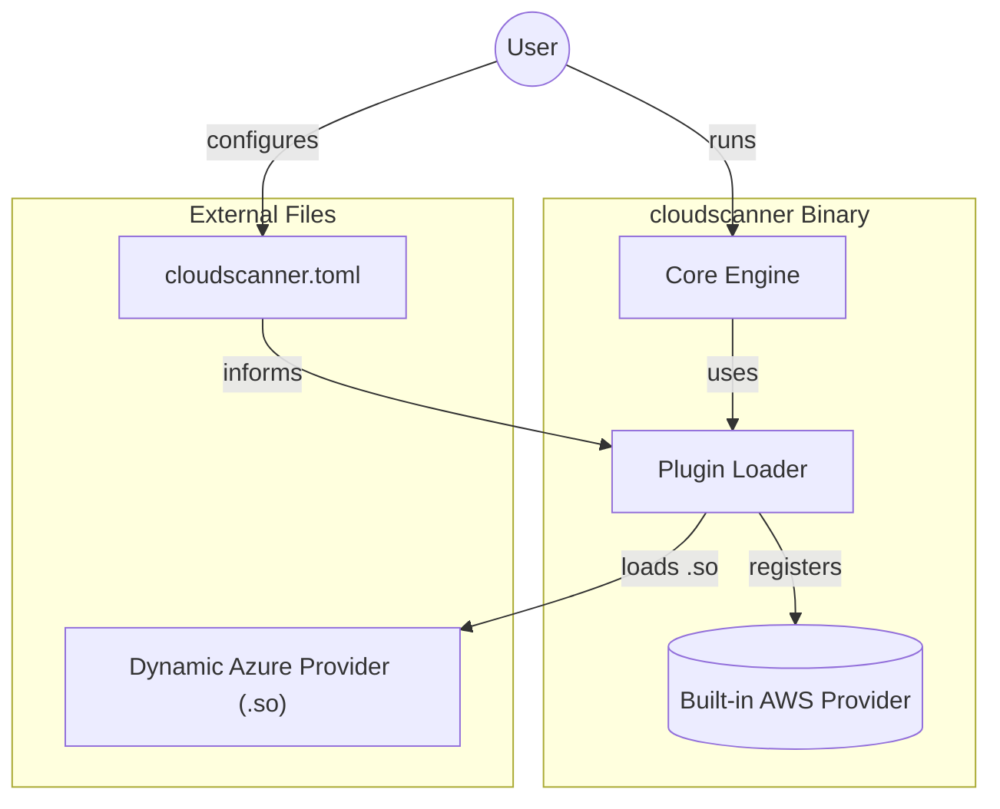

# TRD-001: Provider as a Plugin

## 1. Status

**Draft**

## 2. Context

The core `cloudscanner` application needs a way to support a wide and growing range of cloud providers without requiring recompilation for each new addition. A monolithic architecture where all provider logic is compiled into the main binary becomes difficult to maintain, extend, and deploy. We need a flexible, decoupled architecture that allows for independent development and deployment of provider-specific logic.

## 3. Decision

Cloud provider integration will follow a hybrid model that supports both dynamic plugins and statically compiled "built-in" providers.

1.  **Dynamic Plugins (Default for Extensibility):** Third-party or custom providers are implemented as self-contained, dynamically loadable libraries. This allows for near-infinite extensibility without modifying the core application.

2.  **Static Loading (Bundled Providers for Convenience):** Official, core providers (like AWS, GCP, Azure) are included directly in the `cloudscanner` binary at compile time. They are only initialized if a corresponding configuration is found, providing the convenience of a single-file deployment for most users.

This hybrid approach provides the best of both worlds: the out-of-the-box convenience of a single binary and the unlimited extensibility of a dynamic plugin system.

## 4. Consequences

### 4.1. Advantages

*   **Extensibility:** New providers can be added simply by creating a new plugin.
*   **Robustness & Safety:** A versioned ABI prevents crashes from mismatched plugins. Task cancellation prevents runaway processes, and structured remediation with dry-run support enhances operational safety.
*   **Performance & Memory Safety:** The architecture is designed to accommodate future performance enhancements like streaming discovery.
*   **Deployment Flexibility:** The solution can be deployed as a single batteries-included binary or a lean core with external plugins, and is compatible with serverless environments.

### 4.2. Disadvantages

*   **ABI Complexity:** Implementing a sophisticated interface with versioning, callbacks, and structured data across a C ABI boundary is complex and requires rigorous engineering.
*   **Larger Binary Size:** The statically-linked binary will be larger due to the inclusion of the bundled provider code.

## 5. Technical Implementation: The Plugin System

To ensure long-term stability and compatibility, a stable C-style Application Binary Interface (ABI) is required. This ABI is the contract that both statically and dynamically loaded providers must adhere to.

### 5.1. The Loading Process

1.  **Probe Plugin:** The engine loads the library (statically or dynamically) and calls `_cloudscanner_provider_info()` to get an `Info` struct.
2.  **Version Check:** The engine compares the plugin's `api_version` with its own. If they are not compatible, the plugin is rejected.
3.  **Initialization:** If compatible, the engine calls `_cloudscanner_provider_init()` to get the `Provider` instance and proceeds with configuration and execution.

### 5.2. Build and Deployment Targets

*   **Standard CLI Build:** The default build, leveraging the full hybrid model. Ideal for local use and CI/CD.
*   **Serverless Static Build:** A single, self-contained executable with dynamic loading disabled, designed for read-only environments like AWS Lambda.

### 5.3. The Enterprise-Grade Plugin Interface

To create a truly robust and production-ready system, the plugin interface must go beyond simple discovery. It must be designed for safety, control, and performance.

*   **Versioning:** The ABI will be explicitly versioned to prevent compatibility issues.
*   **Task Cancellation:** Long-running tasks like discovery must be cancellable by the core engine.
*   **Structured Data:** Moving from simple strings to actions and results makes the interface more powerful and less error-prone.

### 5.4. Example Provider API Contract (`cloudscanner-api` crate)

The `cloudscanner-api` crate defines the shared data structures and the core `Provider` trait that plugins must implement.

```rust
// In cloudscanner-api crate

/// The primary trait defining the functionality of a provider plugin.
pub trait Provider {
    // ... other methods like name(), configure(), etc. ...

    /// Discovers assets and returns them as a collection.
    /// The `is_cancelled` function should be polled periodically to allow for graceful termination.
    fn discover_assets(
        &self,
        services: &[&str],
        is_cancelled: &dyn Fn() -> bool,
    ) -> Result<Vec<Asset>, String>;

    // ... other methods like remediate_asset(), etc. ...
}

// ABI-stable entry points exposed by the plugin .so/.dll file

#[no_mangle]
pub extern "C" fn _cloudscanner_provider_info() -> PluginInfo { /* ... */ }

#[no_mangle]
pub extern "C" fn _cloudscanner_provider_init() -> *mut dyn Provider {
    Box::into_raw(Box::new(MyCloudProvider::new()))
}
```

### 5.5. Asset Discovery Models: PoC and Long-Term Vision

#### 5.5.1. PoC Implementation: "Collect-Then-Return"

For the Proof of Concept, we will use a straightforward "Collect-Then-Return" model.

*   **How it works:** The `discover_assets` function collects all found assets into a vector (e.g., `Vec<Asset>`) and returns the entire collection to the core engine at once.
*   **Advantages:** This approach is simple to implement for both the core engine and plugin developers, making it ideal for the PoC.
*   **Limitations:** The memory required grows linearly with the number of discovered resources. This is acceptable for the PoC scope but can be problematic for massive-scale environments.

#### 5.5.2. Long-Term Vision: Streaming-First Discovery

To handle enterprise-scale environments with millions of assets, the plugin ABI will be extended to support a "Streaming-First" discovery model as an advanced, optional feature.

*   **How it will work:** A provider could implement a `discover_assets_streaming` method that accepts a callback function (e.g., `on_asset`). Instead of collecting assets, the provider would invoke the callback for each asset as it is discovered.
*   **Advantages:** This design has a minimal and constant memory footprint, regardless of the number of assets, making it highly scalable. It also allows the policy engine to evaluate assets in real-time as they are found.
*   **Decision:** This more complex implementation is explicitly **deferred** to a post-PoC phase to ensure focus remains on delivering the core requirements.

## 6. Questions and Mitigations

| Question | Proposed Mitigation |
| :--- | :--- |
| **How do we handle dependency conflicts between plugins?** (e.g., two plugins link against different versions of OpenSSL) | **Mitigation:** For the PoC, plugins will be encouraged to use pure Rust dependencies where possible. For system dependencies, this remains a risk. **Post-PoC**, the long-term solution is to explore running plugins in separate processes or using a WebAssembly (WASM) runtime, which provides a fully sandboxed environment. |
| **What is the security model for loading dynamic plugins?** How do we prevent a malicious plugin from compromising the core engine? | **Mitigation:** For the PoC, plugins are considered trusted and must be placed in a protected, admin-controlled directory. **Post-PoC**, we will implement a code-signing requirement for plugins to be loaded, ensuring they originate from a trusted publisher. A capabilities-based security model, where plugins declare required permissions (e.g., "network access," "file system access") at load time, will also be investigated. |
| **How will ABI versioning be managed to prevent subtle bugs?** What exactly makes an API version "compatible"? | **Mitigation:** We will use Semantic Versioning (`MAJOR.MINOR.PATCH`). Compatibility is defined as a matching `MAJOR` version. The Core Engine and a plugin must have the same major version to be considered compatible. The `PluginInfo` struct returned by the plugin will contain its ABI version, which the loader will check against its own. Any `MAJOR` version mismatch will prevent the plugin from being loaded. |

## 7. Diagrams

### 7.1. System Diagram: Hybrid Plugin Model

This diagram shows how both statically-linked (built-in) and dynamically-loaded plugins integrate with the core engine.



### 7.2. Component Diagram: Plugin Loader

This diagram details the internal components of the Plugin Loader and its interaction with the plugin registry.

```mermaid
componentDiagram
    package "Core Engine" {
        ["Discovery Engine"]
        package "Plugin Loader" {
            ["Loader"]
            ["Registry"]
            ["Version Checker"]
        }
    }

    ["Discovery Engine"] ..> ["Loader"] : "request providers"
    ["Loader"] ..> ["Registry"] : "get registered providers"
    ["Loader"] ..> ["Version Checker"] : "validate version"
    ["Loader"] ..> ["Dynamic Plugin (.so)"] : "dlopen()"
```

### 7.3. Sequence Diagram: Dynamic Plugin Loading

This sequence illustrates the steps the Core Engine takes to load, version-check, and initialize a dynamic provider plugin.

```mermaid
sequenceDiagram
    participant CoreEngine
    participant PluginLoader
    participant DynamicPlugin as "libprovider_azure.so"

    CoreEngine->>PluginLoader: "load_providers()"
    activate PluginLoader

    PluginLoader->>DynamicPlugin: "dlopen() / Load Library"
    PluginLoader->>DynamicPlugin: "_cloudscanner_provider_info()"
    activate DynamicPlugin
    DynamicPlugin-->>PluginLoader: "return PluginInfo { api_version: &quot;1.0.0&quot; }"
    deactivate DynamicPlugin

    PluginLoader->>PluginLoader: "Check if engine_version matches plugin_version"

    alt Version Match
        PluginLoader->>DynamicPlugin: "_cloudscanner_provider_init()"
        activate DynamicPlugin
        DynamicPlugin-->>PluginLoader: "return *mut dyn Provider"
        deactivate DynamicPlugin
        PluginLoader->>CoreEngine: "return [AzureProvider]"
    else Version Mismatch
        PluginLoader-->>CoreEngine: "return error &quot;Version mismatch&quot;"
    end

    deactivate PluginLoader
```

## 8. Reference

This decision is documented in the main technical specification: [CLOUDSCANNER_TECHNICAL_SPECIFICATION.md#2.2.-Dynamic-Provider-Plugin-System](./CLOUDSCANNER_TECHNICAL_SPECIFICATION.md#2.2.-Dynamic-Provider-Plugin-System)

