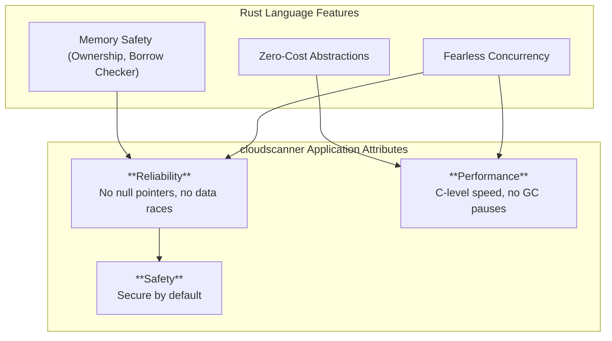
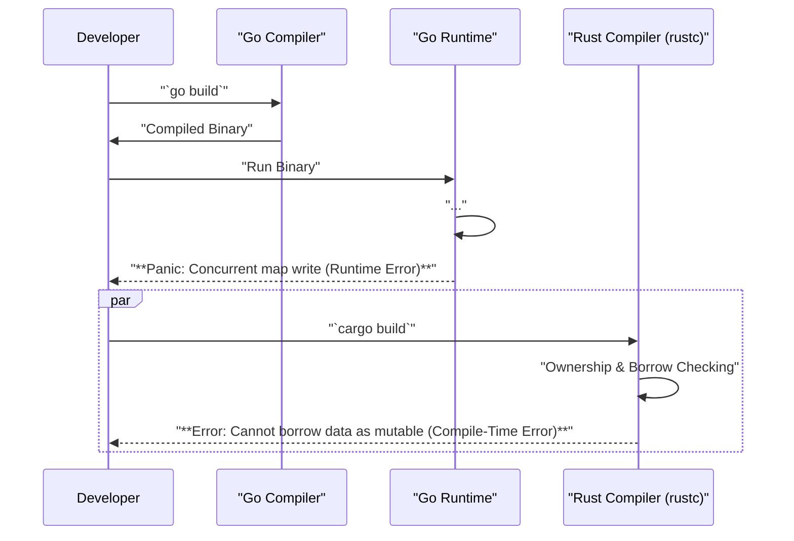

# TRD-002: Language Choice - Rust

## 1. Status

**Decided**

## 2. Context

A foundational decision for `cloudscanner` is the choice of programming language. The previous generation was written in Go. While Go is a capable language, the next generation of the platform has requirements for higher performance, stricter safety guarantees, and more predictable resource utilization, especially for a highly concurrent scanning engine.

## 3. Decision

`cloudscanner` will be built from the ground up in Rust.

## 4. Consequences

### 4.1. Advantages

*   **Memory Safety & Fearless Concurrency:** Rust's ownership model and borrow checker eliminate entire classes of concurrency-related bugs and memory safety issues (e.g., null pointer dereferences, data races) at compile time. This is critical for building a fast and safe concurrent scanning engine.
*   **Performance:** Rust offers C-level performance with high-level abstractions, which is essential for processing large volumes of data from cloud APIs efficiently.
*   **No Garbage Collector:** The absence of a garbage collector (GC) means more predictable latency and resource consumption, which is beneficial for a performance-critical application.
*   **Reliable Single-Binary Deployment:** Rust compiles to a single, statically-linked native binary with no external runtime dependencies. This simplifies deployment across all major platforms and in containerized environments.
*   **Rich Ecosystem:** The Rust ecosystem (Cargo and crates.io) provides high-quality libraries for asynchronous I/O (`tokio`), observability (`tracing`), and more.

### 4.2. Disadvantages

*   **Steeper Learning Curve:** Rust has a steeper learning curve compared to Go, which may impact developer onboarding and initial development velocity.
*   **Compilation Time:** Rust compilation times can be longer than Go's.
*   **Verbosity:** In some cases, Rust code can be more verbose than Go, especially around error handling and lifetimes.

### 4.3. Go vs. Rust: A Comparative Analysis

While the previous version of `cloudlist` was successful in Go, the decision to migrate to Rust is based on key technical trade-offs where Rust offers a distinct advantage for this specific use case.

| Aspect                | Go                                                                           | Rust                                                                                  | Advantage for `cloudscanner`                                                           |
| :-------------------- | :--------------------------------------------------------------------------- | :------------------------------------------------------------------------------------ | :------------------------------------------------------------------------------------- |
| **Speed & Performance** | Fast, but with GC pauses that can introduce latency spikes.                   | C-level performance with no GC. Sustained, predictable speed.                         | **Rust**. Predictable performance is critical for a scanning engine.                      |
| **Memory Usage**      | Generally higher due to the GC runtime.                                      | Minimal memory footprint, with manual-like control over memory allocation and lifetimes. | **Rust**. Lower memory usage is crucial when processing millions of assets.               |
| **Concurrency Model** | Goroutines and channels are easy to use but the risk of data races exists.     | Ownership model and borrow checker eliminate data races at compile time.              | **Rust**. Guarantees thread safety, which is essential for a highly concurrent scanner.     |
| **Binary File Size**  | Produces a single, statically-linked binary, but includes the Go runtime.      | Produces a single, statically-linked binary with no runtime overhead.                   | **Rust**. Binaries are typically smaller, leading to more efficient distribution.        |

**Summary of Comparison:**

*   **Go** excels in developer velocity and simplicity, making it excellent for general-purpose network services.
*   **Rust** excels in performance-critical applications where safety, resource control, and predictable speed are paramount.

For a security tool like `cloudscanner`, which must be both fast and absolutely reliable while handling large amounts of data, the guarantees provided by Rust justify the steeper learning curve.

## 5. Questions and Mitigations

| Question | Proposed Mitigation |
| :--- | :--- |
| **How will the "steeper learning curve" be managed to avoid project delays?** | **Mitigation:** A multi-faceted approach will be adopted: 1) Prioritize hiring at least one senior developer with strong Rust experience to anchor the team. 2) Allocate dedicated weekly hours for training and pair programming. 3) Begin with less complex components to allow the team to build momentum and familiarity with Rust's idioms. 4) Leverage Rust's excellent compiler errors and community resources as learning tools. |
| **How will the impact of longer compilation times on developer productivity be minimized?** | **Mitigation:** 1) Utilize `sccache` in CI and on developer machines to share compilation artifacts. 2) Invest in high-performance CI runners with ample RAM and CPU cores. 3) Promote the use of `cargo check` and `clippy` for rapid, pre-compilation feedback loops. 4) Structure the project into smaller, loosely-coupled crates to maximize the effectiveness of incremental builds. |
| **Is the Rust ecosystem (specifically cloud SDKs) mature enough for our needs?** | **Mitigation:** This is a valid risk that will be addressed during Phase 1 of the PoC. We will explicitly evaluate the maturity and completeness of the official AWS and GCP Rust SDKs for the services we need (e.g., EC2, S3, IAM). A contingency plan will be to allocate time for either contributing necessary features upstream to the SDKs or developing a lightweight wrapper using the raw REST APIs for any missing functionality. |

## 6. Diagrams

### 6.1. System Diagram: The Three Pillars of `cloudscanner`

This diagram illustrates how Rust's core features provide the foundation for the key attributes of the `cloudscanner` application.



### 6.2. Sequence Diagram: Shifting Bug Detection Left

This diagram contrasts the development cycle in a garbage-collected language like Go with Rust, highlighting how Rust's compiler catches entire classes of bugs before the code is ever run.



### 6.3. Use Case Diagram: Safe Concurrent Scanning

This diagram shows how Rust's safety guarantees apply directly to the primary use case of scanning multiple cloud services in parallel.

```mermaid
graph TD
    subgraph "Core Engine"
        CE["Discovery Engine"]
    end

    subgraph "Concurrent Scanners (Threads)"
        direction LR
        T1["Scanner Thread 1 (AWS EC2)"]
        T2["Scanner Thread 2 (AWS S3)"]
        T3["Scanner Thread 3 (AWS IAM)"]
    end

    subgraph "Shared Data"
        AssetGraph["Asset Graph (Mutex<Graph>)"]
    end
    
    CE -- "spawns" --> T1
    CE -- "spawns" --> T2
    CE -- "spawns" --> T3

    T1 -- "Writes to<br/>(Compile-time lock enforcement)" --> AssetGraph
    T2 -- "Writes to<br/>(Compile-time lock enforcement)" --> AssetGraph
    T3 -- "Writes to<br/>(Compile-time lock enforcement)" --> AssetGraph

    note right of AssetGraph
        "**Data Race Freedom**<br/>The Rust compiler *guarantees* that<br/>concurrent writes to the graph are<br/>impossible without a lock. This prevents<br/>a whole class of subtle, hard-to-debug bugs."
    end
```

## 7. Reference

This decision is referenced in the main technical specification: [CLOUDSCANNER_TECHNICAL_SPECIFICATION.md#1.1.-Language-Justification:-Rust](./CLOUDSCANNER_TECHNICAL_SPECIFICATION.md#1.1.-Language-Justification:-Rust)

