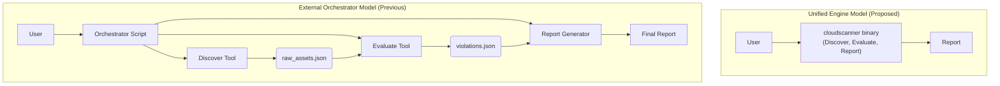
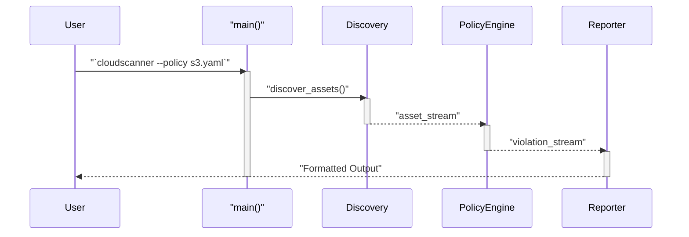

# TRD-003: Unified Engine Architecture

## 1. Status

**Decided**

## 2. Context

The previous generation of the tool relied on an external orchestrator model. While this approach offered some flexibility, it also introduced significant operational complexity, multiple potential points of failure, and a disjointed user experience. Managing separate components for discovery, evaluation, and remediation is cumbersome and inefficient.

## 3. Decision

`cloudscanner` will be architected as a single, cohesive, and powerful binary that manages the entire asset management lifecycle internally. The core workflow is defined as a unified pipeline:

**Discover -> Evaluate -> Remediate**

This integrated approach rejects the previous external orchestrator model in favor of a streamlined, all-in-one solution.

### 3.1. Discovery-Only Mode

To maintain the utility of the original `cloudlist` tool for pure asset inventory, the engine will support a **Discovery-Only Mode**.

*   **Trigger:** This mode will be activated by default if the user does not provide a policy configuration (e.g., via a `--policy-file` flag).
*   **Workflow:** In this mode, the "Evaluate" and "Remediate" stages of the pipeline are bypassed. The workflow is reduced to:
    **Discover -> Report**
*   **Output:** The application will output the discovered assets directly in a user-specified format (e.g., JSON, list), providing a simple and efficient way to perform cloud asset inventory.

This ensures that the core discovery functionality remains a first-class feature, independent of the policy engine.

## 4. Consequences

### 4.1. Advantages

*   **Streamlined User Experience:** The entire workflow can be invoked with a single command and configured via a single file, dramatically simplifying operation.
*   **Simplified Deployment:** A single, self-contained binary is easy to deploy and manage across different environments (laptops, CI/CD, containers).
*   **Tighter Integration & Performance:** Components can pass data in-memory (e.g., from the Discovery Engine to the Policy Engine) without the overhead of serialization or intermediate storage, leading to significant performance gains.
*   **Reduced Complexity:** Eliminates the need for external scripting, cron jobs, or other tools to glue the different stages of the process together.
*   **Dual-Purpose Utility:** The tool can function as both a simple asset discovery tool and a full policy and remediation engine, depending on the user's command-line arguments.

### 4.2. Disadvantages

*   **Monolithic Nature:** The application is more monolithic compared to a microservice-style architecture. However, this is a deliberate trade-off for operational simplicity and is mitigated by the modular, plugin-based design for providers.
*   **Single Point of Failure:** As a single process, a crash in one component could halt the entire workflow. This will be mitigated through robust error handling and the inherent stability provided by Rust.

## 5. Questions and Mitigations

| Question | Proposed Mitigation |
| :--- | :--- |
| **How do we prevent feature bloat in the single binary?** Won't adding more functionality make it unwieldy? | **Mitigation:** A disciplined, modular approach is key. The core binary will remain lean, containing only the essential engine components (loader, discovery, policy, reporter). All provider-specific logic will be in plugins (TRD-001). Future complex features, such as a web UI or a historical database, will be developed as separate, communicating processes, not compiled into the core `cloudscanner` binary. |
| **If the entire workflow is in one process, how can we ensure responsiveness for long-running scans?** | **Mitigation:** The engine will be built on an asynchronous, multi-threaded foundation using Tokio. Discovery for different providers and services will run in parallel. For large-scale data processing, a streaming model will be used (as outlined in TRD-001) so that evaluation can begin *as* assets are discovered, not after a long collection phase. This ensures the application remains responsive and provides continuous feedback (TRD-012). |
| **Does a unified engine limit our ability to scale different parts of the system independently?** (e.g., what if discovery is much more resource-intensive than evaluation?) | **Mitigation:** For the vast majority of use cases, a single binary is sufficient and simpler. For extreme-scale scenarios, the unified engine can still be scaled horizontally by running multiple instances of `cloudscanner` with different configurations (e.g., one instance per cloud provider or region). This "shared-nothing" horizontal scaling is simple to implement with standard container orchestrators like Kubernetes. |

## 6. Diagrams

### 6.1. System Diagram: The Unified Engine vs. External Orchestrator

This diagram contrasts the simplicity of the proposed unified model with the complexity of the previous, externally orchestrated model.



### 6.2. Component Diagram: Internal Data Flow

This diagram shows the high-level components within the single binary and how data flows between them in memory.

```mermaid
componentDiagram
    package "cloudscanner Unified Engine" {
        ["CLI Parser"] as CLI
        ["Config Loader"] as Config
        ["Discovery Engine"] as Discover
        ["Policy Engine"] as Evaluate
        ["Reporter"]

        CLI ..> Config
        Config ..> Discover
        Discover ..> Evaluate : "in-memory stream of Assets"
        Evaluate ..> Reporter : "in-memory stream of Violations"
    }
```

### 6.3. Sequence Diagram: Unified Workflow

This sequence illustrates the end-to-end workflow happening within a single process, from user command to final report.



## 7. Reference

This decision is a core principle outlined in the main technical specification: [CLOUDSCANNER_TECHNICAL_SPECIFICATION.md#1.2.-Architectural-Vision:-The-Unified-Engine](./CLOUDSCANNER_TECHNICAL_SPECIFICATION.md#1.2.-Architectural-Vision:-The-Unified-Engine)

