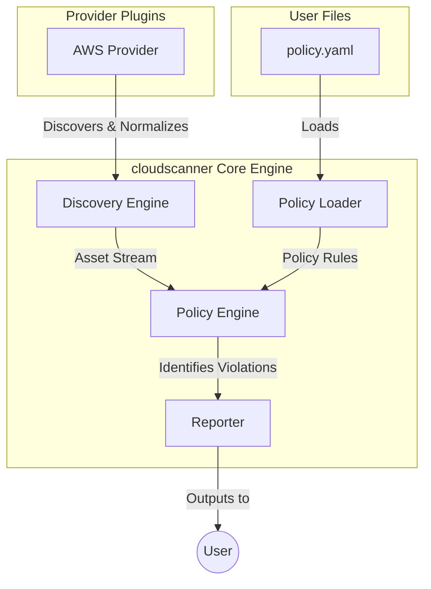

# TRD-004: Human-Readable Policy Engine

## 1. Status

**Decided**

## 2. Context

To effectively manage and secure cloud assets, a powerful and expressive policy engine is required. The complexity of writing policies in a full-featured programming language like Rego (from the OPA/Gatekeeper ecosystem) can be a significant barrier to entry. For many common security and compliance checks, a simpler, more accessible format is desirable.

## 3. Decision

`cloudscanner` will implement its own lightweight, human-readable policy engine where policies are defined in simple YAML files. The engine will focus on ease of use and expressiveness for common asset-based security checks, rather than trying to be a general-purpose policy language.

This decision deliberately avoids adopting a more complex, external policy engine like OPA/Rego for the initial implementation, prioritizing simplicity and a streamlined user experience.

## 4. Consequences

### 4.1. Advantages

*   **Accessibility:** YAML is a widely understood and human-readable format. Writing policies will be intuitive for security engineers, DevOps teams, and even less technical stakeholders.
*   **Low Barrier to Entry:** Users will not need to learn a new, complex policy language like Rego to start writing effective policies.
*   **Self-Contained:** The policy engine is built directly into the `cloudscanner` binary, requiring no external dependencies or services.
*   **Tight Integration:** Policies can be designed to directly and efficiently query the `Asset` data model produced by the Discovery Engine.

### 4.2. Disadvantages

*   **Less Powerful than Rego:** This custom engine will not be as powerful or flexible as a general-purpose engine like OPA. It will be optimized for attribute-based checks on cloud assets, not for complex, logic-heavy policies.
*   **No Existing Ecosystem:** Unlike OPA, there is no pre-existing community or library of policies to draw from. All policies must be written from scratch.
*   **Potential for Reinventing the Wheel:** As the engine becomes more complex, there is a risk of gradually reinventing features already present in more mature solutions.

## 5. Use Cases & Example Policies

This section provides concrete examples of how the YAML-based policy engine can be used to enforce common security and compliance controls in an AWS environment. The policy engine's design philosophy is to keep the rules simple (`field: value`) and push complex logic into the provider plugins. The provider is responsible for inspecting a resource and populating the `Asset`'s `metadata` with clear, boolean-like flags for the policy engine to check.

### 5.1. Use Cases

The policy engine is designed for straightforward, attribute-based checks, such as:
*   **Identifying Public Exposure:** Flagging any resource (S3 buckets, EC2 instances) that is publicly accessible.
*   **Enforcing Tagging Standards:** Ensuring that all resources are tagged with required labels like `owner` or `project`.
*   **Detecting Unencrypted Resources:** Identifying storage volumes (like EBS) that are not encrypted at rest.

### 5.2. Example Policy File: `aws-security-policies.yaml`

A single policy file can contain multiple policies. The engine evaluates all of them against the discovered assets.

```yaml
policies:
  - id: s3-public-read-prohibited
    name: "Public S3 Buckets Prohibited"
    description: "This policy flags any S3 bucket that is publicly accessible."
    # The AWS provider sets the 'metadata.is_public' field to "true" if a bucket is public.
    rules:
      - field: asset_type
        value: "s3_bucket"
      - field: metadata.is_public
        value: "true"

  - id: ec2-unrestricted-ssh
    name: "EC2 Instances with Unrestricted SSH Access"
    description: "Flags any EC2 instance with a security group allowing SSH from anywhere (0.0.0.0/0)."
    # The provider analyzes security groups and sets a simple flag.
    rules:
      - field: asset_type
        value: "ec2_instance"
      - field: metadata.ssh_open_to_world
        value: "true"

  - id: ec2-missing-owner-tag
    name: "EC2 Instances Missing 'owner' Tag"
    description: "Flags any EC2 instance that does not have the 'owner' tag."
    # The provider checks for the existence of the 'owner' tag and sets a flag.
    rules:
      - field: asset_type
        value: "ec2_instance"
      - field: metadata.has_owner_tag
        value: "false"

  - id: ebs-unencrypted-volume
    name: "Unencrypted EBS Volumes"
    description: "Flags any EBS volume that is not encrypted."
    # The provider directly exposes the encryption status.
    rules:
      - field: asset_type
        value: "ebs_volume"
      - field: metadata.encrypted
        value: "false"

```

## 6. Questions and Mitigations

| Question | Proposed Mitigation |
| :--- | :--- |
| **What happens when we need more complex logic (e.g., conditionals, loops)?** Won't we inevitably outgrow this simple YAML format? | **Mitigation:** This is a deliberate design constraint. The core philosophy is to keep the policy logic simple and push complexity into the provider plugins. If a check requires complex logic (e.g., analyzing the contents of a policy document), the provider should perform that analysis and expose a simple boolean result (e.g., `metadata.has_risky_iam_policy: "true"`). This keeps policies readable and avoids reinventing a full programming language in YAML. If a user truly needs more power, we will provide an "escape hatch" to call out to an external script or a WASM module for evaluation. |
| **How will we prevent the `metadata` fields from becoming an inconsistent mess across different providers?** | **Mitigation:** We will establish a **Standardized Metadata Vocabulary**—a documented, conventional set of field names for common attributes (e.g., `is_public`, `is_encrypted`, `has_owner_tag`). While providers can add their own custom metadata, they will be strongly encouraged to adhere to the standard vocabulary for common checks. The core `cloudscanner` documentation will include a registry of these standard fields. |
| **How do we handle policies that need to evaluate relationships between assets (e.g., "find all EC2 instances with a public IP that also have an IAM role with admin privileges")?** | **Mitigation:** The simple key-value rule engine is not designed for this. This is the primary use case for the **Asset Relationship Graph** (TRD-010). Post-PoC, the policy engine will be extended to allow graph-based queries. A policy might look like: `graph.neighbors(asset, {type: 'iam_role', properties: {is_admin: true}}).exists()`. For the PoC, we will focus only on single-asset attribute checks. |

## 7. Diagrams

### 7.1. System Diagram: Policy Evaluation Flow

This diagram shows the journey of an asset from discovery to being evaluated against a policy.



### 7.2. Component Diagram: Inside the Policy Engine

This diagram details the internal components of the Policy Engine.

```mermaid
componentDiagram
    package "Policy Engine" {
        ["YAML Parser"]
        ["Rule Evaluator"]
        ["Asset Matcher"]
    }
    ["YAML Parser"] ..> ["Rule Evaluator"] : "provides rules"
    ["Rule Evaluator"] ..> ["Asset Matcher"] : "evaluates against"
    ["Asset Matcher"] ..> ["Asset Stream"] : "reads from"
```

### 7.3. Sequence Diagram: Evaluating a Single Asset

This sequence illustrates the step-by-step process of the Policy Engine checking one asset against a set of loaded rules.

```mermaid
sequenceDiagram
    participant AssetStream
    participant PolicyEngine
    participant RuleSet
    participant ViolationStore

    AssetStream->>PolicyEngine: "asset(S3_Bucket_A)"
    activate PolicyEngine
    PolicyEngine->>RuleSet: "get_rules(asset_type=&quot;s3_bucket&quot;)"
    activate RuleSet
    RuleSet-->>PolicyEngine: "[s3_public_read_prohibited]"
    deactivate RuleSet

    loop For Each Rule
        PolicyEngine->>PolicyEngine: "evaluate(asset.metadata.is_public == &quot;true&quot;)"
        alt Rule Matches (Violation)
            PolicyEngine->>ViolationStore: "add_violation(asset, rule)"
        end
    end
    deactivate PolicyEngine
```

## 8. Reference

This decision is a core component of the product vision and is referenced in the main technical specification: [CLOUDSCANNER_TECHNICAL_SPECIFICATION.md#2.3.-Lightweight-Policy-Engine](./CLOUDSCANNER_TECHNICAL_SPECIFICATION.md#2.3.-Lightweight-Policy-Engine)

