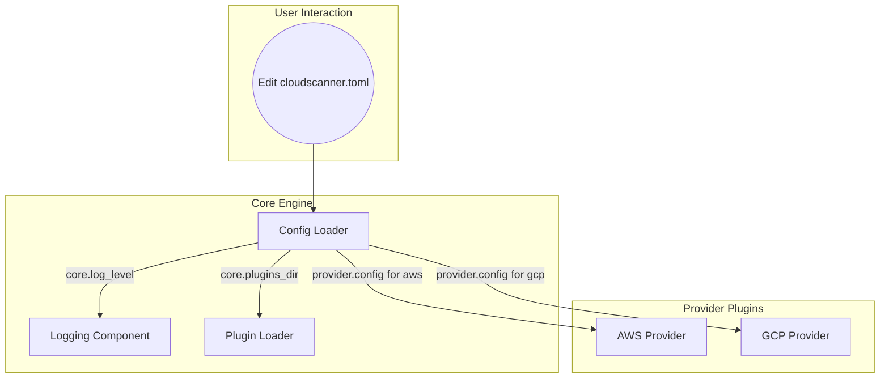
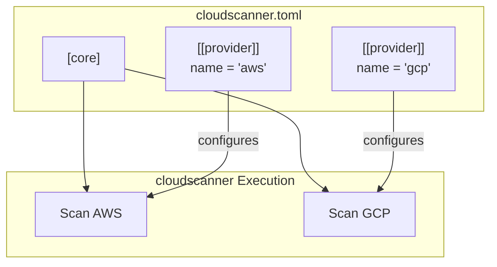

# TRD-005: TOML-Based Configuration

## 1. Status

**Decided**

## 2. Context

The `cloudscanner` application requires a flexible and user-friendly method for configuring its core settings and the various provider plugins it manages. Configuration needs to be clearly structured, easy to edit, and capable of handling both global parameters (like logging) and provider-specific details (like API credentials, regions, or project IDs).

## 3. Decision

All application and provider configuration will be managed through a single TOML file named `cloudscanner.toml`. TOML (Tom's Obvious, Minimal Language) is chosen for its clear, explicit semantics and excellent human readability, which aligns with the project's goal of providing a streamlined and intuitive user experience.

The configuration structure will consist of a main `[core]` section for global settings and an array of `[[provider]]` tables for defining the configuration for each active provider plugin.

## 4. Consequences

### 4.1. Advantages

*   **Readability:** TOML is designed to be easy for humans to read and write, reducing the risk of configuration errors.
*   **Structured & Explicit:** The format clearly distinguishes between different sections, making it obvious how global settings and provider configurations are separated.
*   **Flexibility:** Using an array of tables (`[[provider]]`) allows users to define multiple configurations for different providers or even multiple instances of the same provider (e.g., scanning different AWS organizations with separate roles).
*   **Standardized:** TOML is a well-established standard with robust and efficient parsing libraries available in the Rust ecosystem (e.g., the `toml` crate).

### 4.2. Disadvantages

*   **Verbosity for Lists:** Defining lists of complex objects can be more verbose in TOML than in YAML.
*   **Ecosystem Adoption:** While popular in the Rust ecosystem, TOML is not as universally adopted as YAML or JSON in the broader cloud-native tooling space.

## 5. Example Configuration: `cloudscanner.toml`

This example demonstrates how to configure global settings and multiple providers.

```toml
# Global settings for the cloudscanner core engine
[core]
# Log level can be "debug", "info", "warn", or "error"
log_level = "info"
# Log format can be "text" or "json" for machine-readable output
log_format = "json"
# Optional: Override the default directory for loading dynamic plugins
plugins_dir = "/usr/local/lib/cloudscanner/plugins"

# Provider configurations are defined in an array of tables.
# Each table represents a single provider instance to be loaded.

[[provider]]
# The 'name' must match the name exposed by the provider plugin (e.g., "aws").
name = "aws"
enabled = true

# Provider-specific settings are passed directly to the plugin as a key-value map.
# This example shows a potential configuration for the AWS provider.
[provider.config]
regions = ["us-east-1", "eu-west-1", "ap-southeast-2"]
roles_to_assume = [
  "arn:aws:iam::123456789012:role/CloudlistScannerRole",
  "arn:aws:iam::987654321098:role/CloudlistScannerRole"
]

[[provider]]
name = "gcp"
enabled = true

[provider.config]
project_ids = ["my-gcp-project-1", "my-gcp-project-2"]
# The plugin should resolve the path, including home directory shorthand (~)
credentials_file = "~/.config/gcloud/application_default_credentials.json"

[[provider]]
# This demonstrates a disabled provider, which will be ignored by the engine.
name = "digitalocean"
enabled = false

[provider.config]
# The plugin can be designed to read the token from an environment variable.
api_token_env_var = "DO_API_TOKEN"

```

## 6. Questions and Mitigations

| Question | Proposed Mitigation |
| :--- | :--- |
| **How do we support sensitive values without storing them in the config file?** (e.g., API tokens) | **Mitigation:** The configuration schema will support environment variable expansion. A user can specify a value like `token = "$DO_API_TOKEN"`. The Config Loader will be responsible for interpreting these values and substituting them from the environment at runtime. This provides a secure way to inject secrets without hardcoding them, as detailed in TRD-015. |
| **How will configuration be validated?** How do we provide clear error messages for invalid settings? | **Mitigation:** Configuration loading will be a two-step process. First, the main `cloudscanner.toml` file is parsed. Second, the `[provider.config]` block for each enabled provider is passed to the provider plugin itself for validation. Each plugin is responsible for validating its own configuration and returning a descriptive error message if a required field is missing or has an invalid value (e.g., "Error in AWS provider config: 'regions' must be a list of strings"). |
| **Can a user configure multiple instances of the same provider?** (e.g., to scan two different AWS organizations) | **Mitigation:** Yes, the `[[provider]]` syntax in TOML defines an array of tables. Users can create multiple entries with the same `name`. To distinguish them, a user-defined `id` field will be added, e.g., `id = "aws-org-1"`. The engine will treat `aws-org-1` and `aws-org-2` as two separate provider instances to be run. |

## 7. Diagrams

### 7.1. System Diagram: Configuration Loading Flow

This diagram illustrates how the TOML configuration file is loaded and used to configure the various components of the application.



### 7.2. Use Case Diagram: Multi-Provider Configuration

This diagram shows how the TOML file structure directly maps to the user's goal of configuring multiple cloud providers for a single scan.



### 7.3. Sequence Diagram: Configuration Validation

This sequence details the two-phase validation process, showing how the core engine and the provider plugin collaborate to ensure the configuration is valid.

```mermaid
sequenceDiagram
    participant User
    participant CoreEngine
    participant ConfigLoader
    participant AWS_Plugin

    User->>CoreEngine: "`cloudscanner discover`"
    CoreEngine->>ConfigLoader: "load_config(&quot;cloudscanner.toml&quot;)"
    activate ConfigLoader
    ConfigLoader->>ConfigLoader: "Parse TOML file"
    alt TOML is invalid
        ConfigLoader-->>CoreEngine: "return Error(&quot;Invalid TOML syntax&quot;)"
        CoreEngine-->>User: "Print error and exit"
    end

    ConfigLoader->>AWS_Plugin: "configure(provider.config)"
    activate AWS_Plugin
    AWS_Plugin->>AWS_Plugin: "Validate required fields (e.g., 'regions')"
    alt Config is invalid
        AWS_Plugin-->>ConfigLoader: "return Error(&quot;Missing 'regions' field&quot;)"
        ConfigLoader-->>CoreEngine: "return Error"
        CoreEngine-->>User: "Print provider-specific error and exit"
    else Config is valid
        AWS_Plugin-->>ConfigLoader: "return Ok"
    end
    deactivate AWS_Plugin
    ConfigLoader-->>CoreEngine: "return ValidatedConfig"
    deactivate ConfigLoader
```

## 8. Reference

This decision is a core component of the application's architecture and is referenced in the main technical specification: [poc2.md#3.1.-High-Level-Component-Diagram](./poc2.md#3.1.-High-Level-Component-Diagram)

