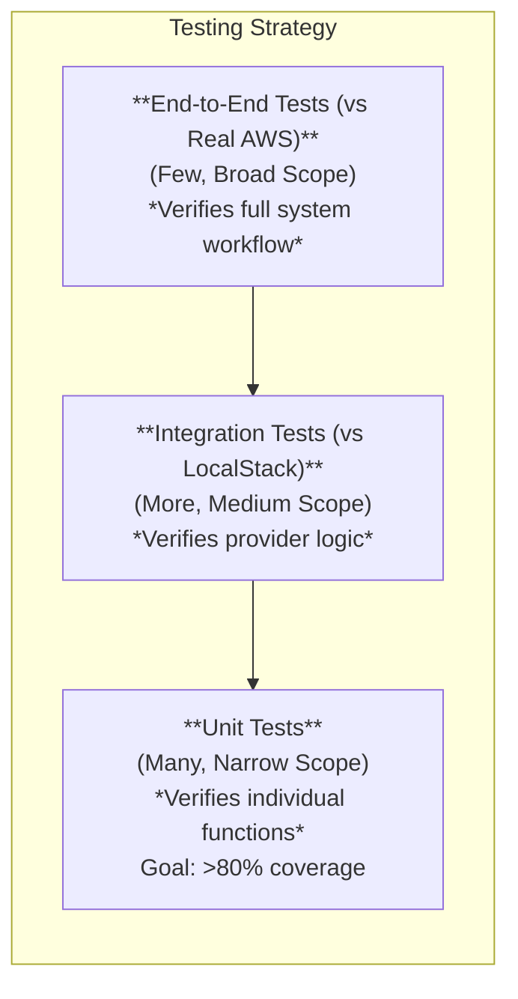

# TRD-008: Measurable Testing Strategy

## 1. Status

**Proposed**

## 2. Context

Technical Requirement TR-8 mandates a "comprehensive testing strategy," but this is too abstract to be actionable. To ensure the reliability and correctness of the `cloudscanner` PoC, we need to define specific, measurable goals for our testing efforts. This provides a clear "definition of done" for quality assurance and gives us confidence that the core architecture is sound.

## 3. Decision

The `cloudscanner` testing strategy will be composed of three distinct layers, each with a mandatory, measurable goal for the PoC.

1.  **Unit Testing:**
    *   **Scope:** Individual functions and components (structs/modules) within the core engine and provider plugins. Logic for parsing, data transformation, and configuration loading are key candidates.
    *   **Method:** Standard `cargo test` framework. Cloud provider SDKs and other external dependencies will be mocked.
    *   **Measurable Goal:** The core engine components (including the Policy Engine, Discovery Engine, and Reporter) **must achieve a minimum of 80% unit test line coverage**.

2.  **Integration Testing:**
    *   **Scope:** The interaction between two or more components, such as the Core Engine and a provider, or a provider and the cloud API.
    *   **Methods:**
        *   **Plugin ABI Testing:** `cargo test` will be used to load a compiled mock plugin and verify the function-calling interface.
        *   **Provider Logic Testing (LocalStack):** For the AWS provider, tests will run against a local AWS cloud environment provided by **LocalStack** in a Docker container. This allows testing API interactions without needing a real AWS account.
    *   **Measurable Goals:**
        *   At least one integration test **must be implemented to verify the Plugin Loader can successfully load and execute a mock provider plugin**.
        *   At least one integration test for the AWS provider **must be implemented to verify S3 bucket discovery using LocalStack**.

3.  **End-to-End (E2E) Testing:**
    *   **Scope:** The entire, compiled `cloudscanner` binary operating in a realistic scenario against a live cloud environment.
    *   **Method:** A test script runs as part of the CI/CD pipeline. It will use infrastructure-as-code to provision resources in a sandboxed AWS account, run `cloudscanner`, and assert the output. This serves as the final validation.
    *   **Measurable Goal:** The PoC **must include at least one end-to-end test that runs in CI**. This test will:
        1.  Create an AWS S3 bucket with public read access.
        2.  Execute the `cloudscanner` binary against the sandbox account with a policy to detect public S3 buckets.
        3.  Assert that the JSON output contains a violation for the created bucket.
        4.  Tear down the created resources.

## 4. Consequences

### 4.1. Advantages

*   **High Confidence:** Provides strong guarantees that the system works as intended, from individual functions to the complete workflow.
*   **Prevents Regressions:** A comprehensive test suite makes it safer and faster to refactor code or add new features.
*   **Clear Development Targets:** The measurable goals give developers a clear target for what constitutes "well-tested" code.
*   **Automated Quality Gate:** The CI-based E2E test acts as an automated quality gate, preventing broken builds from being released.
*   **Cost-Effective and Fast:** Using LocalStack for integration tests provides fast feedback and reduces the cost and complexity associated with real cloud resources.

### 4.2. Disadvantages

*   **Infrastructure Overhead:** Still requires managing a dedicated, sandboxed cloud account for the final E2E tests.
*   **Development Time:** Writing and maintaining high-quality tests across all three layers requires a non-trivial amount of development effort.
*   **CI Complexity:** The CI/CD pipeline becomes more complex, as it needs to manage LocalStack services in addition to real cloud credentials for E2E tests.

## 5. Questions and Mitigations

| Question | Proposed Mitigation |
| :--- | :--- |
| **How can we test provider logic without the cost and flakiness of a real cloud environment?** | **Mitigation:** For testing the logic of cloud providers, particularly AWS, we will use **LocalStack**. LocalStack provides a high-fidelity local emulation of AWS services. This allows us to run integration tests for our provider plugins in CI quickly and cheaply, verifying that our API calls are correct without the overhead of managing real cloud resources for every test run. Full E2E tests against a real sandbox account will still be used for final validation. |
| **Won't the 80% line coverage goal lead to developers writing tests just to meet the metric?** | **Mitigation:** The 80% goal is a guideline, not a dogma. The primary focus during code reviews will be on the *quality* and *intent* of the tests, not just the raw number. We will prioritize testing critical and complex logic paths. The metric serves as a safety net to ensure a baseline level of testing is maintained, not as a replacement for thoughtful test design. |
| **How will we test providers for clouds we don't have a sandbox account for?** | **Mitigation:** For the PoC, we will focus E2E testing on AWS, as it is the primary target. For other providers, we will rely heavily on **contract testing**. The provider plugin will be tested against a mocked version of the Core Engine, and its interaction with the cloud API will be tested using pre-recorded API responses (e.g., using a tool like `vcr`). This ensures the provider logic is correct, even if we cannot run a full E2E test in a live environment. |

## 6. Diagrams

### 6.1. System Diagram: The Testing Pyramid

This diagram visualizes the three layers of the testing strategy, showing the relative scope and volume of tests at each layer.



### 6.2. Component Diagram: Provider Integration Test with LocalStack

This diagram shows how a provider plugin is tested against a local, emulated AWS environment.

```mermaid
componentDiagram
    package "CI/CD Environment (e.g., GitHub Actions)" {
        ["Test Runner"] -- AWS_Plugin : "Executes tests for"
        AWS_Plugin -- LocalStack : "Makes AWS API calls to"
        ["Test Runner"] -- LocalStack : "Starts/Stops"
        [AWS Provider Plugin] as AWS_Plugin
        [LocalStack (Docker)] as LocalStack
    }
```

### 6.3. Component Diagram: E2E Test in CI/CD

This diagram shows the components involved in the automated end-to-end test that runs in the CI/CD pipeline.

```mermaid
componentDiagram
    package "CI/CD Environment (e.g., GitHub Actions)" {
        ["Test Runner"]
        ["Terraform"] as TF
        ["cloudscanner"] as Bin
    }
    package "AWS Sandbox Account" {
        ["S3 Bucket"] as S3
        ["IAM Role"] as IAM
    }

    ["Test Runner"] ..> TF : "apply"
    TF ..> S3 : "create"
    TF ..> IAM : "create role"
    ["Test Runner"] ..> Bin : "run scan"
    Bin ..> S3 : "reads from"
    Bin ..> ["Test Runner"] : "returns JSON output"
    ["Test Runner"] ..> ["Test Runner"] : "Assert output"
    ["Test Runner"] ..> TF : "destroy"
    TF ..> S3 : "delete"
    TF ..> IAM : "delete role"
```

## 7. Reference

This TRD provides the concrete, measurable goals for the high-level requirement defined in: [poc2.md#3.-Technical-Requirements](./poc2.md#3.-Technical-Requirements) (TR-8).
