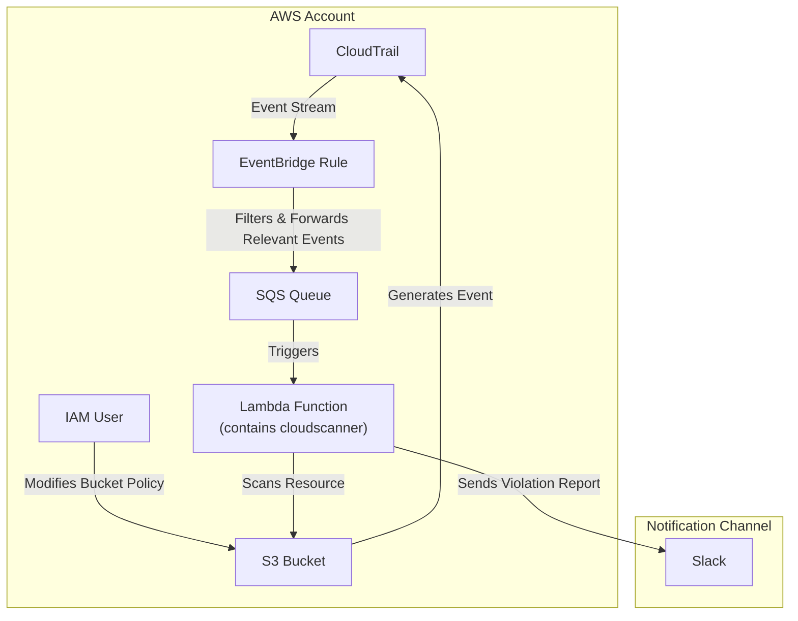
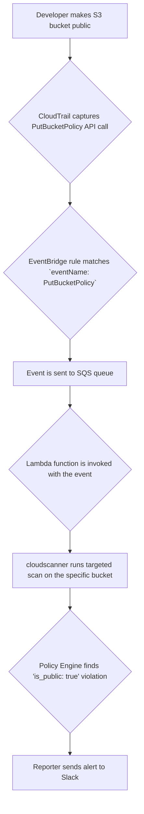
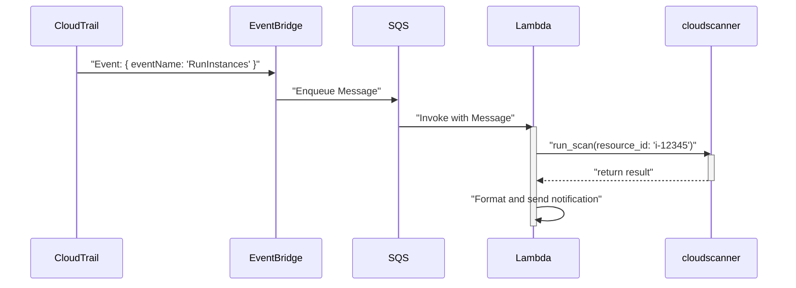

# TRD-009: Event-Driven Discovery for Real-Time Monitoring

## 1. Status

**Proposed**

## 2. Context

The standard "scan-on-demand" model for asset discovery provides a snapshot of the cloud environment at a specific point in time. While essential for periodic inventory and deep analysis, it is a reactive approach. A time gap exists between when a misconfiguration occurs and when the next scan detects it. For a 10x security solution, this gap must be minimized to enable near real-time detection and response.

## 3. Decision

`cloudscanner` will implement a secondary, event-driven discovery mode to complement the full-scan mode. This mode will be designed for serverless execution and will listen to cloud provider event streams to evaluate resources as they are created or modified.

The primary implementation of this architecture will be for AWS, using a combination of CloudTrail, EventBridge, SQS, and Lambda.

### 3.1. Architectural Workflow

1.  **Event Capture (AWS CloudTrail):** All API activity within the AWS account is logged by CloudTrail. This serves as the raw source of truth for all changes.

2.  **Event Filtering (Amazon EventBridge):** An EventBridge rule will be configured to filter the stream of CloudTrail events for specific, security-relevant API calls (e.g., `CreateSecurityGroup`, `PutBucketPolicy`, `RunInstances`). This avoids processing irrelevant events.

3.  **Durable Buffering (Amazon SQS):** Filtered events are sent to an SQS queue. This decouples the filtering from the processing and provides a durable, asynchronous buffer, ensuring that events are not lost if the processing logic fails or needs to be paused.

4.  **Processing (AWS Lambda):** An AWS Lambda function, containing a serverless-optimized build of the `cloudscanner` Rust binary, is triggered by new messages in the SQS queue.
    *   The Lambda function parses the CloudTrail event to identify the resource that was changed.
    *   It invokes the `cloudscanner` engine to perform a targeted discovery and evaluation of only that specific resource.
    *   Policy violations are then sent to the Reporter for immediate notification.

This architecture is highly scalable, cost-effective, and provides near real-time visibility into the security posture of the cloud environment.

## 4. Consequences

### 4.1. Advantages

*   **Real-Time Detection:** Reduces the Mean Time to Detect (MTTD) for misconfigurations from hours to seconds.
*   **Efficiency:** Instead of scanning an entire account, only the changed resources are evaluated, leading to significantly lower computational cost and API usage.
*   **Scalability:** The serverless architecture scales automatically with the volume of events.
*   **Cost-Effective:** Leverages pay-per-use serverless components, making it a cost-effective solution for continuous monitoring.
*   **Proactive Security:** Moves the security posture from reactive to proactive, enabling faster response and remediation.

### 4.2. Disadvantages

*   **Incomplete Picture:** Event-driven discovery only sees what has changed. It does not provide a holistic view of the environment and cannot detect pre-existing misconfigurations. It is a complement to, not a replacement for, full periodic scans.
*   **Configuration Complexity:** Setting up the required cloud infrastructure (CloudTrail, EventBridge, SQS, Lambda) introduces additional configuration complexity compared to a simple CLI tool.
*   **Potential for Missed Events:** If CloudTrail logging is misconfigured or disabled, events will be missed. The system relies on the integrity of the cloud provider's event stream.

## 5. Questions and Mitigations

| Question | Proposed Mitigation |
| :--- | :--- |
| **How do we handle a "thundering herd" problem?** What if a single action (e.g., a script modifying 10,000 S3 bucket policies) generates a massive flood of events? | **Mitigation:** The SQS queue acts as a natural shock absorber. The Lambda function will be configured with a small `batch_size` (e.g., 5-10 events per invocation) and a `concurrency_limit`. This throttles the processing rate, preventing the `cloudscanner` function from overwhelming downstream APIs or incurring a massive cost spike. The queue will simply grow and be processed steadily over time. |
| **How do we handle events for which the resource is not yet fully available?** (Eventual consistency issues) | **Mitigation:** This is a common issue. The Lambda function will include a simple retry mechanism with exponential backoff. If `cloudscanner` is triggered to evaluate a resource but receives a "Not Found" error, it will return an error to the Lambda runtime. The SQS message will then become visible again after a timeout and be re-driven, giving the resource time to propagate through the cloud provider's backend. If it fails after a set number of retries, it will be sent to a Dead-Letter Queue (DLQ) for manual inspection. |
| **How do we deploy and manage the serverless infrastructure?** | **Mitigation:** The entire serverless stack (EventBridge rule, SQS queue, Lambda function) will be defined using an Infrastructure-as-Code (IaC) tool like Terraform or AWS CloudFormation. A separate repository or directory will contain the IaC templates and a deployment script, allowing the event-driven architecture to be deployed and configured in a repeatable, automated fashion. |

## 6. Diagrams

### 6.1. System Diagram: Event-Driven Architecture on AWS

This diagram provides a high-level overview of the components and data flow for the real-time monitoring solution.

### 6.2. Use Case Diagram: Real-Time S3 Bucket Policy Alert

This diagram focuses on the specific use case of detecting and alerting on a newly public S3 bucket.

### 6.3. Sequence Diagram: Processing a Single Event

This sequence details the interaction between the serverless components as a single CloudTrail event is processed.

## 7. Reference

This decision is a core component of the "10x Vision" and is referenced in the main proof of concept document: [poc2.md#4.1.-From-On-Demand-to-Real-Time:-Event-Driven-Discovery](./poc2.md#4.1.-From-On-Demand-to-Real-Time:-Event-Driven-Discovery)

