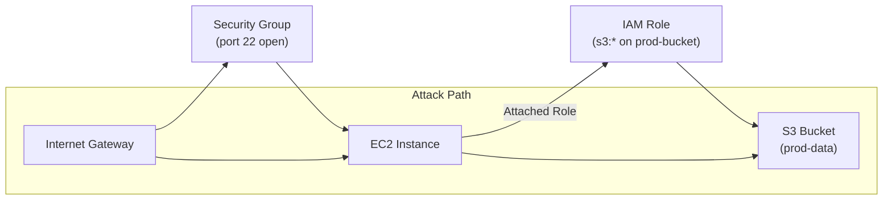

# TRD-010: Asset Relationship Graph

## 1. Status

**Proposed**

## 2. Context

Simply listing assets in isolation is insufficient for understanding actual risk. A public S3 bucket is a finding, but a public S3 bucket that can be reached from an EC2 instance that has an IAM role with access to a production database is a critical threat. To move beyond basic misconfiguration scanning and enable advanced "attack path" analysis, the system must understand not just the assets themselves, but the *relationships between them*.

## 3. Decision

`cloudscanner` will construct and maintain an in-memory, directed graph of all discovered assets and their relationships. This Asset Relationship Graph (ARG) will be a core data structure, enabling a new class of context-aware security analysis.

### 3.1. Graph Implementation

1.  **Graph Library:** The `petgraph` crate will be used for the underlying graph implementation. It is the de-facto standard in the Rust ecosystem, offering a robust and performant API for graph operations.
2.  **Node and Edge Structure:**
    *   **Nodes:** Each node in the graph will represent a single discovered cloud asset (e.g., an EC2 instance, an S3 bucket, an IAM user). The node will store the full `Asset` struct.
    *   **Edges:** Edges will represent the relationship between two assets (e.g., `CONTAINS`, `IS_ATTACHED_TO`, `HAS_ACCESS_TO`).
3.  **Graph Construction:** The Discovery Engine will be responsible for populating the graph. As assets are discovered, the provider plugins will not only return the asset but also a list of its known relationships to other assets.

### 3.2. Graph Output and Serialization

To make the asset graph useful for analysis and visualization, the **Reporter** component must be able to serialize it into a standard format.

1.  **Output Format:** For the PoC, the engine must support exporting the asset graph into the **Graphviz DOT (.dot) format**. This is a widely supported, human-readable format that can be easily converted into an image for visualization.
2.  **Control Mechanism:** A new command-line flag, **`--output-format <format>`**, will be implemented to control the output.
    *   `--output-format json` (default): Will output the traditional list of assets.
    *   `--output-format dot`: Will output the asset relationship graph.

## 4. Consequences

### 4.1. Advantages

*   **Enables Advanced Analysis:** Allows for powerful graph-based queries like "Find all paths from a public-facing asset to a database."
*   **Context-Aware Prioritization:** Moves beyond simple asset lists to provide a true understanding of risk and blast radius.
*   **Powerful Visualization:** The graph can be easily exported and visualized to give security teams a clear map of their cloud environment.

### 4.2. Disadvantages

*   **Increased Memory Usage:** Storing the entire cloud environment as a graph can be memory-intensive for very large accounts.
*   **Increased Complexity:** The logic for building and querying the graph is more complex than simply processing a list of assets.

## 5. Questions and Mitigations

| Question | Proposed Mitigation |
| :--- | :--- |
| **How will we manage the memory consumption for extremely large cloud environments?** | **Mitigation:** For the PoC, the graph will be held entirely in memory, which is sufficient for moderately sized environments. For a full production system, we will investigate several strategies: 1) **Graph Pruning:** Allowing users to configure rules to exclude certain low-value assets or relationships from the graph. 2) **Disk-Based Storage:** Using a lightweight, embedded graph database like `sled` to spill the graph to disk if it exceeds a certain memory threshold. |
| **How are relationships discovered?** Does this make provider plugins much more complex? | **Mitigation:** Initially, relationship discovery will be opportunistic and focus on high-value, easy-to-identify links (e.g., an EC2 instance's attached IAM role, a security group's associated instances). The provider ABI will be extended with an optional function, `discover_relationships()`, so that only capable providers will participate in graph building. This keeps the barrier to entry low for simple providers. |

## 6. Diagrams

### 6.1. System Diagram: Graph Construction Flow

This diagram shows how asset and relationship data flows from providers to build the graph.

```mermaid
graph TD
    subgraph Provider [
        AWS["AWS Provider"]
    ]
    subgraph Engine [
        Discovery["Discovery Engine"]
        Graph["Asset Relationship Graph"]
    ]

    AWS -- "Asset & Relationship Data" --> Discovery
    Discovery -- "Adds Nodes & Edges" --> Graph
```

### 6.2. Component Diagram: Example Asset Graph

This diagram provides a simplified visualization of what the ARG looks like.



## 7. Reference

This decision supports a key market differentiator outlined in the MRD: [MRD2.md#4.-Key-Capabilities-&-Value-Propositions](./MRD2.md#4.-Key-Capabilities-&-Value-Propositions)
