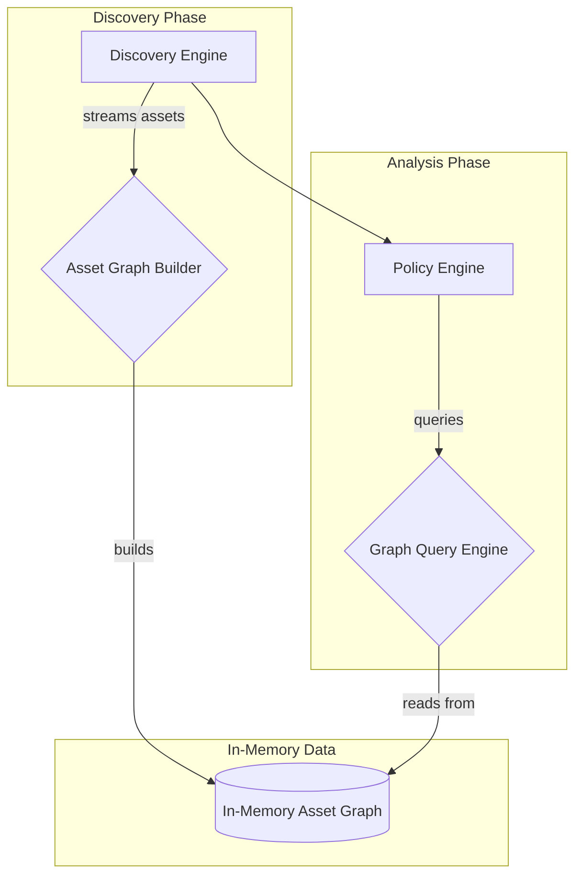
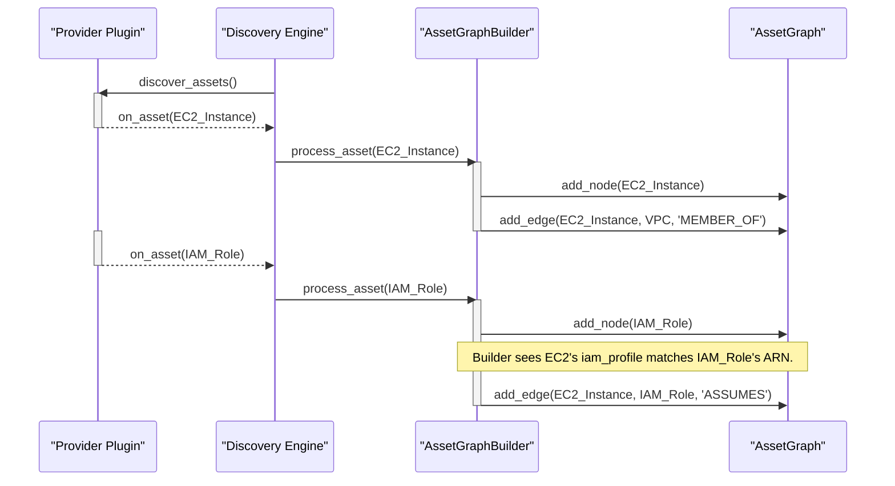

# TRD-010: Asset Relationship Graph for Advanced Analysis

## 1. Status

**Proposed**

## 2. Context

A traditional asset inventory provides a flat list of resources. While useful for simple checks (e.g., "find all public S3 buckets"), this model is fundamentally limited. It cannot answer complex questions about the relationships between resources, which is where the most significant cloud security risks often hide. To understand concepts like blast radius or potential attack paths, we must model the environment as it truly exists: a complex, context-rich graph of interconnected entities.

This moves us from a passive, reactive inventory to a proactive **Asset Intelligence Platform**.

## 3. Decision

`cloudscanner` will construct and maintain an in-memory graph representation of the discovered cloud assets and their critical relationships. Instead of just storing a list of assets, the Discovery Engine will be responsible for identifying and recording the connections between them. This graph is the core data structure that enables advanced analysis.

For the PoC, a suitable in-memory graph library from the Rust ecosystem (e.g., `petgraph`) will be used. The nodes of the graph will be the `Asset` objects, and the edges will represent the relationships.

### 3.1. Key Relationships to Model

The initial implementation will focus on modeling high-impact relationships, such as:

*   **Compute -> Identity:** An EC2 instance and the IAM Role it assumes.
*   **Compute -> Network:** An EC2 instance becomes a node linked to its Security Groups and VPC.
*   **Network -> Rules:** A Security Group and its inbound/outbound rules.
*   **Data -> Access:** An S3 bucket and the Bucket Policy or ACLs that grant access.
*   **Serverless -> Identity:** A Lambda function and its execution Role.

## 4. Detailed Technical Design

To implement the asset graph, we will introduce two new components within the Core Engine: the `AssetGraphBuilder` and the `GraphQueryEngine`.

*   **AssetGraphBuilder:** This component receives the stream of `Asset` objects from the Discovery Engine. It is responsible for upserting each asset as a node in the graph and, crucially, identifying and creating the edges that represent relationships between them. For example, when it receives an EC2 instance asset, it will look for its `security_group_id` in its metadata and create an `ATTACHED_TO` edge pointing to the corresponding Security Group node.

*   **GraphQueryEngine:** This component provides a high-level API for the Policy Engine and other internal components to query the graph. It abstracts the underlying graph library, allowing for queries like `find_attack_paths(source_asset, destination_asset)` or `get_blast_radius(asset, depth)`. 

### 4.1. System Diagram

This diagram shows how the asset graph components fit within the broader `cloudscanner` data flow.



### 4.2. Component Diagram

This diagram details the internal structure of the `AssetGraph` component itself.

```mermaid
componentDiagram
    package "cloudscanner Core Engine" {
        [Policy Engine] ..> [GraphQueryEngine]

        package "AssetGraph Component" {
            [AssetGraphBuilder] ..> [Graph Data Structure]
            [GraphQueryEngine] ..> [Graph Data Structure]

            database "Graph Data Structure (petgraph)" {
                [Nodes: Assets]
                [Edges: Relationships]
            }
        }
    }
```

### 4.3. Sequence Diagram: Building the Graph

This diagram illustrates the step-by-step process of discovering two related assets (an EC2 Instance and its IAM Role) and adding them to the graph.



## 5. Consequences

### 5.1. Advantages

*   **Enables True Asset Intelligence:** This is the foundational requirement for moving beyond simple scanning to genuine asset intelligence.
*   **Attack Path Analysis:** Allows the engine to traverse the graph to identify potential attack paths (e.g., a public-facing instance with a role that has access to a sensitive data store).
*   **Blast Radius Calculation:** If a resource is compromised, the engine can traverse the graph outwards to determine its "blast radius"—all other resources it has access to.
*   **Toxic Combination Detection:** Makes it possible to find dangerous combinations of permissions and network paths that are not apparent from looking at individual resources in isolation.

### 5.2. Disadvantages

*   **Increased Memory Usage:** Storing a graph of the entire cloud environment will be more memory-intensive than storing a simple list. This must be managed carefully, likely in conjunction with the streaming discovery model.
*   **Discovery Complexity:** Provider plugins become more complex, as they must not only discover assets but also resolve and report their relationships.
*   **Query Complexity:** Querying a graph is more complex than querying a flat list. A well-designed internal query API will be required.

## 6. Q&A

**Q: What is the definitive data schema for an "Asset"? We know it has relationships, but what are the mandatory fields every single asset, regardless of provider, must have?**

**A:** This is a critical question. A stable, universal schema is essential for the Policy Engine to work reliably across different clouds. For the PoC, every `Asset` object, which represents a node in the graph, will adhere to the following baseline schema:

```rust
struct Asset {
    // A unique, provider-agnostic identifier for the node in the graph.
    // e.g., "aws-ec2-instance-i-1234567890abcdef0"
    graph_id: String,

    // The canonical ID of the resource from the provider.
    // e.g., "arn:aws:ec2:us-east-1:123456789012:instance/i-1234567890abcdef0"
    resource_id: String, 

    // The type of the resource, using a standardized vocabulary.
    // e.g., "compute:instance", "storage:bucket", "identity:role"
    resource_type: String,

    // The name of the provider plugin that discovered this asset.
    // e.g., "aws", "gcp", "file"
    provider: String, 

    // A key-value map containing all other relevant metadata about the asset.
    // This is where provider-specific details (tags, IP addresses, etc.) are stored.
    metadata: HashMap<String, String>,
}
```

This structure ensures that the core engine and policy engine can operate on a consistent data model while still allowing for rich, provider-specific details to be stored and queried when needed.

## 7. Reference

This decision is a core component of the "10x Vision" and is referenced in the main proof of concept document: [poc2.md#4.2.-From-a-List-to-a-Graph:-Asset-Intelligence](./poc2.md#4.2.-From-a-List-to-a-Graph:-Asset-Intelligence)
