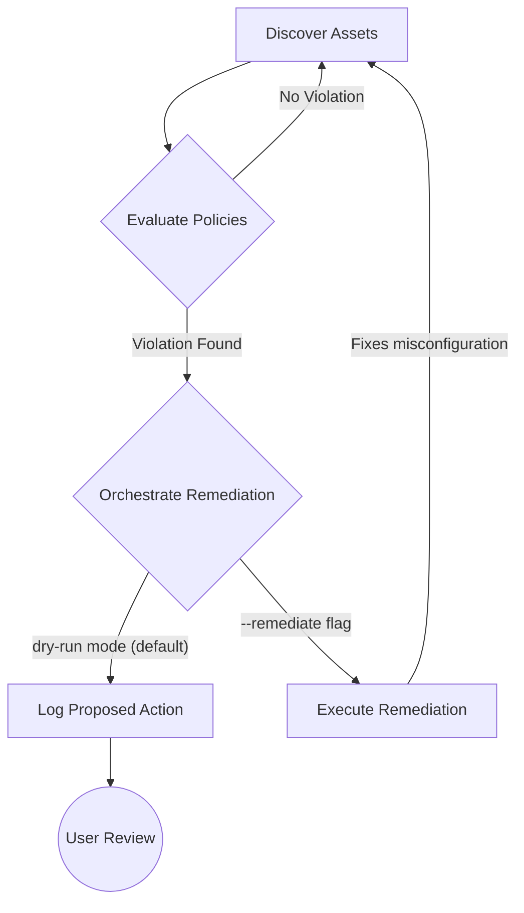
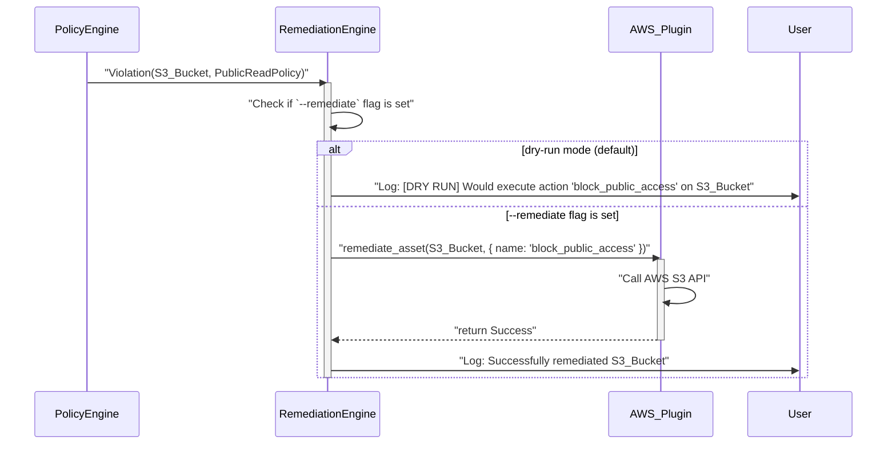

# TRD-011: Automated Remediation Engine

## 1. Status

**Proposed**

## 2. Context

Detecting and reporting policy violations is only the first step in securing a cloud environment. The critical second step is remediation—fixing the identified issue. Manual remediation processes are slow, prone to human error, and do not scale with the speed and complexity of modern cloud deployments. This leads to a long Mean Time to Remediation (MTTR) and leaves the organization exposed to risks for extended periods.

To create a truly effective, "self-healing" security posture, the system must be able to close the loop by automatically remediating the violations it discovers.

## 3. Decision

`cloudscanner` will incorporate a built-in Remediation Engine that is directly integrated with the Policy Engine. This engine will be responsible for orchestrating remediation actions based on policy violations. The entire process will be designed with safety and control as paramount concerns.

### 3.1. Core Principles

1.  **Policy-Defined Actions:** Remediation actions are defined directly within the YAML policy files, tightly coupling detection logic with its corresponding fix.
2.  **Safety First (`dry-run` by Default):** The engine will operate in a `dry-run` mode by default. In this mode, it will only log the actions it *would* take without making any actual changes to the cloud environment. An explicit flag (e.g., `--remediate`) will be required to enable live remediation.
3.  **Provider-Led Execution:** The core engine orchestrates, but the provider plugins execute. The engine will call the `remediate_asset` function on the appropriate plugin, making the plugin responsible for implementing the specific API calls to fix an issue.
4.  **Structured Actions:** Remediation actions will be structured, with a clear name and parameters, to create a well-defined and extensible interface.

### 3.2. Architectural Workflow

1.  The **Policy Engine** identifies a `Violation`.
2.  The engine inspects the corresponding policy definition for a `remediation` block.
3.  If a remediation block exists, the **Core Engine** invokes the `remediate_asset` function on the provider plugin that discovered the asset.
4.  The provider's `remediate_asset` function receives the asset ID, the structured `RemediationAction`, and the `dry_run` flag.
5.  The plugin performs the remediation and returns a `RemediationResult`, which is logged by the **Reporter**.

## 4. Example Policy with Remediation

This example extends a policy to include a remediation block.

```yaml
policies:
  - id: ec2-unrestricted-ssh
    name: "EC2 Instances with Unrestricted SSH Access"
    description: "Flags any EC2 instance with a security group allowing SSH from anywhere (0.0.0.0/0)."
    rules:
      - field: asset_type
        value: "ec2_instance"
      - field: metadata.ssh_open_to_world
        value: "true"
    # This block defines the action to take if a violation is found.
    remediation:
      # 'name' corresponds to a function implemented in the provider plugin.
      name: "revoke_public_ssh"
      # Parameters provide context to the remediation function.
      parameters:
        owner_tag: "not-found"
        notification_channel: "#security-alerts"

```

## 5. Consequences

### 5.1. Advantages

*   **Reduced MTTR:** Dramatically shortens the time from detection to remediation, improving the overall security posture.
*   **Enables Automation:** Creates a path towards a fully automated, "self-healing" infrastructure.
*   **Frees Up Security Teams:** Reduces the burden of manual, repetitive remediation tasks, allowing security engineers to focus on higher-value work.
*   **Consistent Enforcement:** Ensures that security policies are enforced consistently and reliably.

### 5.2. Disadvantages

*   **Increased Risk:** If not implemented carefully, automated remediation can have unintended consequences, such as causing application downtime. The `dry-run` by default and rigorous testing are critical to mitigate this.
*   **Expanded Permissions:** The `cloudscanner` tool will require write-level permissions in the cloud environment to perform remediations, increasing its own security profile.
*   **Implementation Complexity:** Building a safe and reliable remediation engine is significantly more complex than a read-only scanner.

## 6. Questions and Mitigations

| Question | Proposed Mitigation |
| :--- | :--- |
| **How do we prevent a buggy remediation from causing a major outage?** | **Mitigation:** A multi-layered safety approach: 1) **Mandatory `dry-run`:** As stated, this is the default. 2) **Scoped E2E Testing:** All remediation actions will be tested in isolated, non-production environments first (TRD-008). 3) **Limited Remediation Logic:** Remediation actions will be simple and targeted (e.g., `revoke_public_access`). Complex, multi-step remediations are explicitly out of scope for the PoC. 4) **Rollback Capability (Post-PoC):** For future versions, providers could implement a `rollback` function for each remediation, allowing the system to undo a change if it causes problems. |
| **How are the permissions required for remediation managed securely?** | **Mitigation:** The `cloudscanner` IAM role/service account will follow the principle of least privilege. It will be granted a set of specific, limited `write` permissions required for the implemented remediation actions (e.g., `ec2:RevokeSecurityGroupIngress`, `s3:PutBucketPublicAccessBlock`). Read-only scans and remediation scans may even use two separate roles, with the more permissive remediation role only being used for runs with the `--remediate` flag. |
| **What happens if a remediation action fails?** (e.g., due to a temporary API error) | **Mitigation:** The `remediate_asset` function in the provider plugin will return a `Result`. If an error occurs, the Remediation Engine will log the failure and, for non-critical errors, will not halt the entire scan. For event-driven remediation, the Lambda function could be configured to retry the operation a few times before sending the event to a Dead-Letter Queue (DLQ) for manual analysis. |

## 7. Diagrams

### 7.1. System Diagram: The Remediation Feedback Loop

This diagram shows the complete "self-healing" loop, from discovery to automated remediation.



### 7.2. Component Diagram: Remediation Engine

This diagram details the internal components of the Remediation Engine and its interaction with other parts of `cloudscanner`.

```mermaid
componentDiagram
    package "Core Engine" {
        ["Policy Engine"]
        ["Remediation Engine"]
        ["Reporter"]
    }
    package "Provider Plugin" {
        ["Remediation Executor"]
    }

    ["Policy Engine"] ..> ["Remediation Engine"] : "sends Violation"
    ["Remediation Engine"] ..> ["Remediation Executor"] : "calls remediate_asset()"
    ["Remediation Executor"] ..> ["Reporter"] : "sends RemediationResult"
```

### 7.3. Sequence Diagram: Remediating a Public S3 Bucket

This sequence illustrates the end-to-end process of finding and fixing a policy violation, with the crucial `dry-run` check.



## 8. Reference

This decision is a core component of the "10x Vision" and is referenced in the main proof of concept document: [poc2.md#4.3.-From-Reporting-to-Governing:-Automated-Remediation](./poc2.md#4.3.-From-Reporting-to-Governing:-Automated-Remediation)

