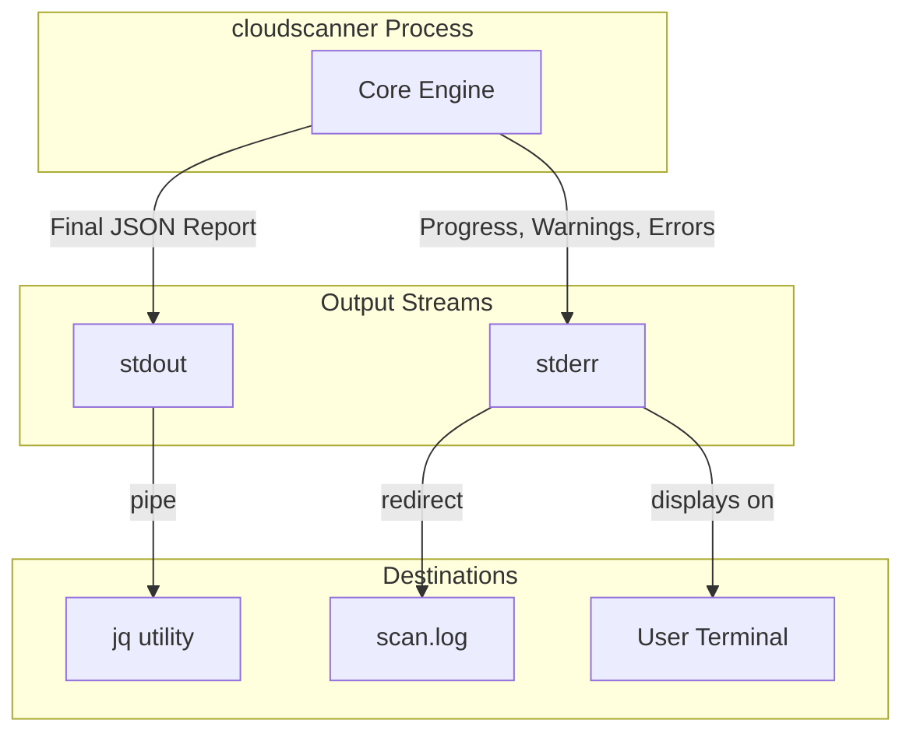
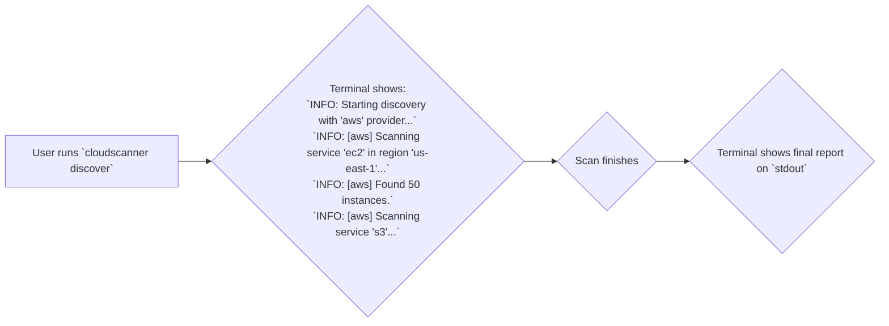

# TRD-012: Interactive Progress Indication

## 1. Status

**Proposed**

## 2. Context

Long-running scans, especially in large and complex cloud environments, can make the application appear unresponsive or "hung." Users have no way of knowing if the tool is working correctly, how far along it is, or which part of the scan might be causing a slowdown. This erodes user trust and makes the tool difficult to debug from a user's perspective.

## 3. Decision

`cloudscanner` will provide real-time feedback to the user during the discovery process. The primary mechanism for this will be through the structured logging system.

1.  **Structured Logging:** The Core Engine and Discovery Engine will emit log messages at an `INFO` level to indicate the start and end of key phases (e.g., "Starting discovery with 'aws' provider," "Scanning service 'ec2' in region 'us-east-1'").
2.  **Reporter Component:** The Reporter component will be responsible for formatting these logs for the console. In the default mode, this will appear as a sequence of status updates.
3.  **Future Enhancement (Post-PoC):** A more advanced implementation using a terminal UI library (e.g., `indicatif`) could provide a dynamic progress bar, but for the PoC, structured logging is sufficient.

## 4. Consequences

### 4.1. Advantages

*   **Improved User Experience:** Provides immediate feedback and a sense of progress, assuring the user the application is working.
*   **Enhanced Debugging:** Helps users and developers pinpoint which provider, service, or region is slow or causing issues.
*   **Builds Trust:** A responsive and informative CLI is perceived as more reliable and professional.

### 4.2. Disadvantages

*   **Minor Code Complexity:** Requires a small amount of additional instrumentation in the discovery loop to emit the relevant log events.

## 5. Questions and Mitigations

| Question | Proposed Mitigation |
| :--- | :--- |
| **How do we prevent progress updates from polluting machine-readable output?** | **Mitigation:** This is critical. All progress-related logging will be written to `stderr`. The final report data (e.g., the JSON output of discovered assets or violations) will be the only data written to `stdout`. This is a standard CLI convention that allows a user to pipe the JSON output to another tool (like `jq`) or redirect it to a file while still seeing the progress indicators in their terminal. The `--quiet` flag (TRD-013) will suppress `stderr` output entirely. |
| **Will logging every single asset discovery be too noisy and slow down the application?** | **Mitigation:** No, the progress indication is not that granular. It will operate at a higher level of abstraction. The log messages will report on major milestones, such as starting or finishing a provider, a service within a provider, or a region. For example: `INFO: [aws] Starting EC2 discovery in us-east-1`, not `INFO: Discovered instance i-123`. This provides a good balance of feedback without overwhelming the user or introducing significant performance overhead. |

## 6. Diagrams

### 6.1. System Diagram: Standard Output vs. Standard Error

This diagram illustrates the critical separation of output streams to allow for both human-readable progress and machine-readable results simultaneously.

### 6.2. Use Case Diagram: User Experience

This diagram shows the intended user experience during a scan, with progress messages appearing in the terminal.

## 7. Reference

This decision supports a core usability requirement referenced in: [poc2.md#2.-Technical-Requirements](./poc2.md#2.-Technical-Requirements)

