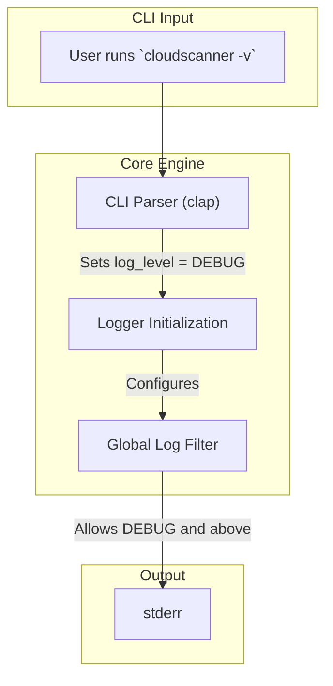
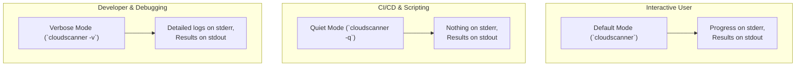

# TRD-013: Verbosity and Quiet Mode Control

## 1. Status

**Proposed**

## 2. Context

Different use cases require different levels of output. A user running a scan interactively may want to see detailed progress and debugging information. A script or CI/CD pipeline, however, is typically only interested in the final, machine-readable report data. `cloudscanner` needs to support both of these modes effectively.

## 3. Decision

The `cloudscanner` CLI will implement standard verbosity flags to control the output.

1.  **Default Mode:** When no flags are specified, the application will print progress updates (per TRD-012) to `stderr` and the final report (e.g., violations) to `stdout`.

2.  **Quiet Mode (`-q` or `--quiet`):** In this mode, all non-essential output, including progress updates and informational logs, will be suppressed. Only the final report data will be printed to `stdout`. This is ideal for scripting and automation.

3.  **Verbose Mode (`-v` or `--verbose`):** In this mode, the logging level will be increased to `DEBUG`. This will emit highly detailed information about the application's internal state, such as the exact API calls being made, the full content of discovered assets, and detailed timing information. This is intended for developers and advanced debugging.

## 4. Consequences

### 4.1. Advantages

*   **Flexible for Different Audiences:** Caters to both interactive human users and automated systems.
*   **Clean, Machine-Readable Output:** Quiet mode ensures that `stdout` can be safely piped to other tools like `jq` or a file.
*   **Powerful Debugging:** Verbose mode provides a deep level of introspection without needing to recompile the application.

### 4.2. Disadvantages

*   **CLI Parsing Logic:** Requires a small amount of logic in the main CLI entry point to parse the flags and configure the global logger and reporter components accordingly.

## 5. Questions and Mitigations

| Question | Proposed Mitigation |
| :--- | :--- |
| **How do multiple verbose flags (`-vv`, `-vvv`) work?** | **Mitigation:** We will adopt the standard convention used by many CLI tools. The verbosity level will be cumulative. `-v` sets the log level to `DEBUG`. `-vv` sets it to `TRACE`, which is an even more granular level of detail, potentially including raw API request/response bodies. The logging framework (`tracing`) natively supports these hierarchical levels. A maximum of two or three verbosity levels will be supported to keep it manageable. |
| **What is the default log level if no flag is provided?** | **Mitigation:** The default log level will be `INFO`. This provides a good balance of progress indication (as described in TRD-012) without being overly noisy for the standard interactive user. Errors (`ERROR`) will always be shown unless `--quiet` is used. |

## 6. Diagrams

### 6.1. System Diagram: Log Level Configuration

This diagram shows how the CLI flags are parsed and used to configure the global logging filter.

### 6.2. Use Case Diagram: Output Modes

This diagram illustrates the three primary output modes and their intended use cases.

## 7. Reference

This decision supports a core usability requirement referenced in: [poc2.md#2.-Technical-Requirements](./poc2.md#2.-Technical-Requirements)

