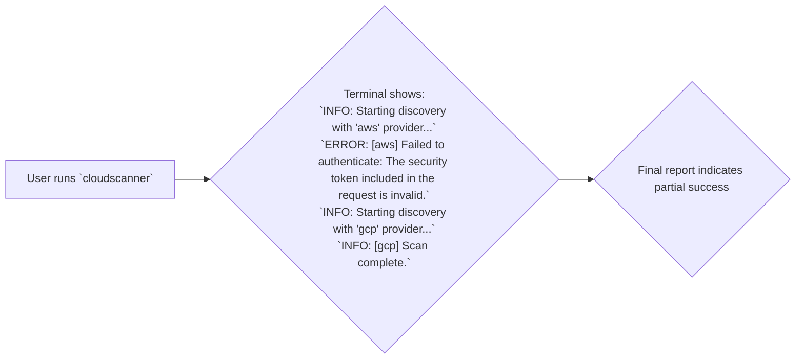

# TRD-014: Graceful Error and Failure Handling

## 1. Status

**Proposed**

## 2. Context

A `cloudscanner` run may involve multiple providers, each with its own configuration and potential failure points (e.g., invalid credentials, network issues, API throttling). A failure in one part of the scan should not terminate the entire process. The tool must be resilient enough to complete as much of the scan as possible, providing partial results rather than crashing completely.

## 3. Decision

The `cloudscanner` Core Engine will be designed to handle errors gracefully and continue processing where possible.

1.  **Provider-Level Isolation:** The main discovery loop will iterate through the configured providers. If any single provider plugin returns an error during its `discover_assets()` call, the Core Engine will:
    *   Log the error clearly to `stderr` (respecting verbosity settings).
    *   Mark that provider as failed.
    *   Continue execution with the next configured provider.

2.  **Error Propagation:** Errors will be modeled as a distinct type within the application. The `discover_assets()` function in the provider ABI will return a `Result<_, Error>` type, allowing the Core Engine to robustly distinguish between success and failure.

3.  **Final Report:** The final report will clearly indicate which providers were successful and which failed, ensuring the user understands the scope of the completed scan.

## 4. Consequences

### 4.1. Advantages

*   **Increased Resilience:** The tool is more robust and useful in real-world scenarios where partial failures are common.
*   **Better User Experience:** Provides a more complete picture of the environment, even if some parts are inaccessible.
*   **Prevents cascading failures** where one small misconfiguration would render the entire tool useless.

### 4.2. Disadvantages

*   **More Complex Control Flow:** The Core Engine's discovery loop is slightly more complex, as it must handle the `Result` of each provider call.

## 5. Questions and Mitigations

| Question | Proposed Mitigation |
| :--- | :--- |
| **What constitutes a "fatal" error that *should* stop the whole scan?** | **Mitigation:** A distinction will be made between *provider errors* and *core engine errors*. A provider error (e.g., invalid AWS credentials) is isolated and will not halt the scan. A core engine error (e.g., failure to read the main `cloudscanner.toml` config file, inability to load any plugins) is considered fatal and will cause the application to exit with a non-zero status code. The principle is: if the application cannot perform any useful work at all, it should fail fast. |
| **How will the final report reflect partial success?** | **Mitigation:** The final JSON report will contain a top-level `summary` object. This object will include a list of `successful_providers` and `failed_providers`. This allows an automated system to programmatically determine if the scan was complete or partial. The human-readable console output will also include a clear summary section at the end. |

## 6. Diagrams

### 6.1. System Diagram: Error Handling Flow

This diagram shows how the Core Engine handles a failure in one provider while continuing with others.

```mermaid
graph TD
    subgraph "Core Engine"
        Start["Start Scan"] --> LoadAWS["Load AWS Provider"]
        LoadAWS -- "Success" --> ScanAWS["Scan AWS"]
        ScanAWS -- "Credentials Invalid (Error)" --> LogError["Log AWS Error"]
        LogError --> LoadGCP["Load GCP Provider"]
        LoadGCP -- "Success" --> ScanGCP["Scan GCP"]
        ScanGCP -- "Success" --> Report["Generate Report"]
        Report --> End["End Scan"]
    end
    
    subgraph "Final Report"
        ReportContent["{\n  &quot;summary&quot;: {\n    &quot;successful_providers&quot;: [\"gcp\"],\n    &quot;failed_providers&quot;: [\"aws\"]\n  },\n  &quot;violations&quot;: [...]\n}"]
    end

    Report --> ReportContent
```

### 6.2. Use Case Diagram: User Experience with a Failed Provider

This diagram illustrates what the user sees in the terminal when one of the configured providers fails.



### 6.3. Sequence Diagram: Handling a Result in the Discovery Loop

This sequence shows the Core Engine's logic for handling the `Result` returned by a provider plugin.

```mermaid
sequenceDiagram
    participant CoreEngine
    participant AWS_Plugin
    participant GCP_Plugin
    
    CoreEngine->>AWS_Plugin: "discover_assets()"
    activate AWS_Plugin
    AWS_Plugin-->>CoreEngine: "return Err(&quot;Invalid Credentials&quot;)"
    deactivate AWS_Plugin

    CoreEngine->>CoreEngine: "Log error for AWS"

    CoreEngine->>GCP_Plugin: "discover_assets()"
    activate GCP_Plugin
    GCP_Plugin-->>CoreEngine: "return Ok(asset_list)"
    deactivate GCP_Plugin

    CoreEngine->>CoreEngine: "Process GCP assets"
```

## 7. Reference

This decision supports a core reliability requirement referenced in: [poc2.md#2.-Technical-Requirements](./poc2.md#2.-Technical-Requirements)

