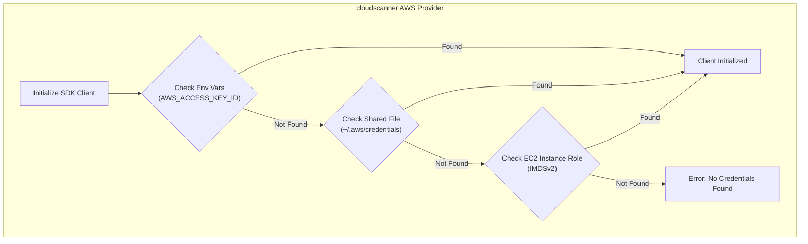
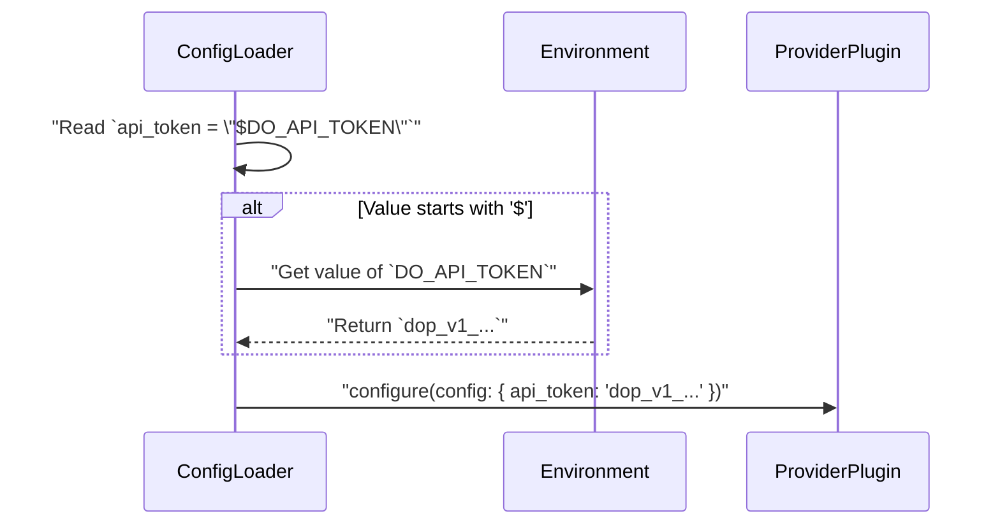

# TRD-015: Secure Credential Management

## 1. Status

**Proposed**

## 2. Context

`cloudscanner` requires credentials to access cloud provider APIs. Hardcoding secrets (like API keys, tokens, or passwords) into configuration files is a major security risk. The application must support secure, industry-standard methods for loading and managing these credentials.

## 3. Decision

`cloudscanner` will adopt a layered and standardized approach to credential management, ensuring that secrets are never stored in plain text in the primary configuration file.

1.  **Environment Variable Expansion (Primary Method):** The configuration loader will support resolving values from environment variables. In `cloudscanner.toml`, a user can specify a credential like `api_token = "$DO_API_TOKEN"`. The loader will detect the `$` prefix and substitute the value from the `DO_API_TOKEN` environment variable at runtime.

2.  **Provider-Specific SDK Behavior (Default):** All official provider plugins will be built using the official vendor SDKs (e.g., AWS SDK for Rust, Azure SDK for Rust). These SDKs have their own well-defined, standardized credential loading chains. For example, the AWS SDK will automatically look for credentials in environment variables (`AWS_ACCESS_KEY_ID`), shared credential files (`~/.aws/credentials`), and IAM instance metadata services, in that order. `cloudscanner` will leverage this native SDK behavior by default.

3.  **Explicitly Out of Scope:** `cloudscanner` will **not** implement its own secret management or vaulting system. It will integrate with existing, standard mechanisms.

## 4. Consequences

### 4.1. Advantages

*   **Eliminates Hardcoded Secrets:** Prevents the primary anti-pattern of storing sensitive information in configuration files.
*   **Follows Industry Best Practices:** Aligns with established, secure patterns for credential management in cloud-native applications.
*   **Flexible for Different Environments:** Works seamlessly for local development (using environment variables or credential files) and in production/CI environments (using instance roles or secrets injected into the environment).
*   **Reduced Complexity:** Avoids reinventing a complex and security-critical component by leveraging the robust, battle-tested logic in the official cloud SDKs.

### 4.2. Disadvantages

*   **Relies on User Knowledge:** The user is responsible for understanding how to correctly configure their environment (e.g., set environment variables, configure `~/.aws/credentials`). The documentation must be very clear on this.

## 5. Questions and Mitigations

| Question | Proposed Mitigation |
| :--- | :--- |
| **How do we provide clear guidance to users on how to configure credentials for each provider?** | **Mitigation:** The `cloudscanner` documentation will have a dedicated "Credentials" page. This page will provide explicit, copy-pasteable examples for each supported provider, showing how to configure credentials using environment variables, shared credential files, and (where applicable) IAM roles. For each provider in `cloudscanner.toml`, a comment will link to the relevant documentation section. |
| **What happens if no credentials are found?** | **Mitigation:** The provider plugin, using the underlying SDK, will fail to initialize. It will return a descriptive error to the Core Engine (e.g., "No valid AWS credentials found in environment variables, `~/.aws/credentials`, or IAM role"). The Core Engine will then handle this as a graceful provider failure (per TRD-014), log the clear error message, and continue with other configured providers. |

## 6. Diagrams

### 6.1. System Diagram: Credential Loading Chain (AWS Example)

This diagram shows the standard, multi-step process the AWS SDK (and thus the `cloudscanner` AWS provider) uses to find credentials. The first valid credential found wins.



### 6.2. Use Case Diagram: Configuration with Environment Variables

This diagram illustrates the user's workflow for securely configuring a provider that requires an API token.

```mermaid
graph LR
    subgraph "User's Terminal"
        A["Exports `DO_API_TOKEN=dop_v1_...`"] -- "then runs" --> C
    end
    subgraph "cloudscanner.toml"
        B["`api_token = \"$DO_API_TOKEN\"`"]
    end
    subgraph "cloudscanner Execution"
        C["`cloudscanner discover`"]
        D{"Config loader reads `api_token`"} --> E{"Resolves value from environment"}
        E --> F["Provider receives the real token"]
    end

    A --> E
    B --> D
```

### 6.3. Sequence Diagram: Environment Variable Expansion

This sequence details the internal logic of the configuration loader as it parses a value and resolves it from the environment.



## 7. Reference

This decision supports a core security requirement referenced in: [poc2.md#2.-Technical-Requirements](./poc2.md#2.-Technical-Requirements)

