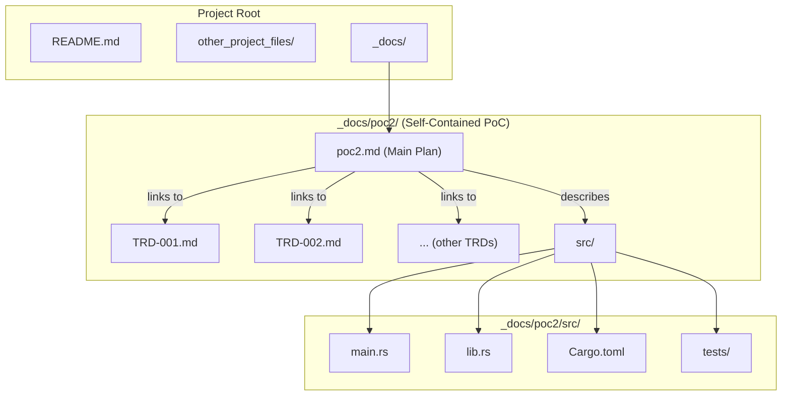

# TRD-016: Self-Contained PoC Artifacts

## 1. Status

**Proposed**

## 2. Context

To ensure the Proof of Concept is a focused, reviewable, and independent body of work, all related artifacts—including documentation, source code, and project plans—need to be organized and managed in a consistent way. Scattered files and code mixed with other projects would make the PoC difficult to evaluate and could lead to confusion about what is and is not part of this specific initiative.

## 3. Decision

All artifacts related to the PoC, from initial planning documents to the final source code, will be organized and contained within a single directory: `_docs/poc2/`.

This includes:

*   **Documentation:** All TRDs, the main `poc2.md` project plan, and any other supporting documents.
*   **Source Code:** A `src/` subdirectory will be created within `_docs/poc2/` to house all the Rust source code for the `cloudscanner` PoC.
*   **Test Cases:** All unit, integration, and E2E test code will reside alongside the source code in `_docs/poc2/src/`.

This creates a self-contained, modular "project within a project" that can be easily reviewed, archived, or even moved to a separate repository after the PoC is complete.

## 4. Consequences

### 4.1. Advantages

*   **Clarity and Focus:** It is immediately clear to any reviewer what is part of the PoC and what is not.
*   **Ease of Review:** A single, well-organized directory makes the entire PoC easy to navigate and evaluate.
*   **Portability:** The entire PoC can be easily archived or moved to a new repository if it is decided to spin it out into a standalone project.

### 4.2. Disadvantages

*   **Unconventional Structure:** It is unconventional to place source code inside a `_docs/` directory. This is a temporary measure for the duration of the PoC to keep all related artifacts together.
*   **Build Configuration:** The `Cargo.toml` for the Rust project will need to be placed within the `_docs/poc2/` directory, and build commands will need to be run from that specific path.

## 5. Diagrams

### 5.1. System Diagram: Proposed Directory Structure

This diagram visualizes the clear, self-contained directory structure for all PoC artifacts.

## 6. Reference

This decision supports a core project management requirement referenced in: [poc2.md#2.-Technical-Requirements](./poc2.md#2.-Technical-Requirements)

