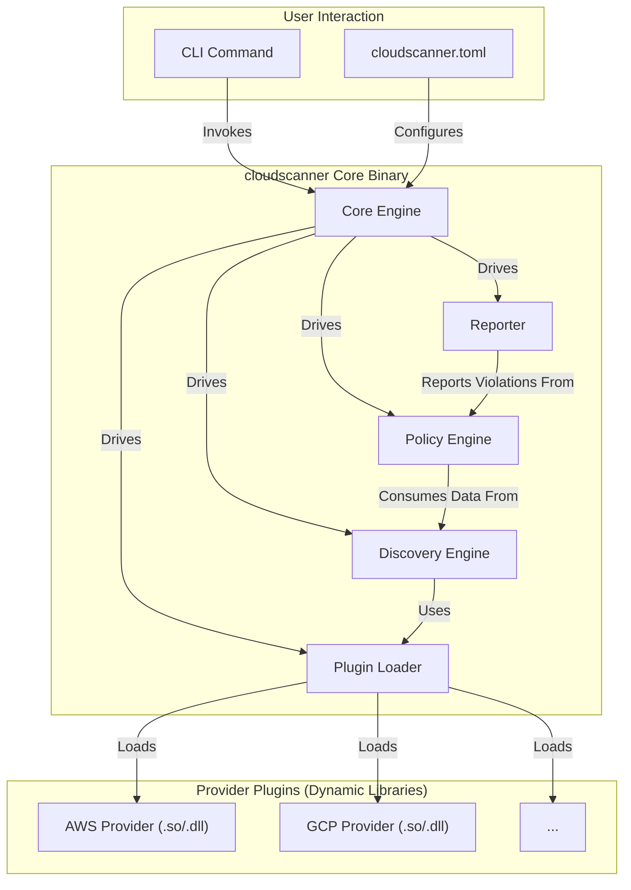
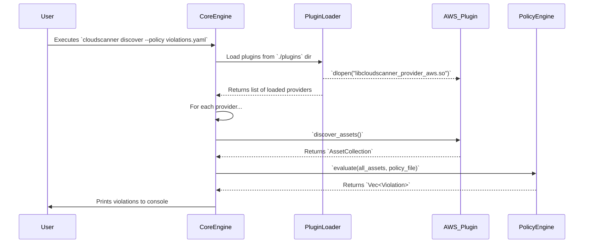

# cloudscanner: Proof of Concept

This document outlines the high-level product and technical requirements for the `cloudscanner` proof of concept (PoC).

## 1. High-Level Product Requirements

The primary goal of the PoC is to validate the core architectural concepts of `cloudscanner` and demonstrate a significant improvement over the previous generation.

*   **PR-1: Plugin-Based Architecture:** The system must be able to dynamically load and execute provider plugins at runtime.
*   **PR-2: Unified Engine:** The PoC must demonstrate a single, cohesive binary that can perform the entire **Discover -> Evaluate -> Report** workflow.
*   **PR-3: Basic Policy Evaluation:** The system must be able to evaluate a simple, human-readable policy (e.g., in YAML) against the discovered assets and report violations.
*   **PR-4: Cross-Platform Support:** The final PoC binary must be executable on at least two major operating systems (e.g., Linux and macOS).
*   **PR-5 (10x Vision): Automated Remediation:** The system must demonstrate the ability to perform at least one automated remediation action based on a policy violation. ([TRD-011](./TRD-011-Automated-Remediation.md))
*   **PR-6: Demonstrable Success Criteria:** The PoC will be considered successful upon demonstrating the following end-to-end workflow:
    1.  Configuration of one cloud provider (e.g., AWS) and one file-based provider via `cloudscanner.toml`.
    2.  Successful discovery of at least two distinct asset types (e.g., AWS EC2 Instances and S3 Buckets).
    3.  Evaluation of a YAML policy that correctly identifies a non-compliant resource (e.g., a publicly open security group).
    4.  Generation of a report in both console and JSON format showing the violation.

### 1.1. Explicit Non-Goals for the PoC

To maintain a sharp focus and ensure the successful delivery of the core objectives, the following items are explicitly out of scope for this PoC:

*   **Full Automated Remediation:** While the PoC will demonstrate a single automated action to prove the concept (PR-5), a comprehensive framework for varied, complex, and multi-step remediation actions is deferred.
*   **Windows as a Host Platform:** While cross-platform support for Linux and macOS is a requirement (PR-4), dedicated support for running the `cloudscanner` binary on Windows is not a goal for the PoC.

## 2. User Personas and Use Cases

To ensure the PoC is grounded in real-world needs, we will focus on two primary user personas:

### 2.1. Persona 1: The Security Engineer

*   **Who they are:** A hands-on practitioner responsible for the day-to-day security of the cloud environment. They are comfortable with the command line and need to quickly investigate and respond to potential threats.
*   **How they will use it:** They will use `cloudscanner` for ad-hoc investigations and to build a library of custom checks for their specific environment.
*   **Primary Use Case:**
    *   **Goal:** Find all publicly accessible EC2 instances with unrestricted SSH access.
    *   **Workflow:**
        1.  The engineer writes a simple YAML policy file named `ssh-open.yaml`.
        2.  They run the command: `cloudscanner discover -p aws --policy ssh-open.yaml`.
        3.  `cloudscanner` scans the AWS account, builds the asset graph, and evaluates the policy.
        4.  The engineer receives a list of instance IDs that violate the policy, printed directly to their console.

### 2.2. Persona 2: The DevOps Engineer

*   **Who they are:** An engineer responsible for building and maintaining the CI/CD pipelines and infrastructure-as-code (IaC) templates. They are focused on automation and preventing misconfigurations from reaching production.
*   **How they will use it:** They will integrate `cloudscanner` into their CI/CD pipeline to act as a security gate.
*   **Primary Use Case:**
    *   **Goal:** Prevent a Terraform change that creates a publicly-readable S3 bucket from being deployed.
    *   **Workflow:**
        1.  A developer submits a pull request with a Terraform change.
        2.  The CI/CD pipeline triggers a `terraform plan` and then runs `cloudscanner` against a file-based provider containing the planned state.
        3.  `cloudscanner` runs in quiet mode: `cloudscanner discover -p file --policy s3-public.yaml -q --json > report.json`.
        4.  A script checks if `report.json` contains any violations. If it does, the pipeline fails, blocking the insecure change and notifying the developer.

## 3. Technical Requirements

These technical requirements support the product goals and form the foundation of the `cloudscanner` architecture.

*   **TR-1: Rust Implementation:** The entire PoC will be written in Rust. ([TRD-002](./TRD-002-Language-Choice.md))
*   **TR-2: Dynamic Plugin ABI:** A stable C-style Application Binary Interface (ABI) must be defined for provider plugins. ([TRD-001](./TRD-001-Provider-Plugin.md))
*   **TR-3: At Least Two Provider Plugins:** The PoC must include at least two provider plugins (e.g., AWS and a file-based provider).
*   **TR-4: Simple YAML Policy Evaluator:** A basic policy engine will be implemented to parse and evaluate YAML-based rules. ([TRD-004](./TRD-004-Policy-Engine.md))
*   **TR-5: Structured Logging:** The application must use structured logging for all its output.
*   **TR-6: TOML-Based Configuration:** All configuration will be managed through a single `cloudscanner.toml` file. ([TRD-005](./TRD-005-Configuration.md))
*   **TR-7: Flexible Reporting Engine:** The application must support multiple output formats (e.g., console, JSON).
*   **TR-8: Comprehensive Testing Strategy:** The project must include a defined testing strategy. ([TRD-008](./TRD-008-Measurable-Testing-Strategy.md))
*   **TR-9: Command-Line Interface (CLI) Definition:** The PoC must implement a clearly defined CLI structure.
*   **TR-10 (10x Vision): Event-Driven Discovery:** The engine must support an event-driven discovery mode for real-time monitoring. ([TRD-009](./TRD-009-Event-Driven-Discovery.md))
*   **TR-11 (10x Vision): Asset Relationship Graph:** Discovered assets and their relationships must be stored in an in-memory graph structure. ([TRD-010](./TRD-010-Asset-Graph.md))
*   **TR-12: Interactive Progress Indication:** For long-running scans, the application must provide real-time feedback to the user (e.g., a progress bar or structured log messages).
*   **TR-13: Verbosity and Quiet Mode Control:** The CLI must support standard verbosity flags (`-v` for verbose, `-q` for quiet) to control the level of detail in the output.
*   **TR-14: Graceful Error and Failure Handling:** The application must handle errors gracefully. If one provider plugin fails, the core engine should log the error and continue to run other configured providers without crashing.
*   **TR-15: Secure Credential Management:** The system must support industry-standard credential loading mechanisms, such as reading from environment variables or using instance metadata services, to avoid hardcoded secrets.
*   **TR-16: Self-Contained PoC Artifacts:** All documentation, source code, and other artifacts related to the PoC must be maintained and organized within the `_docs/poc2/` directory to ensure the PoC is a self-contained, modular, and easily reviewable package of work.

## 4. Project Plan & Timeline

This PoC is organized into four distinct phases, designed to build from foundational architecture to a final, demonstrable product. All work, including documentation and source code, will be self-contained within the `_docs/poc2/` directory.

### Phase 1: Core Engine & Plugin Architecture (Estimated: 2 weeks)

*   **Focus:** Establish the foundational skeleton of the application.
*   **Tasks:**
    *   [ ] **(TR-1, TR-2)** Define the initial `cloudscanner-api` crate with the stable C ABI for plugins. ([TRD-001](./TRD-001-Provider-Plugin.md))
    *   [ ] **(TR-6)** Implement the core engine with TOML-based configuration loading. ([TRD-005](./TRD-005-Configuration.md))
    *   [ ] Implement the plugin loader and the basic `discover` command structure.
    *   [ ] **(TR-5)** Set up structured logging (`tracing`, `log`).
    *   [ ] Create a simple "hello world" file-based provider to prove the loading mechanism.

### Phase 2: Discovery and Basic Evaluation (Estimated: 2 weeks)

*   **Focus:** Make the scanner useful by implementing real data collection and basic policy checks.
*   **Tasks:**
    *   [ ] **(TR-3)** Develop the first full provider plugin for AWS, focusing on EC2 and S3 discovery.
    *   [ ] **(TR-4)** Implement the initial YAML-based Policy Engine. ([TRD-004](./TRD-004-Policy-Engine.md))
    *   [ ] **(TR-7)** Implement the Reporter component with console and JSON output.
    *   [ ] **(TR-8)** Integrate unit and basic integration tests for the core engine and AWS provider.

### Phase 3: Advanced Features & UX (Estimated: 1 week)

*   **Focus:** Add the "10x" features and improve the user experience.
*   **Tasks:**
    *   [ ] **(TR-11)** Implement the in-memory Asset Relationship Graph. ([TRD-010](./TRD-010-Asset-Graph.md))
    *   [ ] **(TR-5)** Demonstrate one automated remediation action (e.g., disabling public access on an S3 bucket). ([TRD-011](./TRD-011-Automated-Remediation.md))
    *   [ ] **(TR-12, TR-13)** Add user-facing features like progress bars and verbosity control.
    *   [ ] **(TR-14)** Improve graceful error handling for provider failures.

### Phase 4: Finalization & Demonstration (Estimated: 1 week)

*   **Focus:** Prepare the PoC for its final demonstration and ensure all requirements are met.
*   **Tasks:**
    *   [ ] **(PR-6)** Build the end-to-end demonstration scenario.
    *   [ ] **(TR-8)** Write the E2E integration test that runs in CI.
    *   [ ] **(PR-4)** Test and validate cross-platform builds (Linux & macOS).
    *   [ ] Finalize all documentation, including the `README.md` and user guides.
    *   [ ] Record a demo video and present the final PoC.

## 5. System Architecture Diagrams

### 5.1. High-Level Component Diagram

**Component Descriptions:**

*   **User Interaction:**
    *   **CLI Command:** The command-line interface used by the user to invoke `cloudscanner`.
    *   **cloudscanner.toml:** The central TOML configuration file where users define which providers to use, their credentials, and other settings.
*   **cloudscanner Core Binary:**
    *   **Core Engine:** The central orchestrator of the application. It initializes all other components and drives the entire Discover -> Evaluate -> Report workflow.
    *   **Plugin Loader:** Responsible for finding, loading, and version-checking both static and dynamic provider plugins.
    *   **Discovery Engine:** Manages the asset discovery process, invoking the configured provider plugins to collect asset data.
    *   **Policy Engine:** Evaluates the discovered assets against user-defined policies to identify violations.
    *   **Reporter:** Formats the results (discovered assets, policy violations) into the desired output format (e.g., console, JSON).
*   **Provider Plugins:**
    *   **AWS/GCP Provider:** Self-contained libraries (e.g., `.so` or `.dll` files) that implement the logic for interacting with a specific cloud provider's API.

### 5.2. PoC Workflow Sequence Diagram

**Participant Descriptions:**

*   **User:** The individual who initiates the scan by running a `cloudscanner` command.
*   **CoreEngine:** The main application process that receives the user's command and orchestrates the entire workflow.
*   **PluginLoader:** The component responsible for locating provider plugins in the filesystem (or memory, for static ones), loading them, and making them available to the Core Engine.
*   **AWS_Plugin:** An instance of a loaded provider plugin. It exposes functions like `discover_assets()` which contain the specific logic for calling the AWS APIs.
*   **PolicyEngine:** The component that takes the collection of discovered assets and the user's policy file as input, and produces a list of violations as output.

## 6. Appendix: The 10x Vision - From Scanner to Asset Intelligence Platform

To elevate this project from a powerful scanner to a true **10x solution**—an asset intelligence platform—we need to think beyond the on-demand "scan and report" workflow. A 10x solution doesn't just provide a snapshot in time; it provides a living, breathing model of the cloud environment and enables active governance.

The following transformative requirements, while potentially beyond the initial PoC, define the vision for this evolution:

### 6.1. From On-Demand to Real-Time: Event-Driven Discovery

The standard workflow is reactive; a user must initiate a scan to get the current state. A 10x solution is **proactive**, enabling near real-time response to security events as they unfold. This is detailed in [TRD-009](./TRD-009-Event-Driven-Discovery.md).

### 6.2. From a List to a Graph: Asset Intelligence

The current model treats assets as a flat list. A 10x solution understands the **relationships** between assets, providing the foundation for true "asset intelligence." This is detailed in [TRD-010](./TRD-010-Asset-Graph.md).

### 6.3. From Reporting to Governing: Automated Remediation

The PoC stops at reporting violations; a 10x solution **closes the loop**. This moves the tool from a passive observer to an active participant in securing the environment, enabling automated governance and transforming it from an alerting system into a self-healing one. This is detailed in [TRD-011](./TRD-011-Automated-Remediation.md).

By incorporating these three pillars, `cloudscanner` evolves from a best-in-class scanner into a foundational platform for modern cloud security operations.

## 7. Q&A

**Q: How will the platform handle stateful policies?**

**A:** For the PoC, `cloudscanner` will focus exclusively on being a high-performance **stateless** policy engine. It evaluates the cloud environment based on its current state at the time of the scan. Stateful analysis—such as identifying resources that have been non-compliant for a specific duration (e.g., more than 24 hours)—is a more complex problem that requires a historical data store. This capability is explicitly **out of scope** for the PoC. The `cloudscanner`'s role is to produce the real-time, stateless data that other, more specialized tools (e.g., a SIEM or a dedicated stateful analysis engine) can then consume for historical and trend analysis.

**Q: How can we make `cloudscanner` lightweight and run faster than the original `cloudlist`?**

**A:** We are making it lighter and faster in several key ways:

1.  **Core Performance Boost with Rust:** The switch from Go to Rust ([TRD-002](./TRD-002-Language-Choice.md)) is the single biggest factor. Rust's lack of a garbage collector gives us predictable, C-level speed and fine-grained memory control. This results in a minimal memory footprint and sustained high performance, crucial for processing thousands of cloud assets efficiently.

2.  **In-Memory Data Flow with a Unified Engine:** The original tool often required external scripts. `cloudscanner` operates as a unified engine ([TRD-003](./TRD-003-Unified-Engine.md)) where the entire **Discover -> Evaluate -> Report** workflow happens within a single process. Data is passed directly in-memory, eliminating the overhead of serialization, disk I/O, or network calls between components, making the end-to-end process significantly faster.

3.  **Hyper-Efficient, Event-Driven Scans:** For continuous monitoring, we are adopting an event-driven model ([TRD-009](./TRD-009-Event-Driven-Discovery.md)). Instead of re-scanning an entire account, `cloudscanner` will listen for specific cloud events and trigger targeted scans of only the resources that have changed. This reduces the workload from thousands of assets to a single one, making detection nearly instantaneous and incredibly lightweight.

4.  **Streaming-First, Plugin-Based Discovery:** The new plugin architecture ([TRD-001](./TRD-001-Provider-Plugin.md)) is designed for memory efficiency. Providers will use a streaming interface to send asset data back to the core engine. This allows the engine to evaluate assets as they are discovered rather than building a massive list in memory first, dramatically reducing peak memory usage.
