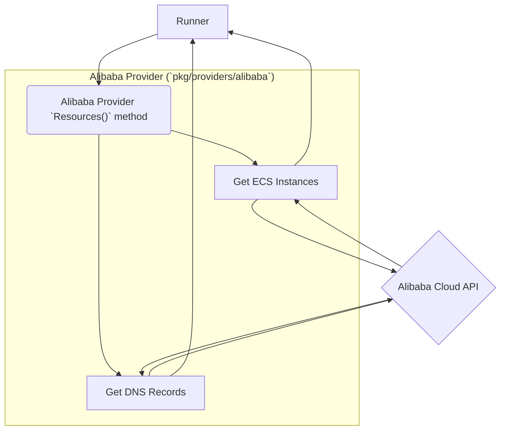
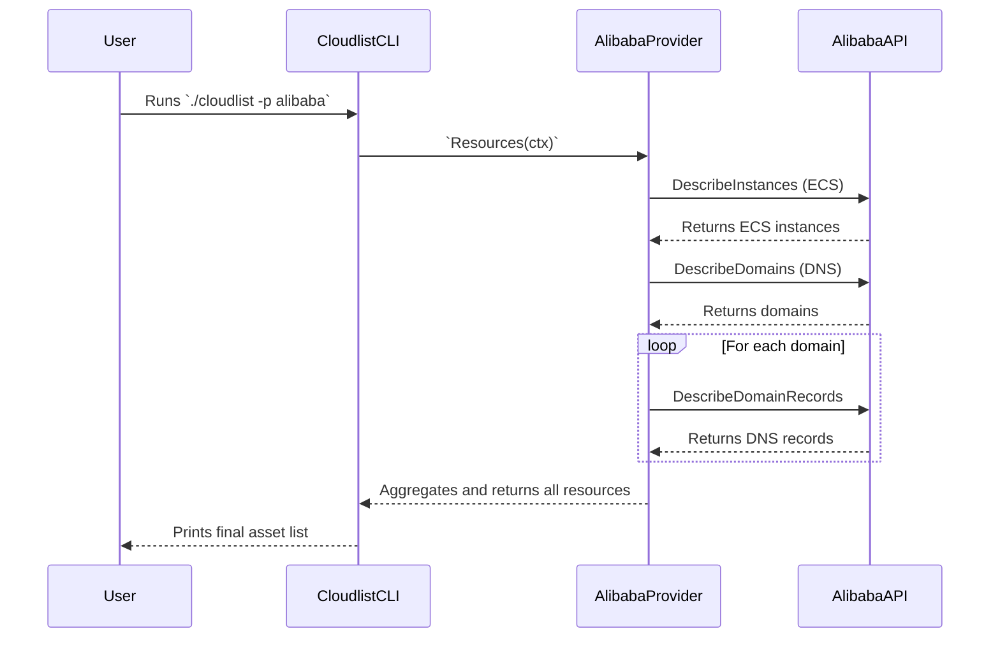

# Alibaba Cloud Provider Documentation

This document provides a detailed overview of the Alibaba Cloud (Alicloud) provider for Cloudlist.

## 1. Provider Overview

The Alibaba Cloud provider discovers and inventories assets within an Alibaba Cloud account, focusing on Elastic Compute Service (ECS) instances and DNS records.

## 2. Configuration

The provider authenticates using an AccessKey ID and Secret. You must also specify a region.

| Key                    | Required | Description                                                    |
| :--------------------- | :--- | :--- |
| `alibaba_access_key`   | **Yes**  | Your Alibaba Cloud AccessKey ID.                               |
| `alibaba_secret_key`   | **Yes**  | Your Alibaba Cloud AccessKey Secret.                           |
| `alibaba_region_id`    | **Yes**  | The ID of the region to scan (e.g., `cn-hangzhou`).              |
| `id`                   | No       | A user-defined identifier for this configuration block.        |

**Example Configuration:**

```yaml
alibaba:
  - id: "ali-prod"
    alibaba_access_key: "$ALI_ACCESS_KEY"
    alibaba_secret_key: "$ALI_SECRET_KEY"
    alibaba_region_id: "us-east-1"
```

## 3. Supported Services

The Alibaba provider enumerates assets from:

*   **ECS:** Public and private IP addresses of ECS instances.
*   **DNS:** Domain names and their associated records.

## 4. Architecture and Interaction

The provider uses the Alibaba Cloud SDK for Go to make API calls for each service.

### Component Interaction Diagram



### User & System Interaction Flow


