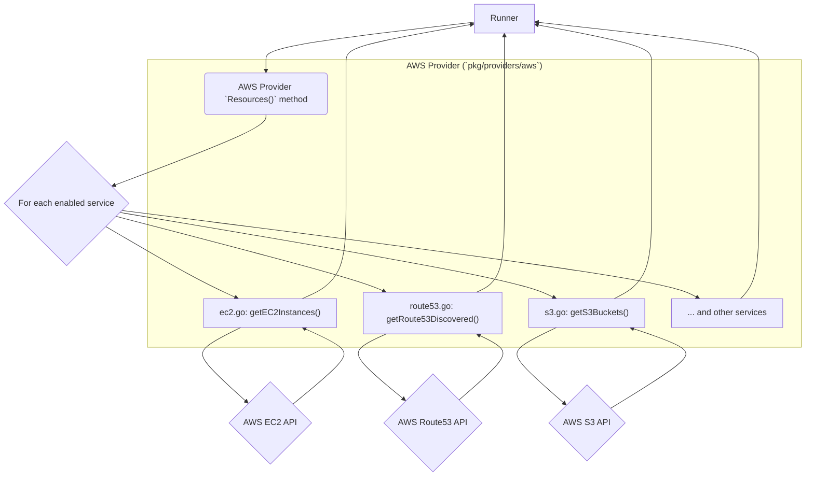
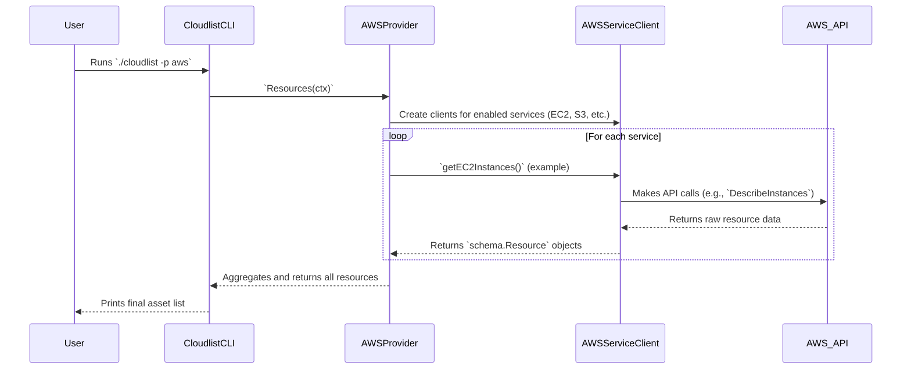

# AWS Provider Documentation

This document provides a detailed overview of the AWS provider for Cloudlist, including its configuration, supported services, and internal architecture.

## 1. Provider Overview

The AWS provider is designed to discover and inventory assets within an Amazon Web Services account. It interacts with various AWS service APIs to enumerate resources like virtual machines, DNS records, load balancers, and more, translating them into the standardized `schema.Resource` format.

## 2. Configuration

The AWS provider is configured within the `provider-config.yaml` file. It supports authentication via access keys, which can be provided directly or through environment variables.

| Key | Required | Description |
| :--- | :--- | :--- |
| `aws_access_key` | **Yes** | The AWS access key ID. Can also be set via the `AWS_ACCESS_KEY_ID` environment variable. |
| `aws_secret_key` | **Yes** | The AWS secret access key. Can also be set via the `AWS_SECRET_ACCESS_KEY` environment variable. |
| `aws_session_token`| No | The AWS session token, required for temporary credentials. Can also be set via the `AWS_SESSION_TOKEN` environment variable. |
| `aws_region` | **Yes** | The AWS region to scope the discovery to. |
| `services` | No | A comma-separated list of specific services to scan (e.g., `ec2,s3`). If omitted, all supported services are scanned. |
| `id` | No | A user-defined identifier for this configuration block. |

**Example Configuration:**
```yaml
aws:
  - id: "aws-dev-account"
    aws_access_key: "$AWS_ACCESS_KEY_ID"
    aws_secret_key: "$AWS_SECRET_KEY"
    aws_region: "us-east-1"
    services: "ec2,route53,s3"
```

## 3. Supported Services

The AWS provider supports the enumeration of assets from the following services:

*   **ALB** (Application Load Balancer)
*   **CloudFront** (Content Delivery Network)
*   **ECS** (Elastic Container Service)
*   **EKS** (Elastic Kubernetes Service)
*   **ELB** (Classic Load Balancer)
*   **EC2 Instances**
*   **Lambda** (via API Gateway)
*   **Lightsail**
*   **Route53** (DNS Service)
*   **S3** (Simple Storage Service)

## 4. Architecture and Interaction

The AWS provider follows a modular, service-oriented architecture. The main `aws.go` file acts as an orchestrator, while dedicated files for each service contain the specific logic for interacting with that service's API.

### Component Interaction Diagram



### User & System Interaction Flow

This diagram shows the sequence of events when a user initiates a scan with the AWS provider.


