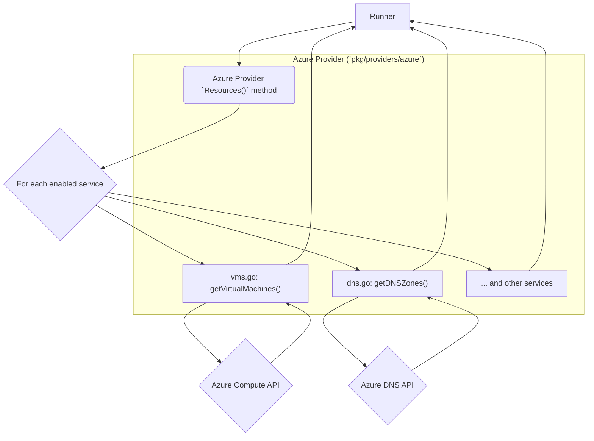
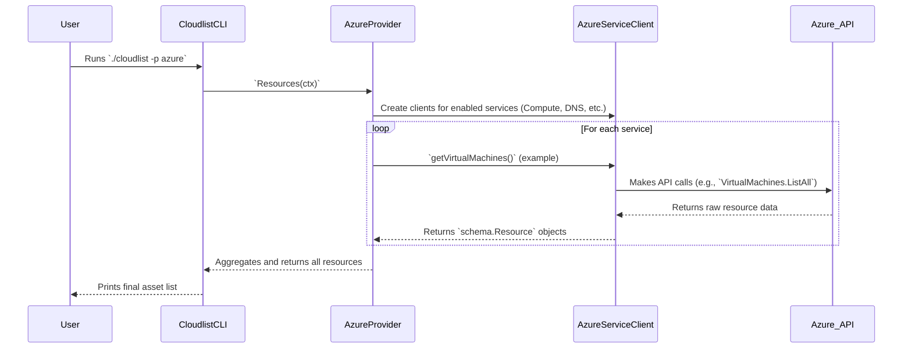

# Azure Provider Documentation

This document provides a detailed overview of the Azure provider for Cloudlist, including its configuration, supported services, and internal architecture.

## 1. Provider Overview

The Azure provider is designed to discover and inventory assets within a Microsoft Azure subscription. It utilizes the Azure SDK for Go to interact with various Azure service APIs and enumerate resources.

## 2. Configuration

The Azure provider authenticates using a service principal. You must provide the client ID, client secret, tenant ID, and subscription ID for the service principal.

| Key | Required | Description |
| :--- | :--- | :--- |
| `azure_client_id` | **Yes** | The Client ID of the service principal. |
| `azure_client_secret` | **Yes** | The Client Secret of the service principal. |
| `azure_tenant_id` | **Yes** | The Tenant ID of the Azure Active Directory application. |
| `azure_subscription_id` | **Yes** | The Subscription ID to scan. |
| `services` | No | A comma-separated list of specific services to scan. If omitted, all supported services are scanned. |
| `id` | No | A user-defined identifier for this configuration block. |

**Example Configuration:**
```yaml
azure:
  - id: "azure-production"
    azure_client_id: "$AZURE_CLIENT_ID"
    azure_client_secret: "$AZURE_CLIENT_SECRET"
    azure_tenant_id: "$AZURE_TENANT_ID"
    azure_subscription_id: "$AZURE_SUBSCRIPTION_ID"
    services: "vms,dns"
```

## 3. Supported Services

*   **Virtual Machines**
*   **DNS**
*   **Load Balancers**
*   **Public IP Addresses**
*   **Container Instances**
*   **App Service**

## 4. Architecture and Interaction

The Azure provider's architecture is similar to the other providers, with a central orchestrator in `azure.go` that calls service-specific functions.

### Component Interaction Diagram



### User & System Interaction Flow


