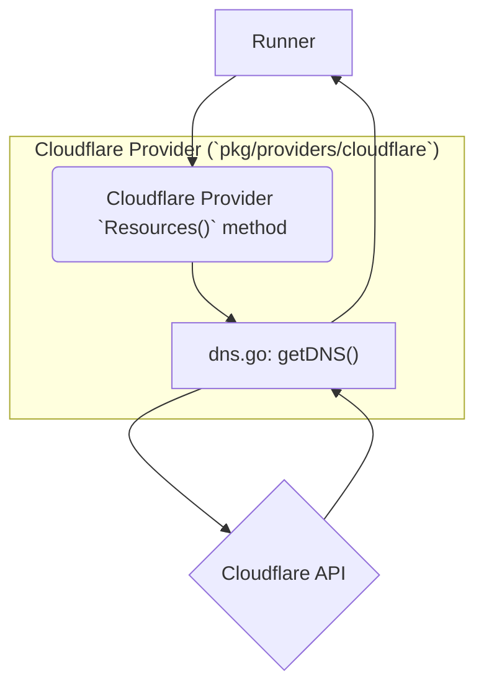
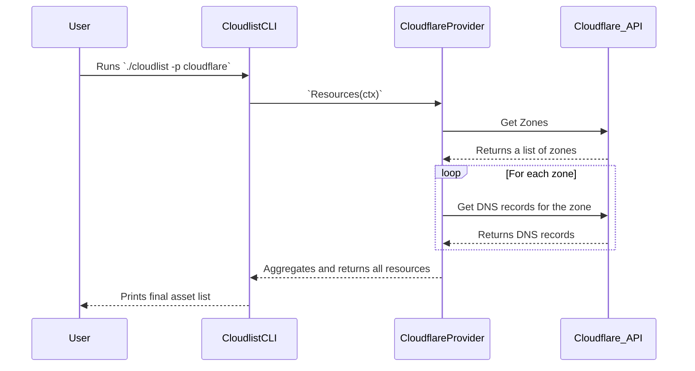

# Cloudflare Provider Documentation

This document provides a detailed overview of the Cloudflare provider for Cloudlist.

## 1. Provider Overview

The Cloudflare provider is designed to discover and inventory DNS records within a Cloudflare account. It uses the Cloudflare API to enumerate all zones and their corresponding DNS records.

## 2. Configuration

The Cloudflare provider can authenticate using either an API key and email or an API token.

| Key | Required | Description |
| :--- | :--- | :--- |
| `cloudflare_api_key` | **Yes (if not using token)** | Your Cloudflare API key. |
| `cloudflare_email` | **Yes (if not using token)** | The email address associated with your Cloudflare account. |
| `cloudflare_api_token` | **Yes (if not using key/email)** | Your Cloudflare API token. |
| `id` | No | A user-defined identifier for this configuration block. |

**Example Configuration (API Key):**

```yaml
cloudflare:
  - id: "cf-main"
    cloudflare_api_key: "$CLOUDFLARE_API_KEY"
    cloudflare_email: "user@example.com"
```

**Example Configuration (API Token):**

```yaml
cloudflare:
  - id: "cf-main"
    cloudflare_api_token: "$CLOUDFLARE_API_TOKEN"
```

## 3. Supported Services

*   **DNS**

## 4. Architecture and Interaction

The Cloudflare provider fetches all zones (domains) and then retrieves the DNS records for each zone.

### Component Interaction Diagram



### User & System Interaction Flow


