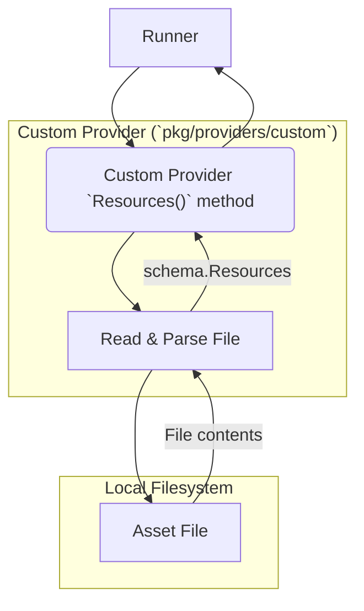
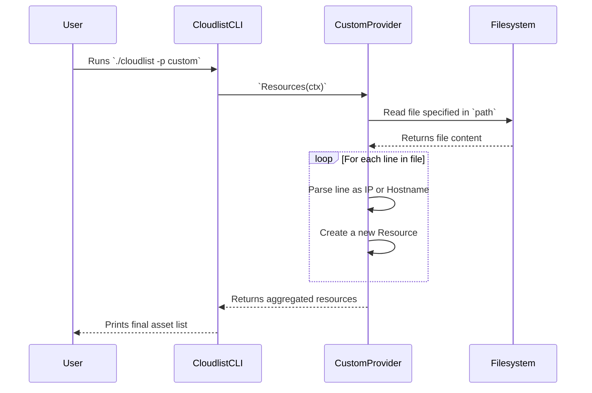

# Custom Provider Documentation

This document provides a detailed overview of the `custom` provider for Cloudlist.

## 1. Provider Overview

The `custom` provider is a special provider that doesn't connect to a cloud API. Instead, it allows you to load a list of assets (IPs and hostnames) directly from a local file on disk.

This is useful for:
-   Integrating assets from sources not yet supported by Cloudlist.
-   Adding manually curated lists of assets to your scans.
-   Running workflows on a known set of targets using Cloudlist's output formatting.

## 2. Configuration

The `custom` provider requires a single key: the path to the file containing your assets.

| Key      | Required | Description                                      |
| :------- | :--- | :----------------------------------------------- |
| `path`   | **Yes**  | The local file path to your list of assets.      |
| `id`     | No       | A user-defined identifier for this configuration block. |

**File Format:**
The file should contain one asset (IP address or hostname) per line. Empty lines and lines starting with `#` (comments) are ignored.

**Example File (`/home/user/custom-assets.txt`):**
```
# Manually tracked servers
192.0.2.1
198.51.100.50

# External services
portal.example.com
```

**Example Configuration:**

```yaml
custom:
  - id: "local-servers"
    path: "/home/user/custom-assets.txt"
```

## 3. Supported Services

The `custom` provider has one service type:

*   **file**: Represents assets loaded from a local file.

## 4. Architecture and Interaction

The provider's logic is straightforward: it reads the specified file line by line, creating a `schema.Resource` for each valid entry.

### Component Interaction Diagram



### User & System Interaction Flow


