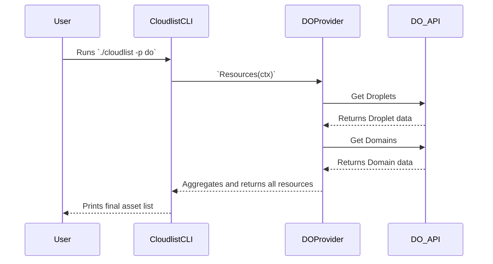

# DigitalOcean Provider Documentation

This document provides a detailed overview of the DigitalOcean provider for Cloudlist, including its configuration, supported services, and internal architecture.

## 1. Provider Overview

The DigitalOcean provider is designed to discover and inventory assets within a DigitalOcean account. It uses the DigitalOcean API to enumerate resources such as Droplets and Domains.

## 2. Configuration

The DigitalOcean provider authenticates using a personal access token.

| Key | Required | Description |
| :--- | :--- | :--- |
| `digitalocean_token` | **Yes** | The DigitalOcean personal access token. Can also be set via the `DIGITALOCEAN_TOKEN` environment variable. |
| `services` | No | A comma-separated list of specific services to scan (e.g., `droplets,domains`). If omitted, all supported services are scanned. |
| `id` | No | A user-defined identifier for this configuration block. |

**Example Configuration:**
```yaml
do:
  - id: "do-main-account"
    digitalocean_token: "$DO_TOKEN"
    services: "droplets,domains"
```

## 3. Supported Services

*   **Droplets** (Virtual Machines)
*   **Domains** (DNS)

## 4. Architecture and Interaction

The DigitalOcean provider is a straightforward implementation that iterates through its supported services to gather resources.

### Component Interaction Diagram

```mermaid
graph TD
    A[Runner] --> B("DigitalOcean Provider `Resources()` method");
    B --> C{For each enabled service};
    C --> D["droplets.go: getDroplets()"];
    C --> E["domains.go: getDomains()"];

    subgraph "DigitalOcean Provider (`pkg/providers/digitalocean`)"
        B
        D
        E
    end

    D --> F{DigitalOcean API (Droplets)};
    E --> G{DigitalOcean API (Domains)};

    F --> D;
    G --> E;

    D --> A;
    E --> A;
```

### User & System Interaction Flow


