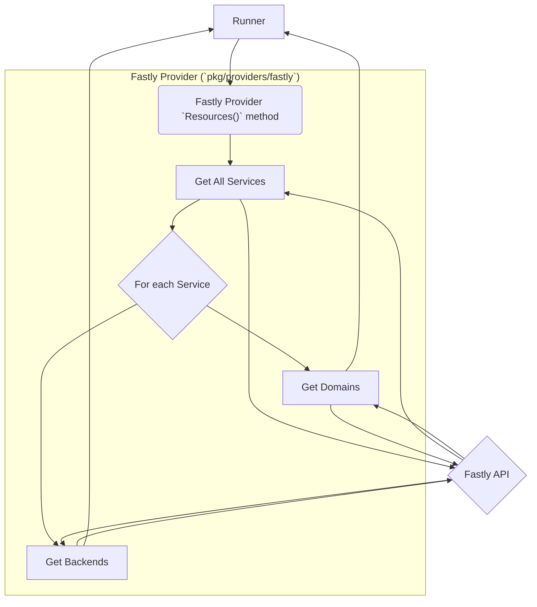
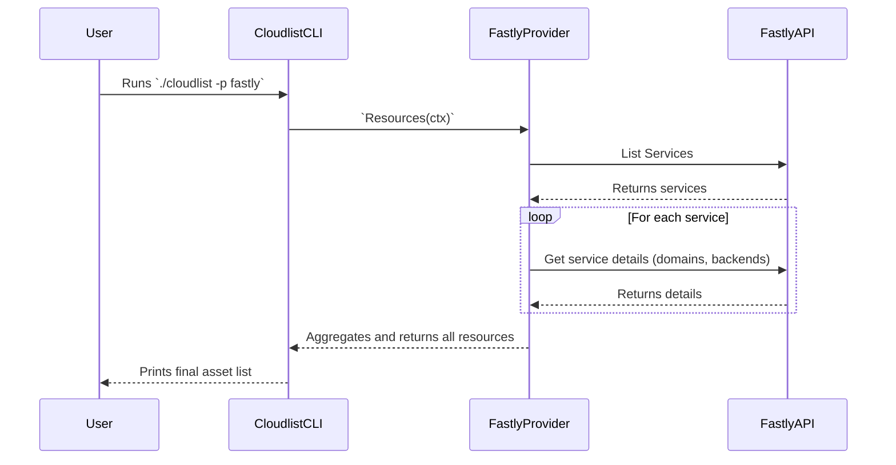

# Fastly Provider Documentation

This document provides a detailed overview of the Fastly provider for Cloudlist.

## 1. Provider Overview

The Fastly provider is designed to discover public-facing IP addresses and domains associated with a Fastly account. It interacts with the Fastly API to gather information about services, domains, and backends.

## 2. Configuration

The Fastly provider authenticates using a Fastly API token.

| Key          | Required | Description                                                  |
| :----------- | :--- | :--- |
| `fastly_token` | **Yes**  | Your Fastly API token. Can also be set via `FASTLY_API_TOKEN`. |
| `id`           | No       | A user-defined identifier for this configuration block.      |

**Example Configuration:**

```yaml
fastly:
  - id: "fastly-main"
    fastly_token: "$FASTLY_TOKEN"
```

## 3. Supported Services

The Fastly provider enumerates assets from the following sources:

*   **Services:** Public IPs of Fastly services.
*   **Domains:** Domain names configured for services.
*   **Backends:** Hostnames and IP addresses of backend servers.

## 4. Architecture and Interaction

The provider fetches a list of all services and then inspects each service for its domains and backends.

### Component Interaction Diagram



### User & System Interaction Flow


