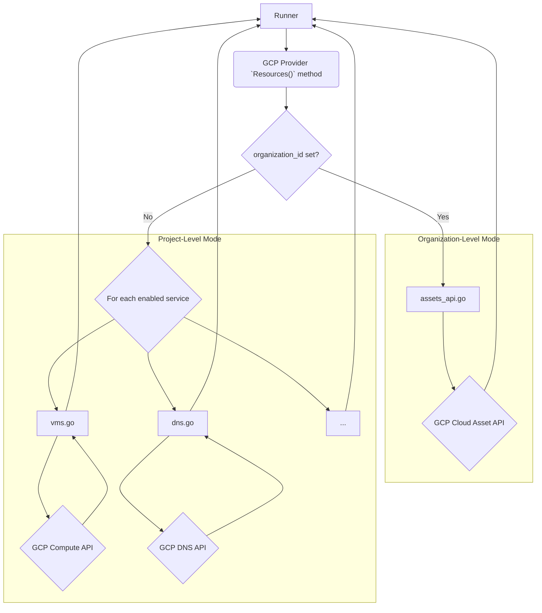
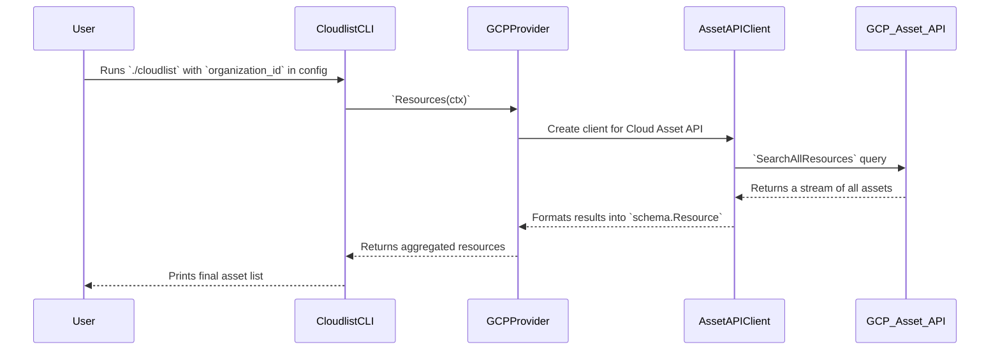

# GCP Provider Documentation

This document provides a detailed overview of the GCP (Google Cloud Platform) provider for Cloudlist, including its configuration, supported services, and internal architecture.

## 1. Provider Overview

The GCP provider is designed to discover and inventory assets within a Google Cloud project or organization. It supports two primary modes of operation:

1.  **Project-Level Discovery:** Scans individual services (like Compute Engine, Cloud DNS) within a specified project.
2.  **Organization-Level Discovery:** Uses the Cloud Asset API to perform a comprehensive, organization-wide scan for assets.

## 2. Configuration

The GCP provider authenticates using a service account JSON key. The path to this key file is the primary configuration requirement.

| Key | Required | Description |
| :--- | :--- | :--- |
| `gcp_service_account_key` | **Yes** | Path to the GCP service account JSON key file. Can also be set via the `GCP_SERVICE_ACCOUNT_KEY_FILE` environment variable. |
| `organization_id` | No | If specified, enables organization-level asset discovery. This changes the discovery method. |
| `services` | No | A comma-separated list of specific services to scan in project-level mode (e.g., `compute,dns`). If omitted, all supported services are scanned. |
| `id` | No | A user-defined identifier for this configuration block. |

**Example Configuration (Project-Level):**
```yaml
gcp:
  - id: "gcp-prod-project"
    gcp_service_account_key: "/path/to/your/credentials.json"
    services: "vms,dns"
```

**Example Configuration (Organization-Level):**
```yaml
gcp:
  - id: "gcp-entire-org"
    gcp_service_account_key: "/path/to/your/credentials.json"
    organization_id: "123456789012"
```

## 3. Supported Services

### Project-Level Discovery
*   **VMs** (Compute Engine)
*   **DNS** (Cloud DNS)
*   **Buckets** (Cloud Storage)
*   **GKE** (Google Kubernetes Engine)
*   **Cloud Run**
*   **Cloud Functions**

### Organization-Level Discovery
When `organization_id` is used, the provider leverages the Cloud Asset API to find a wide range of assets, including but not limited to:
*   Compute Engine VM IPs
*   Cloud SQL IPs
*   Load Balancer IPs

## 4. Architecture and Interaction

The provider's architecture has a primary branching logic based on the presence of `organization_id`.

*   **If `organization_id` is present:** The `assets_api.go` module is used, which makes a single, powerful query to the Cloud Asset API.
*   **If `organization_id` is NOT present:** The main `gcp.go` orchestrator calls separate functions for each service (`vms.go`, `dns.go`, etc.), similar to the AWS provider.

### Component Interaction Diagram



### User & System Interaction Flow (Org-Level)


