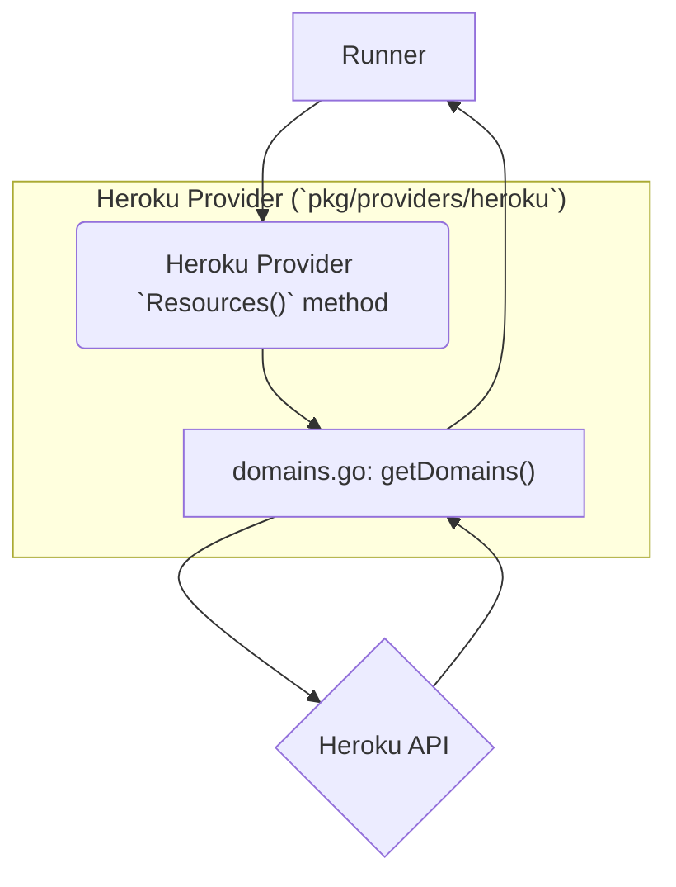
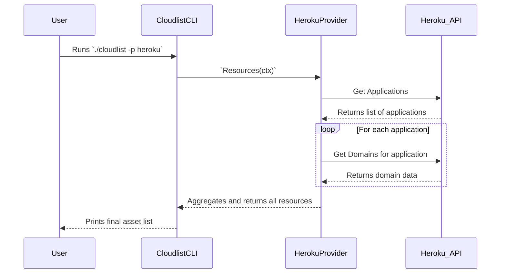

# Heroku Provider Documentation

This document provides a detailed overview of the Heroku provider for Cloudlist.

## 1. Provider Overview

The Heroku provider is designed to discover and inventory assets within a Heroku account. It uses the Heroku API to enumerate domains associated with applications.

## 2. Configuration

The Heroku provider authenticates using a Heroku API token.

| Key | Required | Description |
| :--- | :--- | :--- |
| `heroku_token` | **Yes** | The Heroku API token. Can also be set via the `HEROKU_TOKEN` environment variable. |
| `id` | No | A user-defined identifier for this configuration block. |

**Example Configuration:**
```yaml
heroku:
  - id: "heroku-personal"
    heroku_token: "$HEROKU_API_TOKEN"
```

## 3. Supported Services

*   **Domains**

## 4. Architecture and Interaction

The Heroku provider is a simple implementation that fetches all applications and then retrieves the domains for each application.

### Component Interaction Diagram



### User & System Interaction Flow


