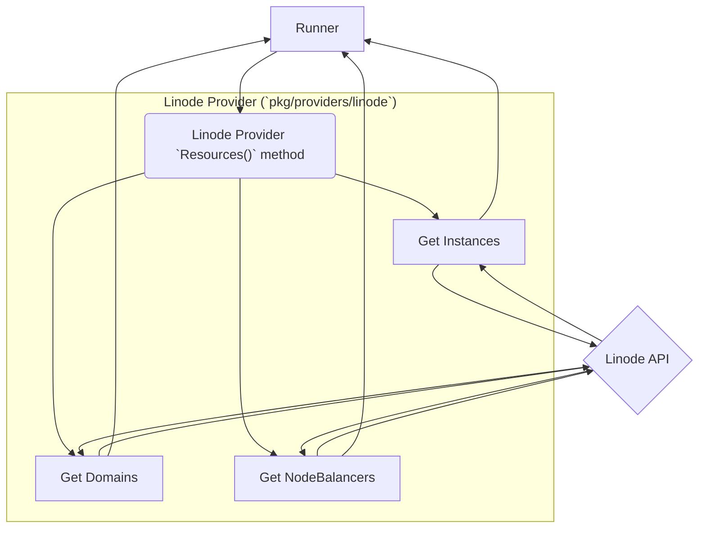
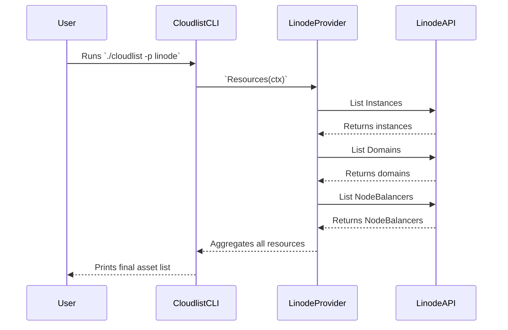

# Linode Provider Documentation

This document provides a detailed overview of the Linode provider for Cloudlist.

## 1. Provider Overview

The Linode provider discovers assets within a Linode account, including Linode instances, domains, and NodeBalancers.

## 2. Configuration

The Linode provider authenticates using a Linode Personal Access Token.

| Key          | Required | Description                                                  |
| :----------- | :--- | :--- |
| `linode_token` | **Yes**  | Your Linode API token. Can also be set via `LINODE_TOKEN`.       |
| `id`           | No       | A user-defined identifier for this configuration block.      |

**Example Configuration:**

```yaml
linode:
  - id: "linode-main"
    linode_token: "$LINODE_TOKEN"
```

## 3. Supported Services

The Linode provider enumerates assets from:

*   **Instances:** Public and private IPs of Linode virtual machines.
*   **Domains:** DNS records configured in the Linode DNS manager.
*   **NodeBalancers:** Public IPs of Linode's load balancers.

## 4. Architecture and Interaction

The provider calls separate functions to gather resources from each supported service concurrently.

### Component Interaction Diagram



### User & System Interaction Flow


