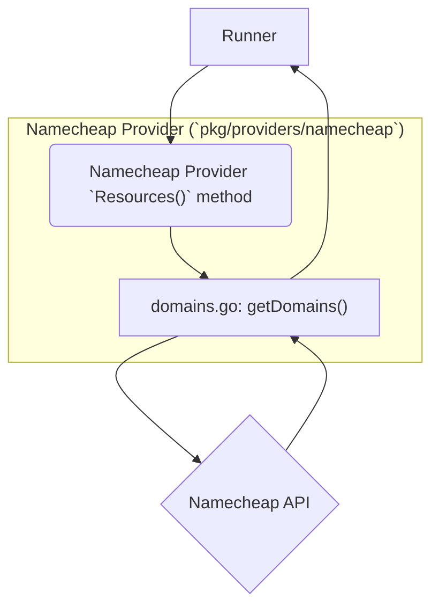
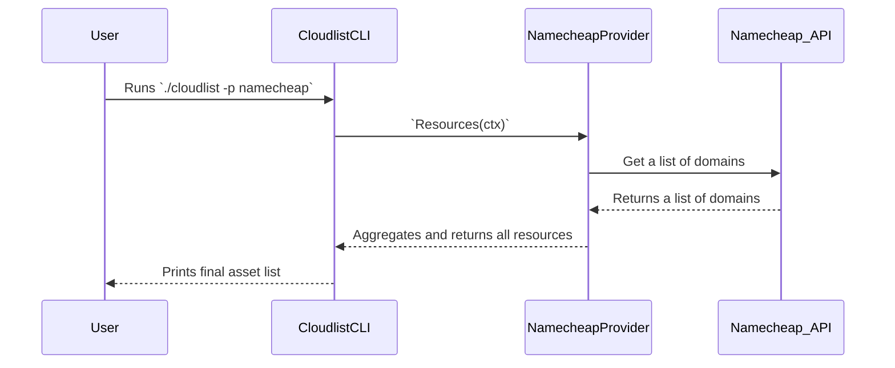

# Namecheap Provider Documentation

This document provides a detailed overview of the Namecheap provider for Cloudlist.

## 1. Provider Overview

The Namecheap provider is designed to discover and inventory domains registered with Namecheap. It uses the Namecheap API to enumerate all domains associated with an account.

## 2. Configuration

The Namecheap provider authenticates using an API key, API user, and the source IP of the machine running Cloudlist.

| Key | Required | Description |
| :--- | :--- | :--- |
| `namecheap_api_key` | **Yes** | Your Namecheap API key. |
| `namecheap_api_user` | **Yes** | Your Namecheap API username. |
| `namecheap_source_ip` | **Yes** | The public IP address of the machine running Cloudlist, which must be whitelisted in your Namecheap account. |
| `id` | No | A user-defined identifier for this configuration block. |

**Example Configuration:**

```yaml
namecheap:
  - id: "namecheap-main"
    namecheap_api_key: "$NAMECHEAP_API_KEY"
    namecheap_api_user: "$NAMECHEAP_API_USER"
    namecheap_source_ip: "192.0.2.1"
```

## 3. Supported Services

*   **Domains**

## 4. Architecture and Interaction

The Namecheap provider is a simple implementation that fetches all domains associated with the account.

### Component Interaction Diagram



### User & System Interaction Flow


