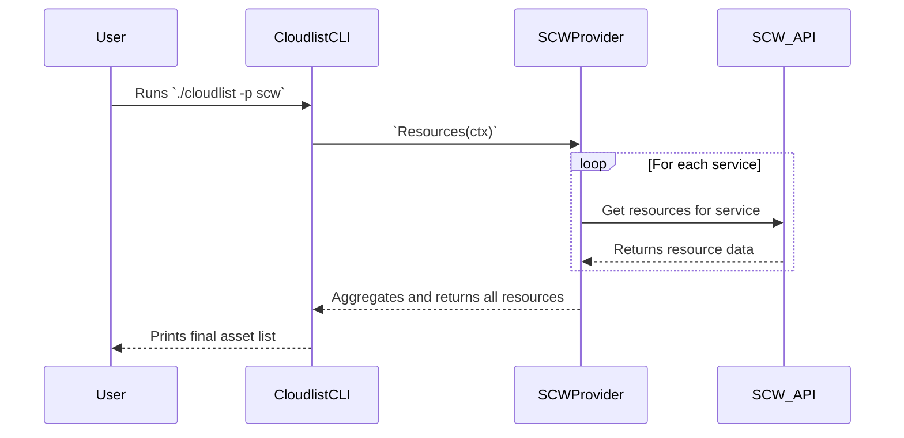

# Scaleway Provider Documentation

This document provides a detailed overview of the Scaleway provider for Cloudlist, including its configuration, supported services, and internal architecture.

## 1. Provider Overview

The Scaleway provider is designed to discover and inventory assets within a Scaleway account. It interacts with various Scaleway service APIs to enumerate resources.

## 2. Configuration

The Scaleway provider authenticates using an access key and a secret key. You also need to specify the region and project ID.

| Key | Required | Description |
| :--- | :--- | :--- |
| `scaleway_access_key` | **Yes** | The Scaleway access key. |
| `scaleway_secret_key` | **Yes** | The Scaleway secret key. |
| `scaleway_region` | **Yes** | The Scaleway region (e.g., `fr-par`). |
| `scaleway_project_id` | **Yes** | The Scaleway project ID. |
| `services` | No | A comma-separated list of specific services to scan. If omitted, all supported services are scanned. |
| `id` | No | A user-defined identifier for this configuration block. |

**Example Configuration:**
```yaml
scw:
  - id: "scw-project-x"
    scaleway_access_key: "$SCW_ACCESS_KEY"
    scaleway_secret_key: "$SCW_SECRET_KEY"
    scaleway_region: "fr-par"
    scaleway_project_id: "xxxx-xxxx-xxxx-xxxx"
```

## 3. Supported Services

*   **Instances** (Virtual Machines)
*   **Domains** (DNS)
*   **Kubernetes**
*   **Load Balancers**

## 4. Architecture and Interaction

The Scaleway provider follows the standard Cloudlist provider architecture.

### Component Interaction Diagram

```mermaid
graph TD
    A[Runner] --> B("Scaleway Provider `Resources()` method");
    B --> C{For each enabled service};
    C --> D["instances.go: getInstances()"];
    C --> E["domains.go: getDomains()"];
    C --> F["... and other services"];

    subgraph "Scaleway Provider (`pkg/providers/scaleway`)"
        B
        D
        E
        F
    end

    D --> G{Scaleway API (Instances)};
    E --> H{Scaleway API (Domains)};

    G --> D;
    H --> E;

    D --> A;
    E --> A;
    F --> A;
```

### User & System Interaction Flow


