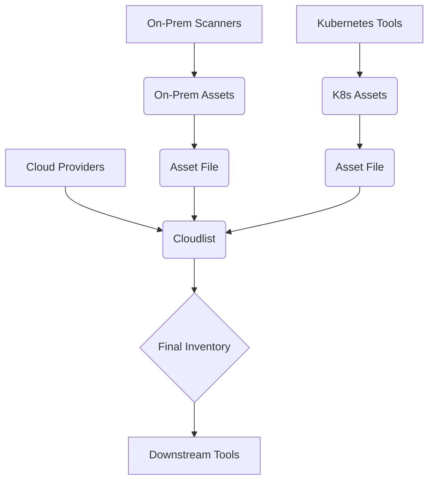

# Cloudlist Scope, Limitations, and Solutions

This document outlines the scope of assets that Cloudlist is designed to discover, details the types of assets it does *not* scan, and provides recommended solutions for achieving a more comprehensive asset inventory.

## 1. Scope of Cloudlist

Cloudlist is specifically designed to be a **multi-cloud asset discovery tool**. Its primary function is to connect to the APIs of supported cloud and infrastructure providers to enumerate resources that have a network presence, such as:

*   Virtual Machines (e.g., AWS EC2, GCP Compute Engine, Azure VMs)
*   Public and Private IP Addresses
*   DNS Records and Hostnames (e.g., AWS Route53, Google Cloud DNS)
*   Load Balancers and Content Delivery Networks (CDNs)
*   Managed Kubernetes Service endpoints (e.g., EKS, GKE, AKS)
*   Storage assets with public endpoints (e.g., S3 buckets with static websites)

As seen in the project's use cases, the goal is to provide a centralized inventory for **Cloud Asset Inventory**, **Shadow IT Discovery**, and **Compliance Auditing** within these cloud environments.

## 2. Digital Assets Not Scanned by Cloudlist

Cloudlist's focus on API-driven cloud enumeration means certain categories of assets are inherently out of scope.

| Asset Category Not Scanned | Description | Recommended Solution |
| :--- | :--- | :--- |
| **On-Premise Infrastructure** | Physical servers, routers, switches, and virtual machines hosted in a corporate data center are not cloud assets and cannot be discovered by Cloudlist. | Use traditional network scanners (`nmap`, `rumble`), vulnerability scanners (`nessus`), or enterprise discovery tools (`ServiceNow`, `Lansweeper`). Export the findings and use the **`custom` provider** to ingest them into Cloudlist. |
| **Internal Application Services** | Services and applications running *inside* a virtual machine (e.g., a specific web server process, a database daemon) are not visible to the cloud provider's API. | Employ host-based agents, runtime security tools (`Sysdig`, `Falco`), or Application Performance Monitoring (APM) to get visibility inside the OS. |
| **Containerized Workloads** | While Cloudlist can find a Kubernetes node (the VM), it does not inspect the cluster to find individual pods, services, or containers running within it. | Use Kubernetes-native commands (`kubectl get all -A`) or container security platforms (`Aqua`, `Prisma Cloud`). For exposed services (LoadBalancer, Ingress), Cloudlist *will* find the resulting public IP or DNS name. |
| **Unsupported SaaS Platforms** | The tool cannot discover assets within the thousands of SaaS applications (e.g., Salesforce, Workday, Slack) unless a specific provider is written for their API. | Implement a Cloud Access Security Broker (CASB) or SaaS Security Posture Management (SSPM) tool designed for this purpose. |
| **Endpoint Devices** | Employee laptops, desktops, and mobile devices are not part of a cloud infrastructure and are therefore not scanned. | Use Unified Endpoint Management (UEM), Mobile Device Management (MDM), or Endpoint Detection and Response (EDR) solutions. |
| **Unsupported Cloud Providers** | Assets hosted with cloud providers for which a provider implementation does not exist in Cloudlist. | **Write a new provider** for the target platform, following the developer guide. As a workaround, export a list of assets from that provider and use the **`custom` provider**. |

## 3. Solution Workflow Diagram

This diagram illustrates how to combine Cloudlist with other tools to create a comprehensive asset inventory that covers both cloud and non-cloud assets.

By leveraging the **`custom` provider**, you can use Cloudlist as the central aggregator for assets discovered by other specialized tools, allowing you to use its powerful formatting and filtering capabilities across your entire digital footprint.
