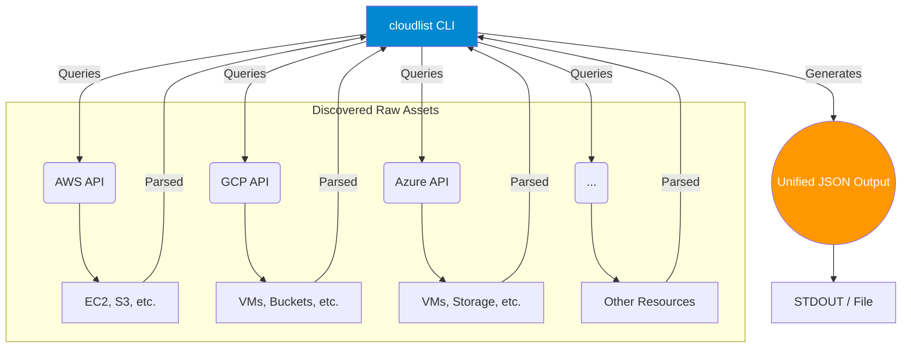
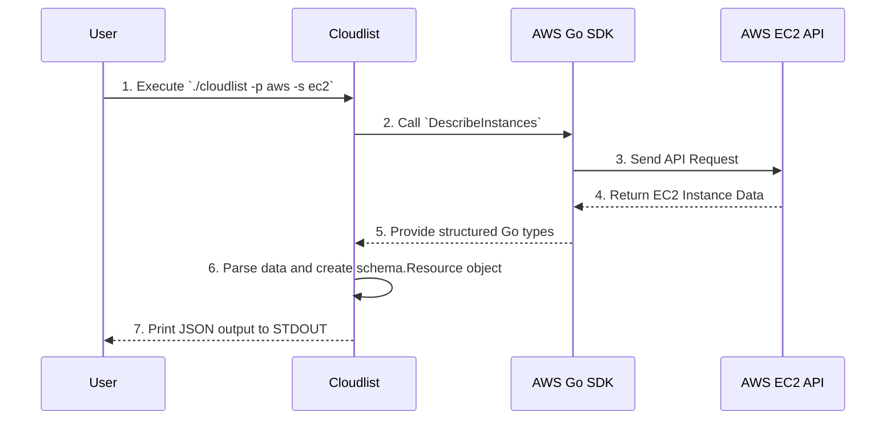

# Supported Cloud Resources

This document provides a detailed list of cloud resources that `cloudlist` can discover, including example outputs and architectural diagrams.

## Overall Architecture

The diagram below illustrates the high-level architecture of `cloudlist`. The tool queries the public APIs of various cloud and service providers, parses the results, and generates a unified stream of asset information in JSON format.



## Data Flow Example: AWS EC2 Scan

This diagram shows the sequence of events when a user scans for AWS EC2 instances.



---

## Amazon Web Services (AWS)

`cloudlist` discovers the following AWS resources. All examples show the output when `extended_metadata: "true"` is enabled.

### **EC2 (Elastic Compute Cloud)**
- **Description**: Scans for virtual machine instances and retrieves their associated IP addresses and DNS names.
- **Example Output**:
```json
{
  "provider": "aws",
  "id": "i-0a1b2c3d4e5f6a7b8",
  "public": true,
  "service": "ec2",
  "public_ipv4": "34.228.10.20",
  "private_ipv4": "172.31.10.15",
  "dns_name": "ec2-34-228-10-20.compute-1.amazonaws.com",
  "metadata": {
    "instance_type": "t2.micro",
    "region": "us-east-1",
    "iam_instance_profile": "arn:aws:iam::123456789012:instance-profile/my-ec2-role",
    "tags": "Name=web-server,Env=prod"
  }
}
```

### **S3 (Simple Storage Service)**
- **Description**: Enumerates S3 buckets, which have globally unique DNS names.
- **Example Output**:
```json
{
  "provider": "aws",
  "id": "my-unique-company-bucket",
  "public": true,
  "service": "s3",
  "dns_name": "my-unique-company-bucket.s3.amazonaws.com",
  "metadata": {
    "region": "us-east-1",
    "creation_date": "2023-01-15T10:30:00Z"
  }
}
```

### **Route53**
- **Description**: Lists DNS records within hosted zones, resolving IP addresses for A and AAAA records.
- **Example Output**:
```json
{
  "provider": "aws",
  "id": "Z0123456789ABCDEFGHIJ_assets.example.com_A",
  "public": true,
  "service": "route53",
  "public_ipv4": "192.0.2.1",
  "dns_name": "assets.example.com",
  "metadata": {
    "record_type": "A",
    "ttl": "300"
  }
}
```

### **ELB / ALB (Load Balancers)**
- **Description**: Discovers Classic, Application, and Network Load Balancers and their public-facing DNS names.
- **Example Output**:
```json
{
  "provider": "aws",
  "id": "internal-app-lb-1234567890.us-east-1.elb.amazonaws.com",
  "public": true,
  "service": "alb",
  "dns_name": "internal-app-lb-1234567890.us-east-1.elb.amazonaws.com",
  "metadata": {
    "type": "application",
    "region": "us-east-1",
    "vpc_id": "vpc-0123456789abcdef0"
  }
}
```

---

## Google Cloud Platform (GCP)

`cloudlist` discovers the following GCP resources. All examples show the output when `extended_metadata: "true"` is enabled.

### **Compute Engine**
- **Description**: Finds virtual machine instances and their assigned public and private IP addresses.
- **Example Output**:
```json
{
  "provider": "gcp",
  "id": "1234567890123456789",
  "public": true,
  "service": "compute",
  "public_ipv4": "34.136.100.200",
  "private_ipv4": "10.128.0.2",
  "dns_name": "200.100.136.34.bc.googleusercontent.com",
  "metadata": {
    "machine_type": "e2-medium",
    "zone": "us-central1-a",
    "tags": "http-server,https-server"
  }
}
```

### **Cloud DNS**
- **Description**: Enumerates DNS records in managed zones to find public hostnames and associated IPs.
- **Example Output**:
```json
{
  "provider": "gcp",
  "id": "example-com-mx-record",
  "public": true,
  "service": "dns",
  "dns_name": "mail.example.com",
   "metadata": {
    "record_type": "MX",
    "ttl": "3600"
  }
}
```

### **Cloud Storage**
- **Description**: Lists storage buckets, which have public DNS names.
- **Example Output**:
```json
{
  "provider": "gcp",
  "id": "gcp-prod-data-lake",
  "public": true,
  "service": "s3",
  "dns_name": "storage.googleapis.com/gcp-prod-data-lake",
  "metadata": {
    "location": "US-CENTRAL1",
    "storage_class": "STANDARD"
  }
}
```

### **Cloud Run**
- **Description**: Discovers deployed Cloud Run services and their assigned URLs.
- **Example Output**:
```json
{
  "provider": "gcp",
  "id": "api-service-prod",
  "public": true,
  "service": "cloud-run",
  "dns_name": "api-service-prod-abcdef123-uc.a.run.app",
  "metadata": {
    "region": "us-central1",
    "service_account": "api-service-sa@my-project.iam.gserviceaccount.com"
  }
}
```

---

## Microsoft Azure

`cloudlist` discovers the following Azure resources. All examples show the output when `extended_metadata: "true"` is enabled.

### **Virtual Machines**
- **Description**: Scans for virtual machines and their associated public IP objects.
- **Example Output**:
```json
{
  "provider": "azure",
  "id": "/subscriptions/.../virtualMachines/prod-web-vm1",
  "public": true,
  "service": "vm",
  "public_ipv4": "20.50.100.150",
  "metadata": {
    "vm_size": "Standard_DS2_v2",
    "region": "eastus",
    "os_type": "Linux"
  }
}
```

### **Public IP Addresses**
- **Description**: Enumerates standalone Public IP Address resources.
- **Example Output**:
```json
{
  "provider": "azure",
  "id": "/subscriptions/.../publicIPAddresses/prod-nat-gateway-ip",
  "public": true,
  "service": "publicip",
  "public_ipv4": "20.60.120.180",
  "metadata": {
    "region": "eastus",
    "ip_allocation_method": "Static",
    "sku": "Standard"
  }
}
```

### **Azure DNS**
- **Description**: Lists records in DNS zones to find hostnames and their resolved IPs.
- **Example Output**:
```json
{
  "provider": "azure",
  "id": "/subscriptions/.../dnszones/example.com/A/www",
  "public": true,
  "service": "dns",
  "public_ipv4": "40.80.140.200",
  "dns_name": "www.example.com",
  "metadata": {
    "record_type": "A",
    "ttl": "3600",
    "zone_name": "example.com"
  }
}
```

### **Storage Accounts**
- **Description**: Discovers storage accounts and their service endpoint URLs (blob, file, queue, table).
- **Example Output**:
```json
{
  "provider": "azure",
  "id": "prodbillingstorage",
  "public": true,
  "service": "storage",
  "dns_name": "prodbillingstorage.blob.core.windows.net",
  "metadata": {
    "region": "eastus",
    "sku": "Standard_LRS",
    "kind": "StorageV2"
  }
}
```
---

## Appendix

### Q: Does cloudlist extract the detailed AWS resources including AWS EC2?

**A:** Yes. `cloudlist` can extract more detailed information for AWS resources. This is done by enabling the `extended_metadata` option for a provider in your `provider-config.yaml` file. When this option is enabled, `cloudlist` includes a `metadata` object in the JSON output containing additional details. For an EC2 instance, this includes information like Instance Type, AWS Region, Associated IAM Instance Profile and Instance tags.

Here is how you would enable it in your configuration file:

**`provider-config.yaml` Example:**
```yaml
aws:
  - id: "my-aws-account"
    aws_access_key_id: "..."
    aws_secret_access_key: "..."
    extended_metadata: "true" # Enable extended metadata
```
