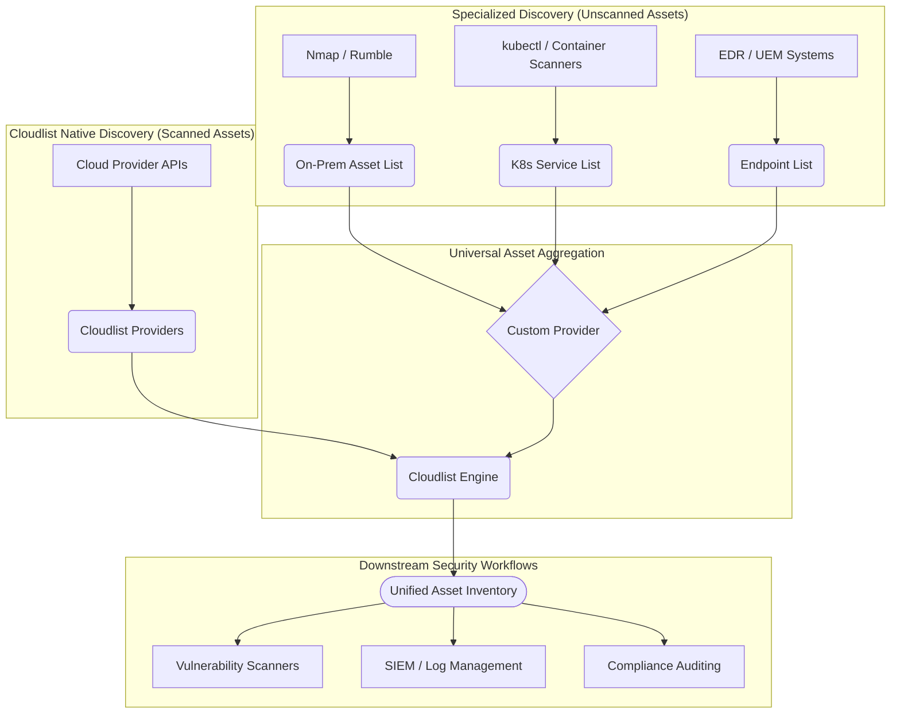

# Achieving a Universal Asset Inventory with Cloudlist

This document outlines the strategy for leveraging Cloudlist as the central engine for a Universal Asset Inventory, unifying assets from disparate sources into a single, actionable dataset.

## 1. The Challenge: A Fragmented Digital Footprint

Modern organizations operate a complex and fragmented digital footprint. Assets are no longer confined to a single data center; they are spread across multiple cloud providers, SaaS platforms, container orchestration systems, and on-premise networks. 

This fragmentation creates significant challenges for security and operations teams:
-   **Lack of Visibility:** It is difficult to get a complete and up-to-date answer to the question, "What are all of our digital assets?"
-   **Inconsistent Data:** Data from different discovery tools comes in various formats, making it hard to integrate with security workflows (e.g., vulnerability scanning, SIEMs).
-   **Increased Risk:** Without a complete inventory, "Shadow IT" and unmanaged assets can go unnoticed, leaving the organization vulnerable.

## 2. The Vision: A Single Source of Truth

The goal is to create a **Universal Asset Inventory**—a single, unified source of truth for all digital assets, regardless of their location or type. This inventory becomes the foundational dataset for critical security jobs, including:

*   Continuous monitoring for unknown assets.
*   Integrating inventory data with security tools like vulnerability scanners.
*   Validating compliance against security policies.
*   Investigating and responding to security incidents.

Cloudlist, with its flexible provider model, is designed to be the central aggregator for this universal inventory.

## 3. The Strategy: Unifying Scanned and Unscanned Assets

Our strategy is to divide the discovery process into two categories and use Cloudlist to unify the results.

### Scanned Assets: Cloudlist's Core Competency

These are the assets that Cloudlist is designed to discover out-of-the-box through its native providers. It does this by connecting directly to cloud provider APIs.

**Asset Types:**
*   Virtual Machines
*   Public & Private IPs
*   DNS Hostnames
*   Load Balancers & CDNs
*   Managed Kubernetes Endpoints
*   Public Storage Endpoints

### Not-Yet-Scanned Assets: Bridging the Gaps

These are assets that fall outside the scope of Cloudlist's native API-based discovery. As outlined in `scope-and-limitations.md`, this includes:

*   **On-Premise Infrastructure:** Physical servers, internal VMs.
*   **Internal Application Services:** Processes running inside a VM.
*   **Containerized Workloads:** Individual pods and services inside a Kubernetes cluster.
*   **SaaS Platforms:** Assets within platforms like Salesforce or Workday.
*   **Endpoint Devices:** Employee laptops and mobile devices.

To bring these assets into our universal inventory, we use specialized tools and connect them to Cloudlist via its most powerful feature for this purpose: the `custom` provider.

## 4. The `custom` Provider: Your Universal Asset Adapter

The `custom` provider is the key to achieving a universal inventory. It treats a simple text file—containing one IP or hostname per line—as a data source.

**This turns Cloudlist into a central processing engine.** You can now use best-in-class tools to discover unscanned assets, export their findings to a file, and ingest them seamlessly into your Cloudlist workflow.

## 5. Architectural Blueprint for Universal Discovery

This diagram shows the end-to-end workflow:

### Implementation Steps:

1.  **Configure Native Providers:** Set up your `provider-config.yaml` to scan all your supported cloud accounts.
2.  **Establish Export Pipelines:** Create scripts or processes to run your specialized scanners (Nmap, kubectl, etc.) and save their output to dedicated text files.
3.  **Configure Custom Providers:** Add `custom` provider blocks to your `provider-config.yaml`, pointing to the output files from Step 2.
4.  **Run Cloudlist:** Execute a single Cloudlist command to scan all sources simultaneously.
5.  **Pipe to Tooling:** Pipe the unified, consistently formatted output from Cloudlist into your downstream security tools.

By following this model, you elevate Cloudlist from a simple discovery tool to the core of a robust and universal asset management program.
